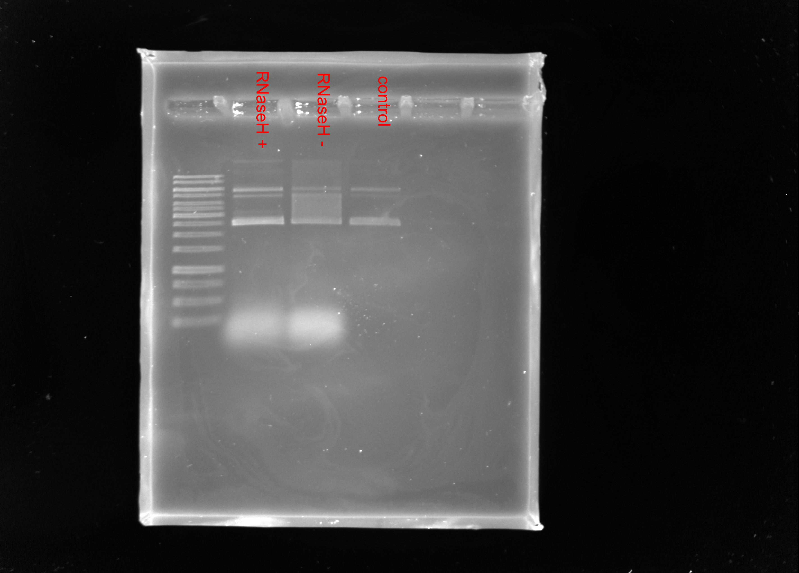
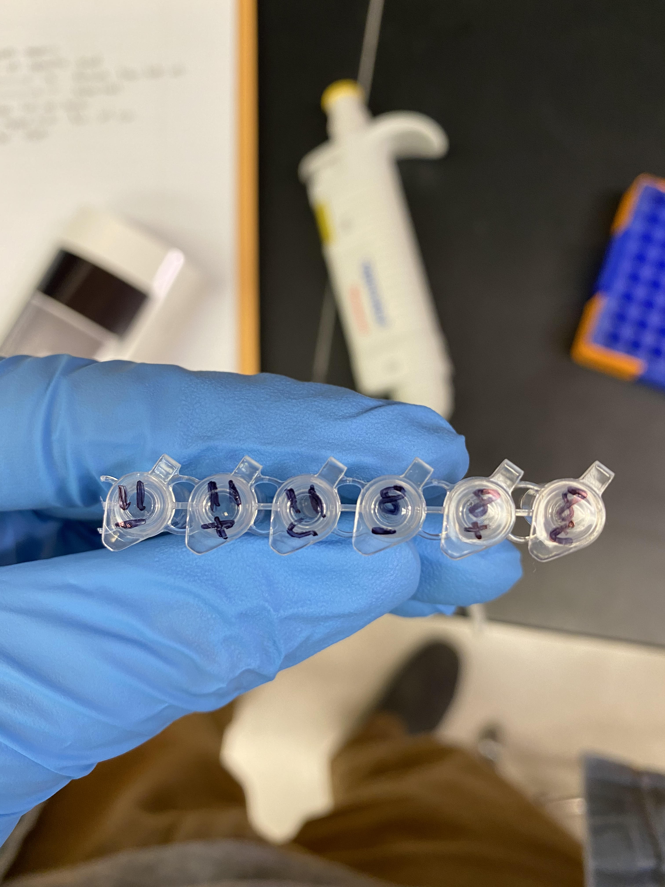
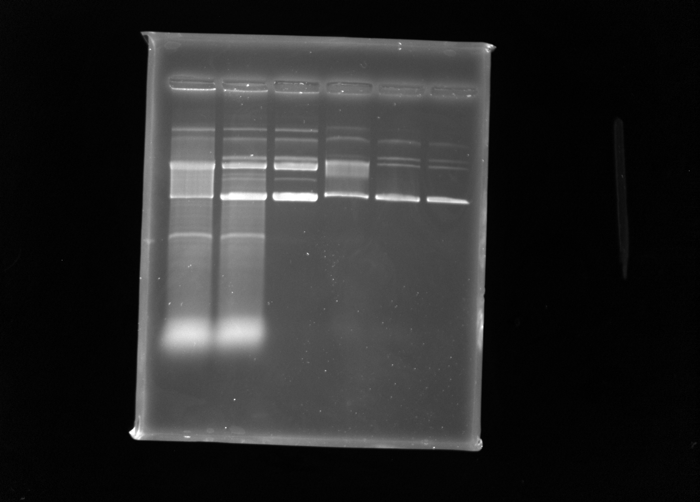

# IVT practice with pFC8 and pFC11

### IVT pFC8

DNA concentration: 740 ng / ul

| Name       | Volume (ul) | 
| ---------- | ----------- |
| 5x Buffer  |       4     |
| 100 mM DTT |       4     |
|2.5 mM NTP  |       1     |
|   DNA      |     0.81    |
|   H20      |     10.19   |

Used **T7 Pol** but was informed by Fred that pFC8 does not actually
have a T7 promoter (oops) so this was never going to work out and is
hopefully why the other gels failed as well.

### Gel image

No shift since not using the correct POL.

0.8 % TBE agarose ran 90v for 1 hr with 1ul 1kb Thermofisher O'Gene ruler. 

## Redo pFC8T1T2 with T3 Pol + pFC11 with T7 Pol

| Plasmid | DNA Concentration (ng / nl) |
| ------- | --------------------------  |
|  pFC8   |            240              |
|  pFC11  |            252              |

### Master mix reagents

| Reagent |  pFC8T1T2  |  pFC11   |
| ---------  | ----------------------------- | -------- |
| 5x Buffer  |       4                       |    4     |
| 100 mM DTT |       4                       |    4     |
|2.5 mM NTP  |       1                       |    1     |
|   DNA      |     2.5                       |    2.38  |
|   H20      |     8.5                       |    8.61  |

### Tube labeling

Order in gel (right to left) is the same.

| Symbol | Meaning             |
| -----  | ------------------  |
|   +    |   RNaseH containing |
|   -    | RNaseH control      |
|   c    |  Un-transcribed     |
|  `\d`  |   Plasmid number    |

### Gel image

0.8 % TBE agarose ran 90v for 1.25 hr. 

