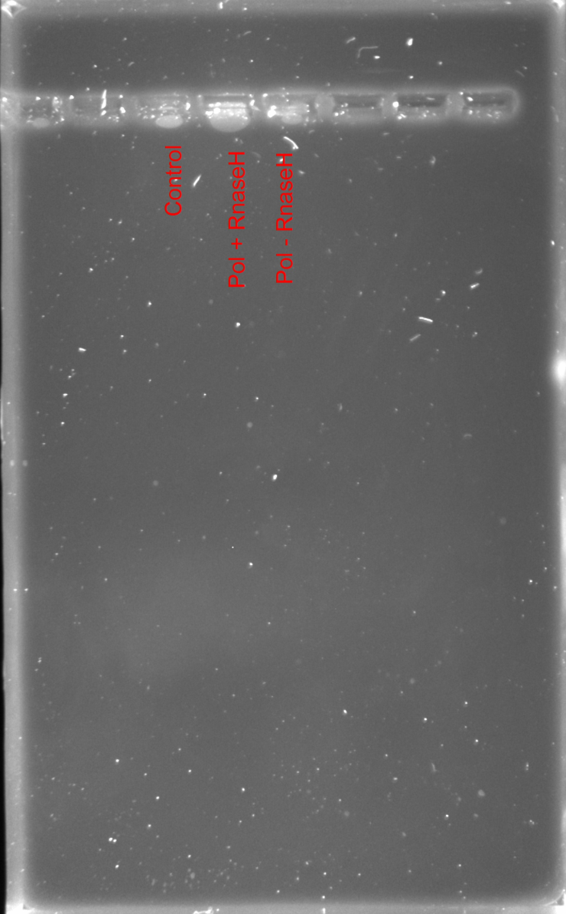

# *In vitro* transcription pf pFC8 plasmid 

## Reagents

| Name | Volume (ul) | 
| ---- | ----------- |
| 5x Buffer | 4 |
| 100 mM DTT | 4 |
2.5 mM NTP | 1 |
DNA | 2.12 |
H20 | 8.88 |

DNA concentration much lower than was marked on
the tube.

## Samples

- Control: Master mix only, no transcription
- Transcribed: Master mix + T7 Polymerase + RNAaseA
- Transcribed + RNAase H: Master mix + T7 + RNAaseA Polymerase + RNAaseH

## Protocol notes

1. Measure DNA concentration using Nanodrop
2. Calculate volume of DNA sample required for ~ 200 ng per lane
3. Make master mix 
4. Aliquot 5 ul for control and remaining sample into PCR reaction
   tubes.
5. Create thermocycler reaction profile; 37 C for 20 mins then 65 C for 10 mins.
6. Add 0.5 ul T7 Polymerase to the treatment tube (15 ul master mix). Run thermocycler profile. 
7. Prepare 0.9 % agarose gel using 40 ml TBE buffer while thermocycler is running.
8. Add 0.5 ul RNAaseA to treatment tube incubate in thermocycler for
   20 mins at 37 C. 
9. Split treatment tube in half (7.5 ul remove to third PCR tube) and
    add 0.5 ml RNAaseH to the third sample. 
10. Incubate at 37 C for 20 mins.
11. Add protease K to all samples to eat junk and incubate at 37 C for 10 mins.
12. Load samples into gel using purple loading dye.
13. Run get for 1 hr at 90 volts.
14. Remove gel from tray and place into temporary container (tuperware will work) and add 1 ul of ethedium bromide and aggitate on the spinner machine by the gel imager for at least 10 minutes.
15. Image the gel and pray.

## Results

Not great lol. Somehow it looks like the DNA did not make it
onto the gel.

