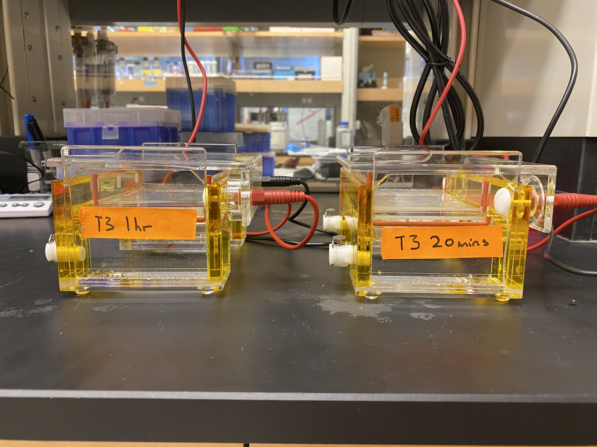

# IVT pFC8 + pFC14 with new reagents

Doing another IVT practice with new reagents except for DTT which
is from existing IVT reagent box. Used DTT lot number `0000038464`.

## Protocol

| Plasmid | DNA concentration (ng/ul) |
| ------- | ------------------------- |
|  pFC8   |           240             |
| pFC14   |           1452            |

|  Reagent  |     pFC8   |   pFC14    |
| --------- | ---------- | ---------  |
| 10x Buffer |     2      |     2      |
| 100 mM DTT|     1      |     1      |
| 25 mM NTP |    0.4     |     0.4    |
|    H20    |    14.1    |     16.187 |
|    DNA    |    2.5     |   0.413    |

Same as [5-6-21](5-6-21.md) IVT but updated concentrations
of reagents (10x buffer and DTT) based on recommendations that
were included with the new set of reagents.

Also wanted to test the recommendation that T3 Pol should be
incubated for 1hr (is this worth it) and so did two replicates, only change was 20 mins transcription time vs 1hr.

Ran two separate gels (6 wells each) for 2hr at 90V.

## Results