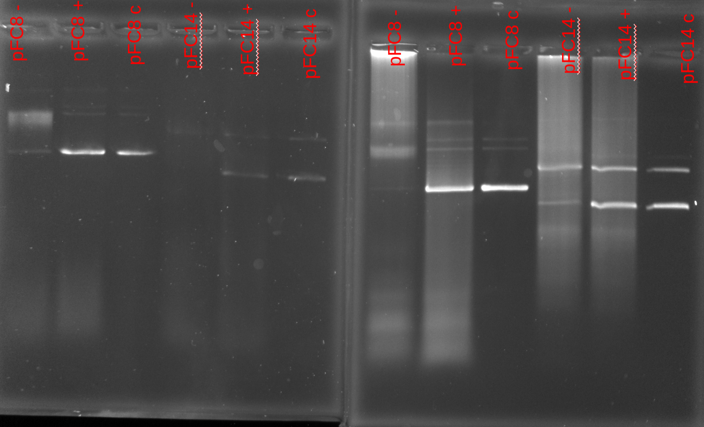

# IVT pFC8 + pFC14 with new reagents

Doing another IVT practice with new reagents except for DTT which
is from existing IVT reagent box. Used DTT lot number `0000038464`.

## Protocol

### DNA concentrations

| Plasmid | DNA concentration (ng/ul) |
| ------- | ------------------------- |
| pFC8    | 240                       |
| pFC14   | 1452                      |

| Reagent    | pFC8 | pFC14  |
| ---------- | ---- | ------ |
| 10x Buffer | 2    | 2      |
| 100 mM DTT | 1    | 1      |
| 25 mM NTP  | 0.4  | 0.4    |
| H20        | 14.1 | 16.187 |
| DNA        | 2.5  | 0.413  |

Same as [5-6-21](5-6-21.md) IVT but updated concentrations
of reagents (10x buffer and DTT) based on recommendations that
were included with the new set of reagents.

Also wanted to test the recommendation that T3 Pol should be
incubated for 1hr (is this worth it) and so did two replicates, only change was 20 mins transcription time vs 1hr.

Ran two separate gels (6 wells each) for 1.5 hr (dye getting close to end of gel) at 90V. De-stained both gels in TBE for 10 mins.

## Results

20 mins on right, 1hr on left.

Overall, the new reagents definietly seem to help but there is lots of room for improvement. Going for the full hour for transcription seems to be definitely worth it as there is actually
a strong shift for pFC8 there. However, did not observe really any shift in the 1hr replicate for pFC14. In fact all treatments look basically identical to each other.

It is also a bit odd that all pFC14 samples after 1hr are showing signal at 2 bands, even for the un-transcribed sample. Some portion of the DNA is not carrying superhelicity before it is even transcribed.

It also might be worthwhile to add additional 0.5 ul of RNaseA as lot of signal in the transcribed samples.

I think I probably introduced some error trying to work between classes and presentations today. Going to repeat with pFC8, pFC14, and pFC11 (test the T7 polymerase) tomorrow and compare results. Overall, need to improve consistency between samples and replicates.
