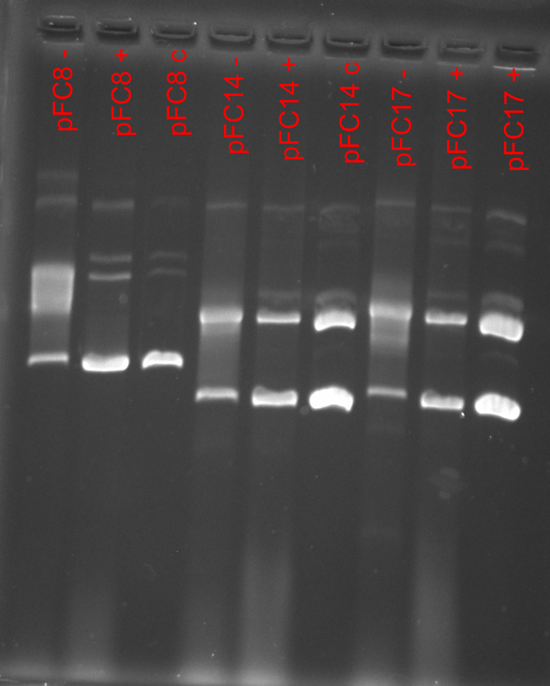

# IVT pFC8, pFC14, pFC17 with new reagents: attempt 2

## Protocol

### DNA concentrations

Remeasured all DNA concentrations before starting today.

| Plasmid | DNA concentration (ng/ul) |
| ------- | ------------------------- |
|  pFC8   |           277             |
| pFC14   |           1356            |
| pFC17   |           1236            |

### Reagents

|  Reagent  |     pFC8   |   pFC14    |  pFC17      |
| --------- | ---------- | ---------  | ----------  | 
| 10x Buffer |     2     |     2      |      2      |
| 100 mM DTT|     1      |     1      |      1      |
| 25 mM rNTP |    0.4     |     0.4    |      0.4    |
|    H20    |    14.4    |     16.15  |      16.11  |
|    DNA    |    2.16     |   0.44    |      0.48   |

Since using more plasmids this time made a master mix composed
of the constant reagents, made 1.5x more than needed. Composition
is shown in the table below.

| Reagent     |      Volume (ul)   |
| ---------   |  ---------------   |
| 10x buffer  |         9          |
|     DTT     |         4.5        |
|    rNTP     |         1.8        |

Added 3.4 ul MM to each sample plus H20 and DNA specific to
each plasmid.

All plasmids use the T3 polymerase.

## Results

Ran 0.8% agarose gel for 1 hour 45 mins.

