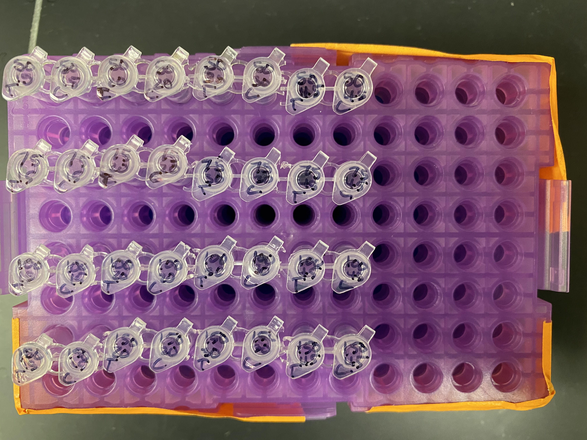
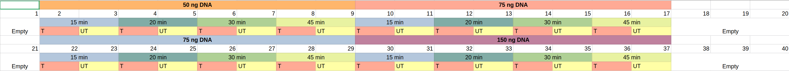
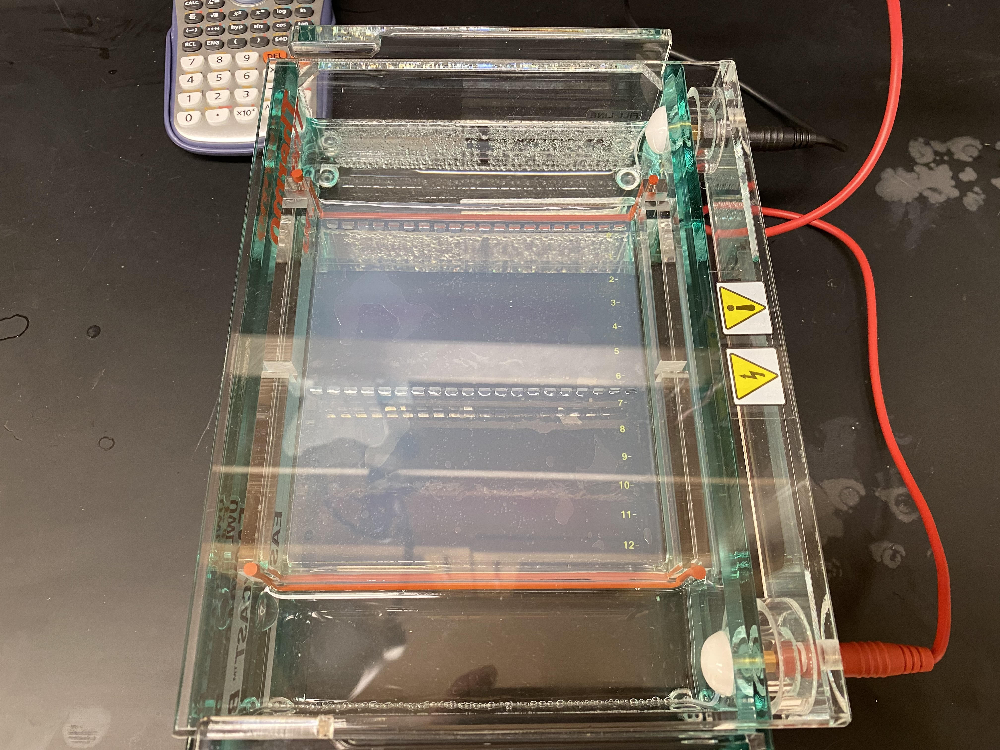
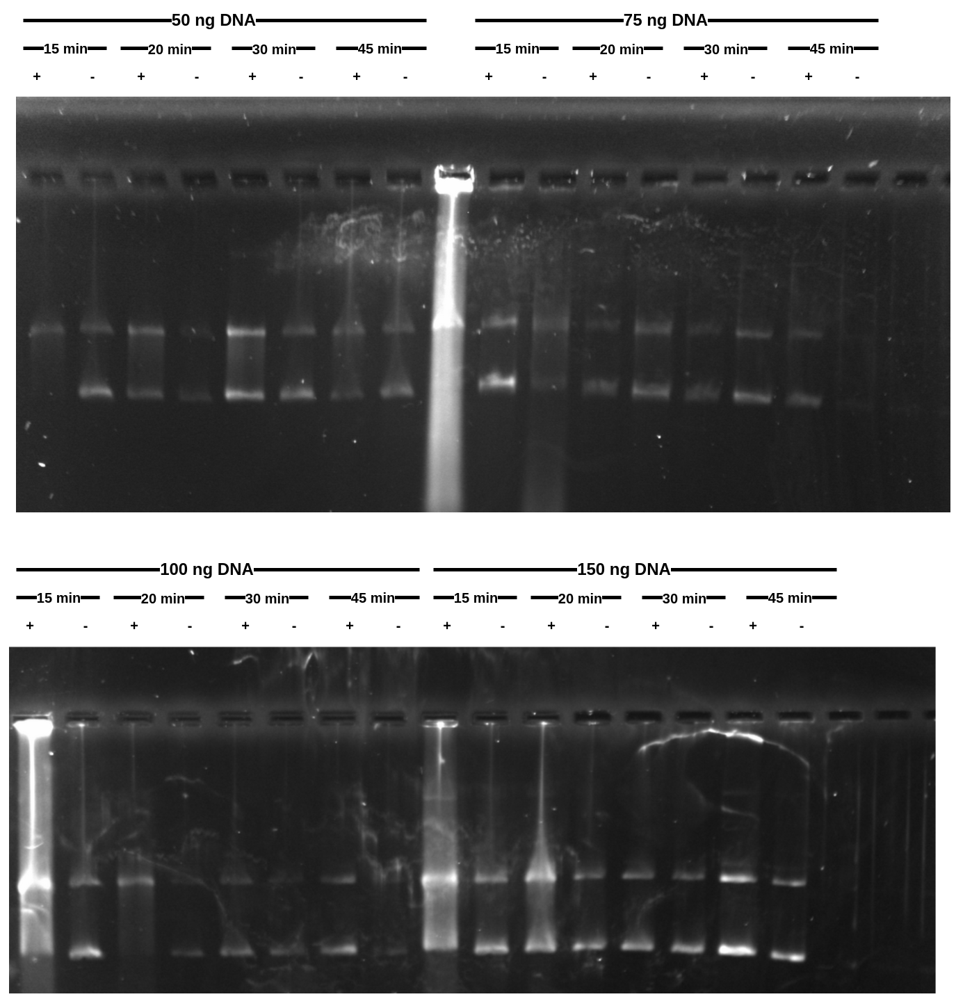

# Transcription time vs DNA concentration optimization

After lab meeting last Friday Fred suggested experimenting
with different DNA concentrations and transcription times
in order to optimize IVT.

Designed protocol which is layed out in 
[spreadsheet form at this link](https://docs.google.com/spreadsheets/d/15oUK6Z6GfXZMH4Q9PZiSx24dGQXJuvFM7fCIeLSdvrQ/edit?usp=sharing).

I choose to use pFC14 as it wasn't as clean as pFC8 but showed
R-loop formation and so there would be lots of room to
optimize using it.

## Protocol

See [spreadsheet form at this link](https://docs.google.com/spreadsheets/d/15oUK6Z6GfXZMH4Q9PZiSx24dGQXJuvFM7fCIeLSdvrQ/edit?usp=sharing) for details of reagents and concentrations.

1. Make buffer master mix (Txn buffer, rNTP, DTT)
2. Make DNA master mix for each DNA concentration
3. Split DNA master mixes into transcription and control samples for each transcription length.

This is where I differed from what I intended to do. Originally I planned to add the T3 just before adding the sample to the thermocycler for incubation. In this system 45 min samples would go in first, then after 15 mins T3 would be added to 30 min sample, etc. until all samples have incubated for repsective lengths. Then all samples run at 65C for 10 mins to kill transcription. This has the benefit of all samples finishing at the same time.

However, I accidentally added T3 to *all* transcribed samples at the same time. So at that point it was game on, transcription was underway and so I basically had to do the above in reverse. All samples went into block B of the thermocycler at 37C. After 15 mins I removed the 15 min sample and incubated in block A at 65, after another 5 I removed the 20 min sample etc. until I finished all samples. Samples were kept on ice while waiting for other samples to finish which may have introduced some error since the sample sat after killing transcription for different amounts of time.

4. Add 1 ul 1:100 RNaseA
5. Incubate all samples 37C for 30 mins.
6. Add 0.25 ul Protease K to all samples.
7. Incubate at 37C for 10 mins.
8. Load samples onto 1% agarose gel (I used higher percentage this time as was using the big gel and was slightly worried about integrity of the gel)
9. Run samples at 90V for 1.75 hours.
10. Post-stain gel with 10ul EtBr for 15 mins.
11. Destain get for 10 mins.
12. Image gel.

### Gel lane layout

Lane layout with respect to transcription time and DNA
concentration available at 
[this link](https://docs.google.com/spreadsheets/d/15oUK6Z6GfXZMH4Q9PZiSx24dGQXJuvFM7fCIeLSdvrQ/edit#gid=929396717) or image below.

## Results

Results are not as clean as I was hoping for. Looks like
I did not add RNaseA in a couple cases (not sure how that
happened and can be seen as the bright lanes).

If I had to pick a best condition I would saw 100 ng
of DNA at 15 mins transcription time. 