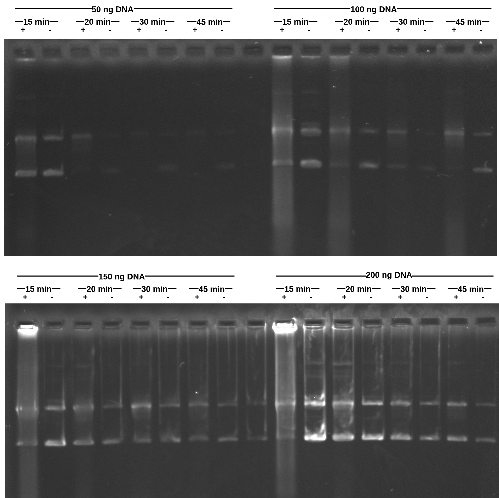

# Transcription time vs DNA concentration optimization with pFC17

This is a replication of 
[Transcription time vs DNA concentration optimization with pFC17](5-25-21.md) with pFC17 instead of 14.

## Protocol

| plasmid |  DNA ng / ul |
| ----    | ---------    |
|  pFC17  |   1236       |

Main difference in protocol was I corrected the order in which
samples were places into the thermocycler. 45 min samples + T3
went in first and then at each time mark (30, 20 and 15 minutes)
the protocol was paused and T3 was added to the respective sample
and then added to the thermocycler. This removed wait time for
short run samples post transcription.

## Results

### Sample switch mistake

When loading the samples into the gel I switched the locations
of the 100 ng and 150 ng 45 minute samples. This will not affect
results but will require some cropping in order to get everything
in the correct order.

