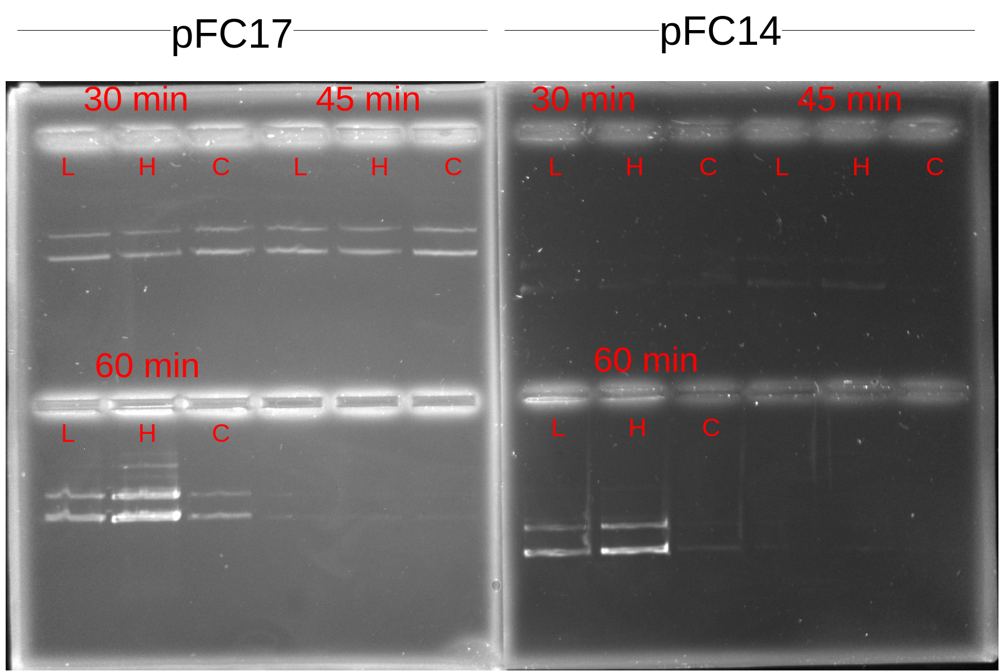

# Test for DNase activity in RNaseA

In the last two time resolved gels saw decrease in DNA
signal as transcription time increased. There were
no samples treated with RNAseH, but all samples were
treated with RNAseA which is lab made. Normally, it is well
boiled to destroy other less hardy proteins but it is
possible that some DNase was retained. 

To test this today doing a time resolved digestion of pFC14 and
17 with high or low concentrations of the RNaseA I used in the
previous two IVTs (see [5-27-21](5-27-21.md) and [5-25-21](5-25-21.md)).

## Protocol

[Google sheet for master mix calculator](https://docs.google.com/spreadsheets/d/19SzEC0GCZEz3y9boZorlRqx0nOqL56obEHCXnjmxrOM/edit?usp=sharing).

Created master mixes of pFC14 and 17 as described in the above
sheet. Each master mix was divided into samples of 4 increasing
digestion times; 15, 30, 45 and 60 mins.

Within each digestion time for each plasmid either 0, 1 or 4 ul
of 1:100 dilution 1mg / ml RNaseH was added just before incubation.

Thermocycler was set to 37C for 60 mins and samples were added
at their respective time point immediately after adding the 
RNaseA. The only exception was the 15 min and 60 minute samples; 60 min samples added at 15 minute mark and 15 minute samples added at 60 min mark. No effect on experimental results after swapping those samples since reagent concentrations are identical.

Samples were kept on ice while they waiting for their turn in
the thermocycler.

While loading samples into 20 well rack noticed that there
seemed to be significant leaking from first well loaded. After 1
min saturation of dye was nearly gone in the loaded well and well
next to it had taken on some purple color. Skipped the next well
kept loading and noticed what I think was overflow while loading.
Seems like the 20 rack wells are too small for sample volumes.
Unfortunately, because of this lost the 15 min samples. Put the rest on ice and made two gels with 6 rack well size using. Kept samples cold in deli fridge while waiting for gels to harden.

## Results

Samples loaded into 0.8% agarose gel with 1x TAE running buffer and 6x purple loading dye. Post-stained with 12 ul EtBr for 20
mins on rotator protected from light.

| Symbol |  Meaning |
| ----   |  ------  |
|   L    |    1 ul RnaseA  |
|   H    |   4 ul RNaseA   |
|   C    |   Control no RnaseA  |

Although signal is definetely weak in the pFC14 samples
(not sure why times are making a difference here though) all
samples seem to be showing about the same signal which would
*not* indicate the presence of a DNase in the RNaseA sample.
60 min samples both seem to be stronger though, maybe when
I was setting up the samples I pulled from the master mix that
had too much DNA. I think it would probably be best just to replicate this one again. If it is not a case of RNAseA being contaminated then I am not
sure what would explain the differences in DNA signal between transcription times besides just pipetting error on my part; possibly due to not adding exact same amounts of sample to each well when mixing on the parafilm. 
