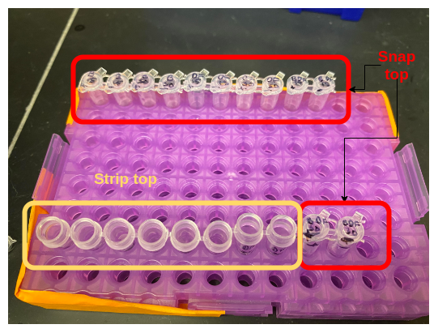
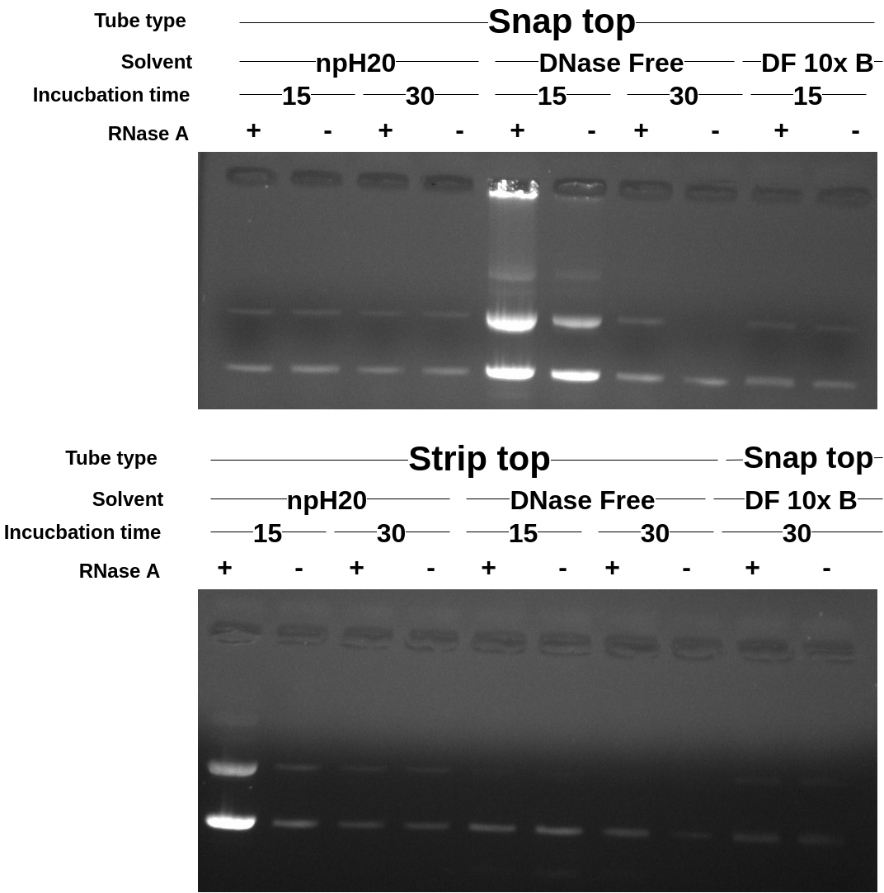

# RNAse mediated DNA degradation; or something more sinister?

As a follow up to the confusing results of [6-3-21](6-3-21.md) I am testing to see if other factors outside
of RNAse A might be degrading DNA during IVT / related
experiments that utilize RNase A lab stock. Two main variables are the tubes and water used. Both where proposed as potential sources of DNA consumption / degradation respectively.

Types of tubes tested shown below, previously I have
been using snap tops for all experiments that needed
PCR tubes.

## Protocol

## Results

