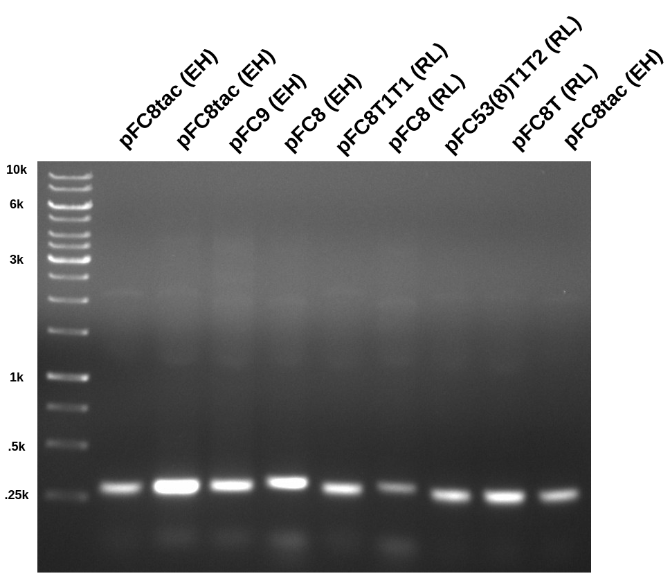
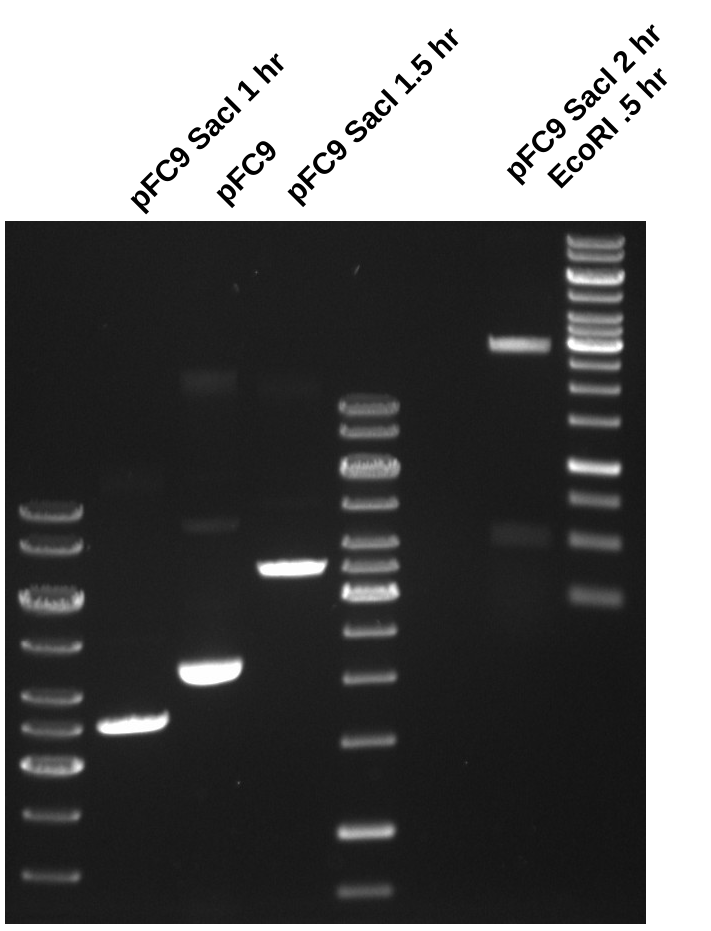
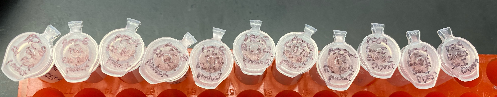

# pFC9 gel purification and pFC PCRs: Attempt 2

Today I am working on optimizing pFC9 digest with SacI and EcoRI
and large fragment extraction and pFC pcr gel extraction. Fred had a couple
suggestions. For digest, Fred thought that additional bands in [this gel](images/pFC9-sacI-ecoRI-digest-labeled.png) are due to incomplete digestion from SacI.
Suggested digesting first with only SacI and incubating for intervals of 30 mins
and running gels to check if digestion is complete. Additionally in general
for gel extractions use tin foil to prevent irradiating bands you want to
extract, cut as little agarose as possible, and bind DNA to column and elute
DNA twice when extracting.

## pFC PCR

Started PCR using the same protocol as yesterday. Added an additional reagent,
pFC8T1(RL). Reagents, primers and concentrations are described in the
spreadsheet [at this link](https://docs.google.com/spreadsheets/d/1C9dQ5NALOPIBd9vnqTwMcuQwFouvtItC6r6D7yj8_8g/edit?usp=sharing).

### Reagents

| Reagent       | Lot     | Expiration date |
| ------------- | ------- | --------------- |
| OneTac        | 0071403 | 3/16            |
| OneTac buffer | 0011101 | 1/14            |

### PCR results

Ran 0.08 agarose gel at 120v for 1hr in TAE.

All PCRs look good, producing expected band at ~300 bp. pFC8tac (EH) was
used in the first and last well so the location of the bands could be determined
while covering the others with tin foil.

### Agarose gel extraction

I next followed Fred's recommendations for agarose gel extraction and the Zymoclean
protocol.

#### Nanodrop results

| Sample Name       | Sample number | ng / ul | 260 / 280 | 260/230 |
| ----------------- | ------------- | ------- | --------- | ------- |
| pFC8tac (EH)      | 1             | 29.8    | 1.396     | 0.0042  |
| pFC8tac (EH)      | 2             | 77.3    | 2.781     | ...     |
| pFC9 (EH)         | 3             | 56.5    | 2.565     | ...     |
| pFC8 (EH)         | 4             | 30.4    | 1.558     | 0.078   |
| pFC8T1T1 (RL)     | 5             | 16.0    | 1.456     | 0.046   |
| pFC8 (RL)         | 6             | 55.5    | 2.714     | ...     |
| pFC53(8)T1T2 (RL) | 7             | 56.3    | 2.804     | ...     |
| pFC8T (RL)        | 8             | 78.4    | 2.711     | ...     |

Overall results are better than yesterday, but still not great, especially
the absorbance ratios. Tomorrow will do again but focus on reducing the amount
of agarose cut. One way I think can do this is by pouring a thinner gel, gel I
poured today as actually pretty thick leading to un necessary amount of agaorse
in the extraction. 

### pFC9 SacI followed by EcoRI digest

Began four replicates of the digestion described in 
[this spreadsheet](https://docs.google.com/spreadsheets/d/1l6wfkW9ukn345qX2bwtJRiUF5r6L9bTFWAB5k-gCVD8/edit?usp=sharing)
but only added SacI *not* EcoRI. Then I incubated all samples, running 10ul alliqoute of sample 1 after 1 and 1.5 hours. After 1.5 hours I determined that
digestion of pFC9 by SacI was complete since only band was visible. After which
I added 1 ul of EcoRI to all samples and ran another 10ul aliquot of sample 1
to determine if digestion of EcoRI was complete.

Based on the results if this digest is done in the future SacI should be incubated
alone with substrate DNA for at least 1 hour then the second enzyme should be
added. I did not have time to run the agarose gel extraction so I heat
inactivated the endonucleases at 65C for 20 mins per NEB recommendations and
then froze all samples in 1.5 ml tubes.

All tubes were placed in the `VR-inserts` box on my shelf in the fridge. Image
of all tubes is below.

