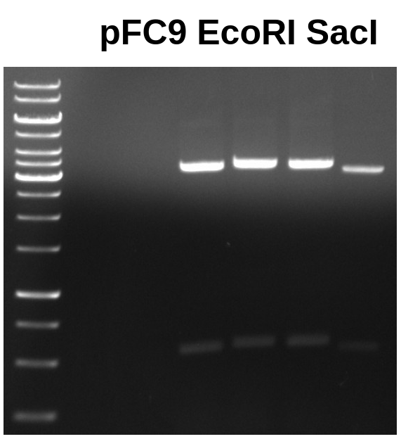
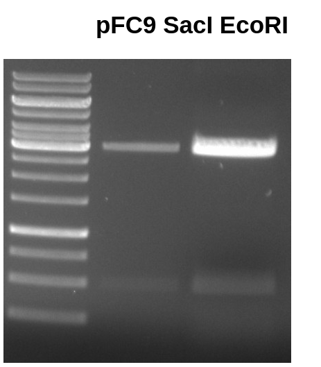
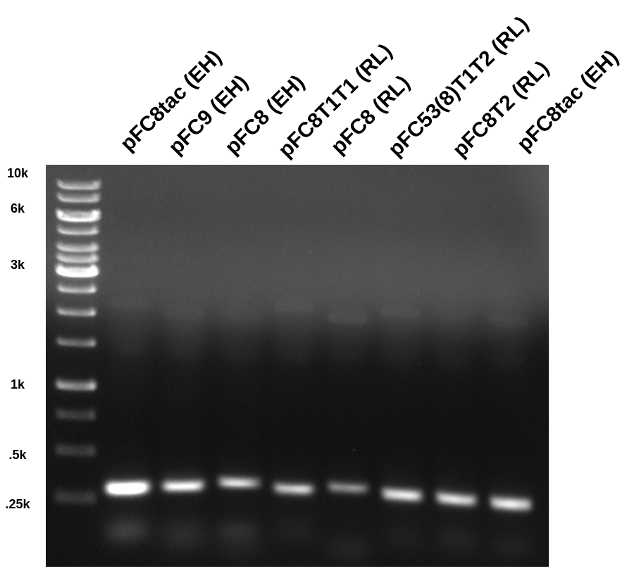
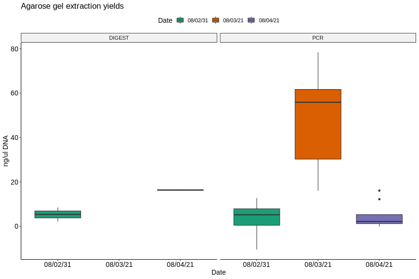
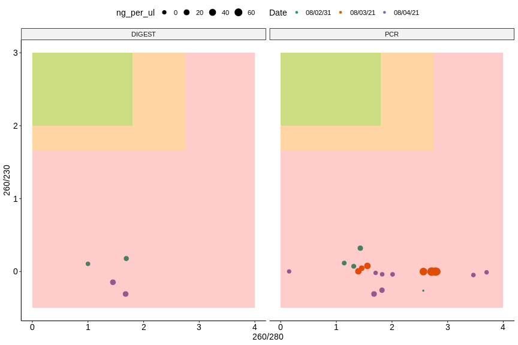

# pFC PCR and pFC9 digest: Round 3

## pFC9 EcoRI SacI digest

[Yesterday](10_8-3-21.md) I digested three 1ug samples of pFC9 with SacI and
EcoRI to produce the large fragment needed for T7 initiation series assemblies.

### Sample 1

First gel ran was standard 0.08 TAE at 120 V for 1 hr. Ran sample 1 in four
separate lanes because I poured very thin gels and was bit worried about
overtopping the wells.

Forth well was a bit lower than the other three due to bent comb, it did not
actually run faster.

I then extracted all large fragment bands using UV table and tin foil method.
Added all bands to the same tube and extracted using Zymoclean protocol.

### Sample 2

Ran another gel in order to attempt the gel extraction again.

However this time I eluted DNA from column with 30 ul water instead of the elution
buffer.

### Nanodrop results

| Sample Name            | Sample number | ng/ul | 260/280 | 260/230 |
| ---------------------- | ------------- | ----- | ------- | ------- |
| pFC9 EcoRI SacI digest | 1             | 16.6  | 1.449   | -0.147  |
| pFC9 EcoRI SacI digest | 2             | 16.1  | 1.677   | -0.307  |

Not great, looks basically exactly like previous extractions. At least I am
consistent!

## pFC PCR

Did the same PCR, exact same protocol, DNA and reagents from [yesterday](10_8-3-21.md).
Only difference was I did two replicates of each sample. Ran "A" samples out on
gel and put "B" samples in `VR-inserts` box.

As usual gel looked good with high signal from expected bands at ~300 bp. I
then extracted each band on the gel UV table using tin foil to protect bands.
Then extracted DNA from the agarose following Zymogen protocol and eluted DNA with 30ul water.

### Nanodrop results

| Sample name       | Sample number | ng/ul | 260/280 | 260/230 |
| ----------------- | ------------- | ----- | ------- | ------- |
| pFC8tac (EH)      | 1             | 12.2  | 1.820   | -0.255  |
| pFC9 (EH)         | 2             | 3.0   | 2.010   | -0.038  |
| pFC8 (EH)         | 3             | 1.2   | 3.7     | -0.01   |
| pFC8T1T2 (RL)     | 4             | 1.2   | 1.706   | -0.018  |
| pFC8 (RL)         | 5             | -0.1  | 0.151   | 0.002   |
| pFC53(8)T1T2 (RL) | 6             | 2.2   | 1.823   | -0.037  |
| pFC8T2 (RL)       | 7             | 2.1   | 3.463   | -0.047  |
| pFC8tac (EH)      | 8             | 16.1  | 1.677   | -0.307  |

Overall worse then yesterday. This may mean that using the elution
buffer is better than H20, however there are too many untested
variables at this point to make that determination especially
considering that eluting with H20 did not improve the pFC9
results. 

Overall all assays from the last three days have shown generally
low yields and aparent contaimination by protein (260/280) and
salt (260/230). Lower values are worse.

Plots generated from 
[this Jupyter notebook](notebooks/nanodrop_pFC_PCR_pFC9_digests.ipynb).

