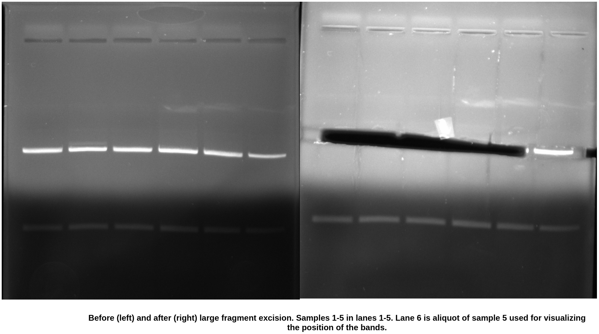
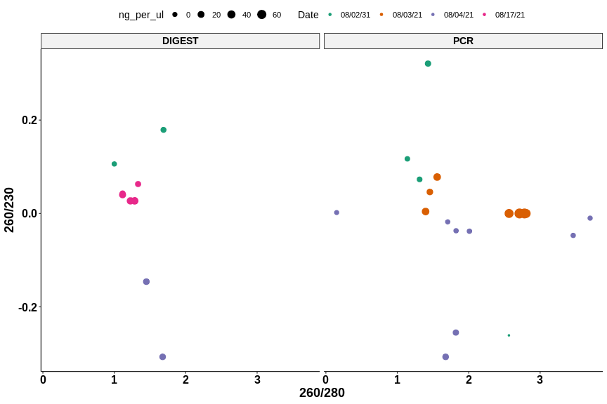
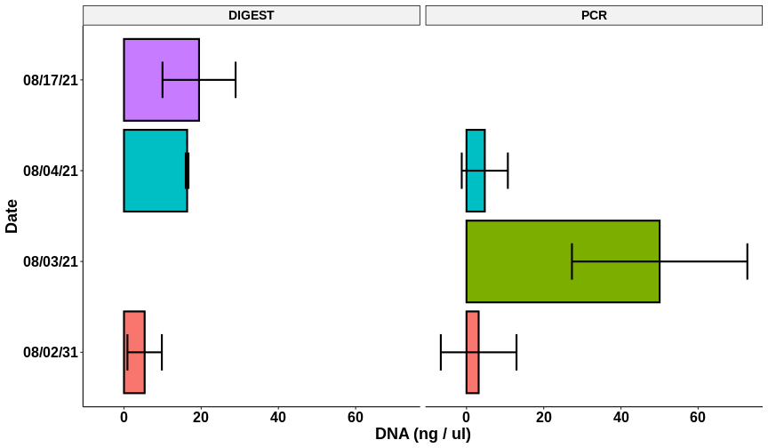
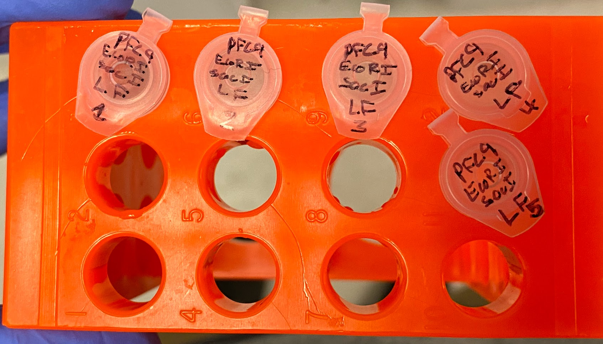
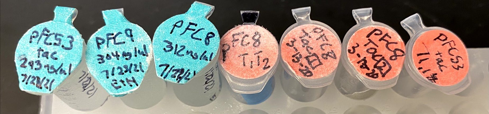

# pFC9 digest with EcoRI SacI and pFC sanger prep

Back from vacation and the inserts are on their way to Davis. Today I am
preparing more pFC9 large fragment for cloning via digestion with SacI
and EcoRI and agarose gel extraction.

## pFC9 digest protocol

Digest 1 ul pFC9 for 1.5 hours with SacI, then digest with EcoRI for 0.5 hrs.
Incubate at 37C in PCR machine. Extract large fragment using Zymoclean DNA recovery protocol.

### Reagents

Split into 5 seperate reactions for incubation. Total DNA per reaction
is then 1 ug.

| Reagent         | Volume (ul) |
| --------------- | ----------- |
| pFC89           | 16.4        |
| SacI-HF         | 5           |
| EcoRI-HF        | 5           |
| Cutsmart buffer | 25          |
| H20             | 198.6       |

### Agarose gel pours

Poured agarose gel very thin, 25 ul per gel. Hopefully will reduce amount of gel during extraction but probably need to split samples
as I don't think the 50ul volume will fit into one lane.

Tested gels after set with loading dye to measure capacity and was
only about 15 ul per lane. Re-poured gels with similar depth but larger
wells (6 per gel).

### Gel extraction

Gel extraction went pretty well. Bit heavier on the agarose then I would have liked but this is
the cost of using the large wells even with thin pours.

| Sample | Agarose mass (g) |
| ------ | ---------------- |
| 1      | 0.154            |
| 2      | 0.173            |
| 3      | 0.165            |
| 4      | 0.150            |
| 5      | 0.147            |

### Nanodrop results

| Sample | DNA ng/ul | 260/280 | 260/230 | Volume (ul) | DNA mass (ng) |
| ------ | --------- | ------- | ------- | ----------- | ------------- |
| 1      | 27.1      | 1.226   | 0.027   | 14          | 379.4         |
| 2      | 29.3      | 1.285   | 0.027   | 14          | 410.2         |
| 3      | 21.7      | 1.116   | 0.040   | 14          | 303.8         |
| 4      | 8.6       | 1.333   | 0.043   | 14          | 120.4         |
| 5      | 10.5      | 1.117   | 0.063   | 14          | 147           |

While the ratios are still similar to previous results the efficiency
of recovery is definitely better. I am pretty happy with these results
and plan to use these samples for cloning moving forward.

Plots produced using [this Jupyter notebook](notebooks/Agarose_gel_extractions.ipynb).

Image of all completed samples. All samples placed into the `VR-inserts` box.

## Sanger prep

I also prepared a number of pFC$_n$ samples for Sanger sequencing.
This was the first time I have done this so I have complied a list of
notes for future sequencing jobs.

- The lab generally used [Quintara Bio](https://www.quintarabio.com/)
  for all Sanger work. They have a pickup box in LSB Monday, Wednesday and Friday. Pick up time is 5pm.
- When prepping samples only include *one* primer.
  
I created this [google sheet](https://docs.google.com/spreadsheets/d/14LjpJSkiA-oPS-KEz1mo4wCLo4d90pHl8FkdC7rvQTM/edit?usp=sharing) for
Sanger sequencing sample prep calculations and includes the samples
I prepped today but this information is also included below.

### Sanger samples

Following samples were included for sequencing.

| Plasmid       | Concentration (ng / ul) | Forward primer                | Forward primer concentration |
| ------------- | ----------------------- | ----------------------------- | ---------------------------- |
| pFC53tac(EH)  | 300                     | pFC8tac_tac_promoter_Primer_1 | 10                           |
| pFC9(EH)      | 300                     | pFC9_t7_primer_1              | 10                           |
| pFC8(EH)      | 293                     | pFC9_t7_primer_1              | 10                           |
| pFC8T1T2(RL)  | 250                     | pFC8tac_tac_promoter_Primer_1 | 10                           |
| pFC8tacI(RL)  | 700                     | pFC8tac_tac_promoter_Primer_1 | 10                           |
| pFC8tacII(RL) | 320                     | pFC8tac_tac_promoter_Primer_1 | 10                           |
| pFC53T1T2(RL) | 123                     | pFC8tac_tac_promoter_Primer_1 | 10                           |

| Plasmid       | Plasmid volume (ul) | H20         | Forward primer volume (ul) | Total volume | Label |
| ------------- | ------------------- | ----------- | -------------------------- | ------------ | ----- |
| pFC53tac(EH)  | 4                   | 8.5         | 2.5                        | 15           | 1     |
| pFC9(EH)      | 4                   | 8.5         | 2.5                        | 15           | 2     |
| pFC8(EH)      | 4.09556314          | 8.40443686  | 2.5                        | 15           | 3     |
| pFC8T1T2(RL)  | 4.8                 | 7.7         | 2.5                        | 15           | 4     |
| pFC8tacI(RL)  | 1.714285714         | 10.78571429 | 2.5                        | 15           | 5     |
| pFC8tacII(RL) | 3.75                | 8.75        | 2.5                        | 15           | 6     |
| pFC53T1T2(RL) | 9.756097561         | 2.743902439 | 2.5                        | 15           | 7     |

Image of all samples from right to left same order as table above.

### Order information

Samples are only picked up on Monday, Wednesday and Friday so I placed
into freezer for storage overnight. The order form included with the
samples is [at this link](documents/quintara_sanger_8-17-21.pdf). 

