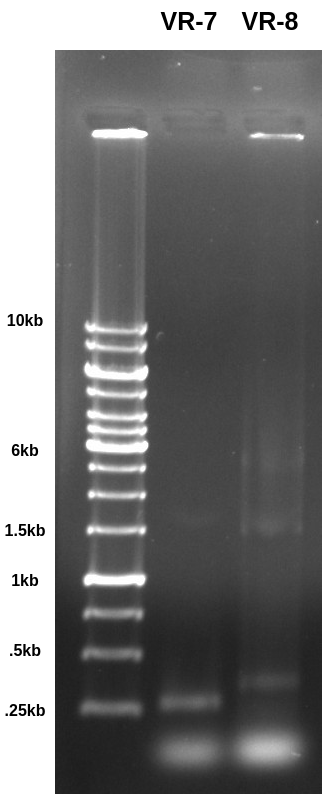
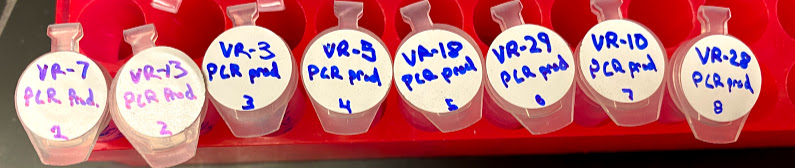
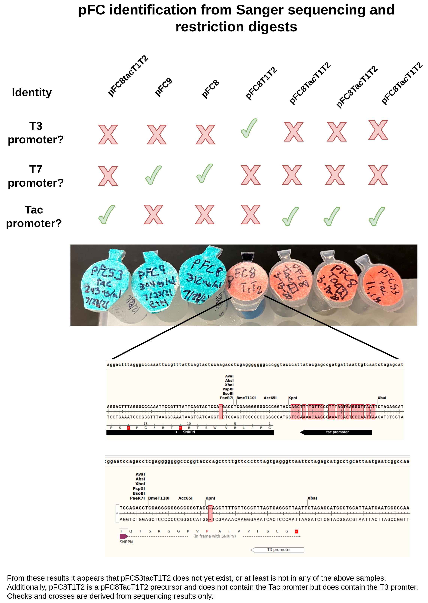
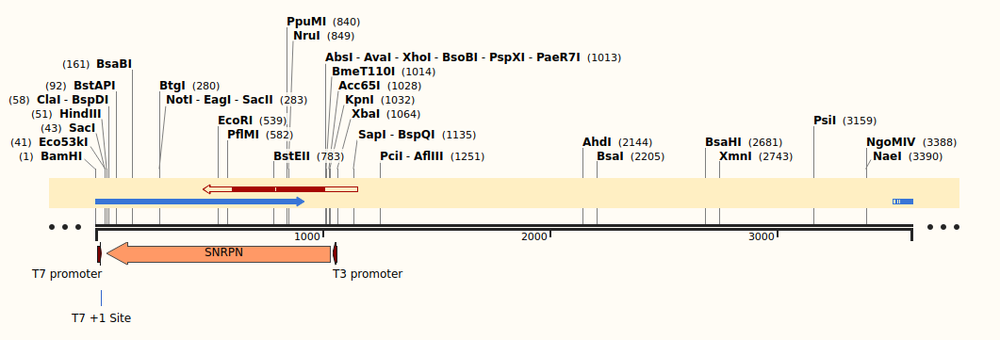

# VR inserts quality checks continued

## PCR results

Ran PCR from [yesterday](13_8-18-21.md) out on 0.8 agarose TAE
gel at 120V for 1hr.

VR-7 is a fragment while VR-8 is a included as part of a vector.
Both were PCR amplified with primers that should produce ~280bp
fragments. The band is basically right where I would expect it
for the VR-7 sample but a but higher for VR-8 which is
making me think maybe something else is included when in the
vector form? Not sure about that. Need to digest with BglII and
see what the results look like.

Also it seems like a lot of something got stuck in both the
ladder and VR-8 lanes. Not sure exactly what that signal is coming from and why the it would not be seen in the VR-7 lane.

## PCR of VR$_n$ fragments for sequencing

Given the results in the gel above, I am planning on submitting several VR
fragments and vectors for Sanger sequencing to "trust but verify" and 
hopefully determine what may be causing the discrepancy in lengths. While there
is plenty of vector inserts to send directly for sequencing, there is far less
fragment to go around. So I am using the VR insert targeting primers to
amplify 8 fragments and then will clean up the results and send the amplicons
for sequencing.

### PCR reactions

PCR reactions and reagents are recorded in [this spreadsheet](https://docs.google.com/spreadsheets/d/1C9dQ5NALOPIBd9vnqTwMcuQwFouvtItC6r6D7yj8_8g/edit?usp=sharing).
VR inserts that were amplified and their sample numbers are listed in the
table below.

| DNA template | Concentration (ng/ul) | ng DNA per reaction | Sample number |
|--------------|-----------------------|---------------------|---------------|
| VR-7         |                    50 |                  15 |             1 |
| VR-13        |                    50 |                  15 |             2 |
| VR-3         |                    50 |                  15 |             3 |
| VR-6         |                    50 |                  15 |             4 |
| VR-18        |                    50 |                  15 |             5 |
| VR-29        |                    50 |                  15 |             6 |
| VR-10        |                    50 |                  15 |             7 |
| VR-28        |                    50 |                  15 |             8 |

After PCR was completed, cleaned up each reaction by following the 
Zymogen DNA cleanup kit protocol. Then I nanodroped all samples results
are shown in the table below

| Insert | ng/ul | 260/280 | 260/230 | Sample volume (ul) |
|--------|-------|---------|---------|--------------------|
| VR-7   | 151.6 | 2.195   | 2.857   | 25                 |
| VR-13  | 108   | 2.139   | 3.487   | 26                 |
| VR-3   | 166.6 | 2.33    | 2.68    | 27                 |
| VR-6   | 120.5 | 2.171   | 2.802   | 28                 |
| VR-18  | 81.7  | 2.033   | 2.112   | 29                 |
| VR-29  | 149.9 | 2.175   | 2.401   | 30                 |
| VR-10  | 199.9 | 2.338   | 2.721   | 31                 |
| VR-28  | 39.2  | 1.989   | 2.418   | 32                 |

Overall I am very happy with these results. There is plenty of DNA
to prepare for sequencing tomorrow.

I put all samples into the VR inserts box on my shelf in the kitchen freezer. Image of the samples is shown below.

### Vector inserts

While I did not do any prep for these because they have much higher
concentrations then fragment inserts I will prep VR 12, 17, 27, 4, and 8 for sequencing tomorrow.

## Gibson assembly reagent prep

For preparing insert vectors I think it would be best to
make my own Gibson reagents as buying the premixed stuff comes
out to a pretty significant cost per reaction. I created this
[Gibson assembly spreadsheet](https://docs.google.com/spreadsheets/d/1Dd30Xx1bssh19DX4bBkxRS1dTOeNpFEqQdiE2VyVzRM/edit?usp=sharing) to calculate reagent amounts
for both isothermal buffer and the master mix. Typical values
for 5x isothermal buffer and Gibson master mix are included in
the tables below.

5x Isothermal buffer.

| Reagent       | Concentration | Unit             | Volume stock (ul) |
|---------------|---------------|------------------|-------------------|
| Tris-HCL      |           500 | mM               |               625 |
| MgCl2         |            50 | mM               |               125 |
| PEG-8000      |            25 | %                |       833.3333333 |
| NAD           |             5 | mM               |               250 |
| dNTPs         |             1 | mM               |               250 |
| PCR grade H20 | NA            | NA               |       416.6666667 |
|               |               | Grand total (ml) |               2.5 |

Gibson assembly master mix.

| Reagent              | Concentration | Unit             | Volume stock (ul) |
|----------------------|---------------|------------------|-------------------|
| Taq ligase           |             5 | units/ul         |            46.875 |
| 5x isothermal buffer |             1 | X                |                75 |
| DNA polymerase       |           0.2 | units/ul         |                15 |
| T5 exonuclease       |         0.005 | units/ul         |            0.1875 |
| PCR grade H20        | NA            | NA               |          237.9375 |
|                      |               | Grand Total      |               375 |
|                      |               | Grand total (ml) |               2.5 |

## Sanger sequencing results and pFC identification

Got sequencing results that were submitted [yesterday](13_8-18-21.md) and
prepared on [Tuesday](12_8-17-21.md) back. Raw data is stored in google
drive and is available [at this link](https://drive.google.com/drive/folders/12SuKprd8IZldUCU92ORQxrR5gL5pHfgz?usp=sharing).

A summary of the results is below.

Alignment of pFC8 and pFC9 samples to pFC9 confirmed their respective
identities. In image below pFC8 is the blue arrow while pFC9 sample is the red
arrow.

