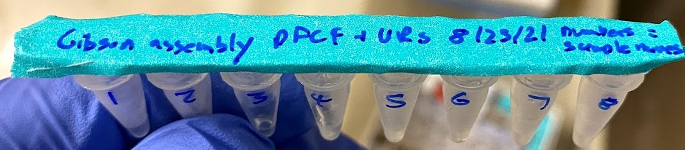
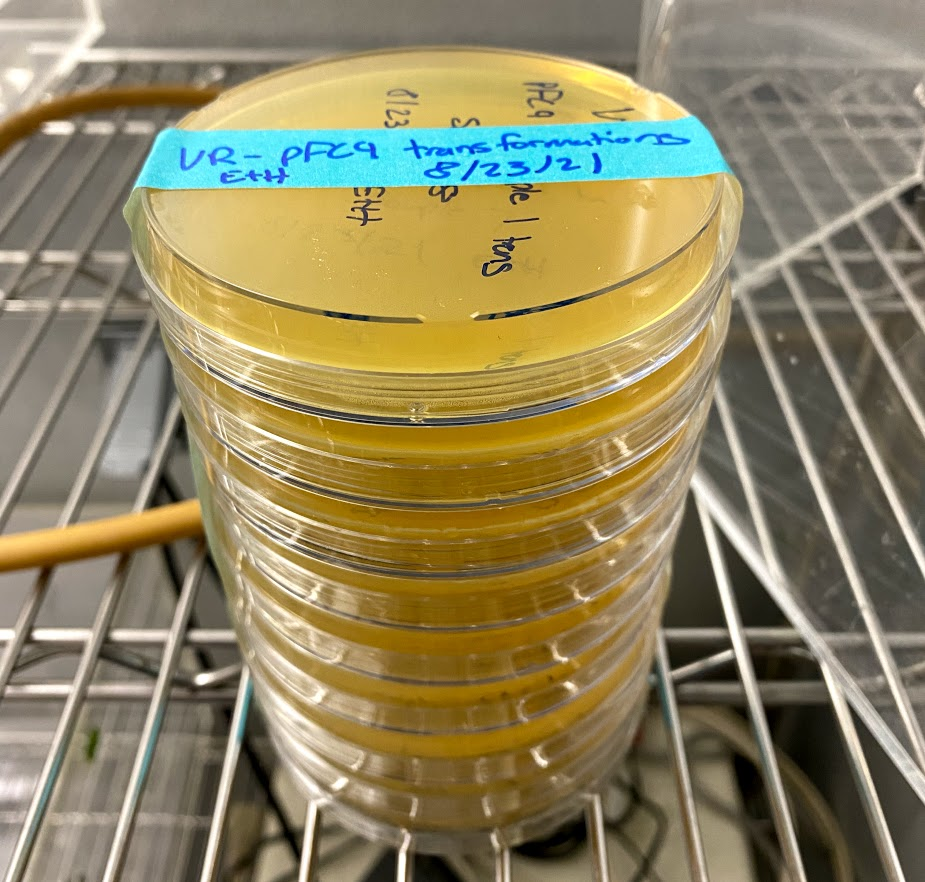
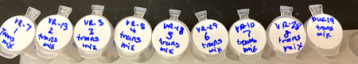
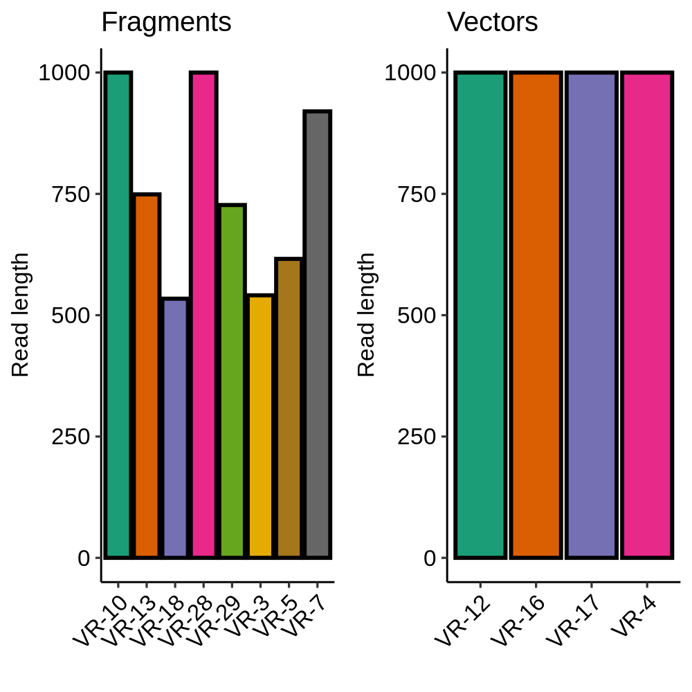
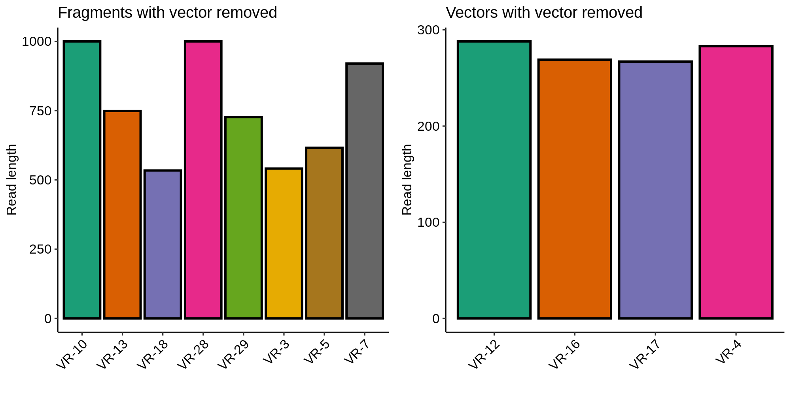
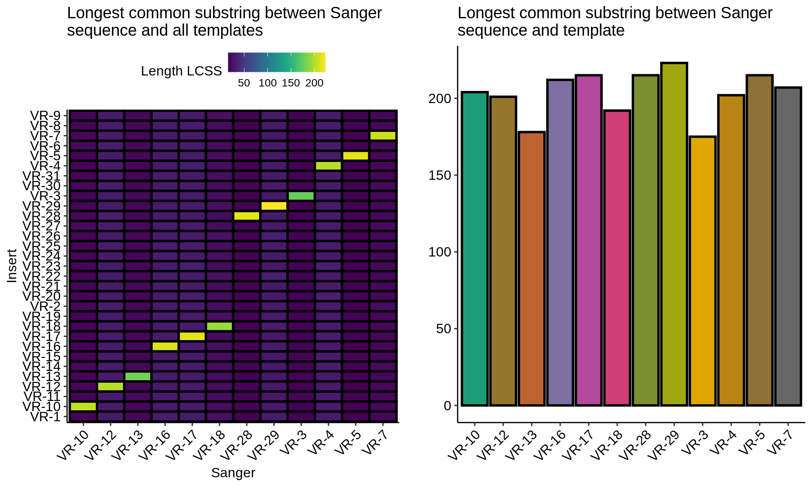
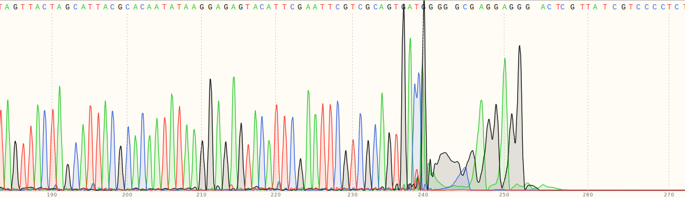

# VR-pFC9 Gibson assembly

Today I am using the VR PCR fragments I generated on [8/18/21](13_8-18-21.md)
and pFC9 large fragment sample 1 generated on [8/17/21](12_8-17-21.md) to
attempt to create pFC9 T7 initiation series constructs. 

## Gibson assembly reagents

I created a 5x isothermal buffer and 1.33x Gibson assembly master mix according
to the values described in [this spreadsheet](https://docs.google.com/spreadsheets/d/1Dd30Xx1bssh19DX4bBkxRS1dTOeNpFEqQdiE2VyVzRM/edit#gid=0). This spreadsheet is also where I will be stored all future Gibson assembly reactions.

## VR inserts

Inserts used for each reaction are listed in the table below.

| Fragment | Length | Concentration (ng/ul) | Sample number |
| -------- | ------ | --------------------- | ------------- |
| VR-7     | 281    | 151.6                 | 1             |
| VR-13    | 281    | 108                   | 2             |
| VR-3     | 281    | 166.6                 | 3             |
| VR-5     | 281    | 120.5                 | 4             |
| VR-18    | 281    | 81.7                  | 5             |
| VR-29    | 281    | 149.9                 | 6             |
| VR-10    | 281    | 199.9                 | 7             |
| VR-28    | 281    | 39.2                  | 8             |

### Gibson assembly reactions

All reagents for each reaction are described in [this spreadsheet](https://docs.google.com/spreadsheets/d/1Dd30Xx1bssh19DX4bBkxRS1dTOeNpFEqQdiE2VyVzRM/edit?usp=sharing). All samples
were incubated at 50C for 1hr. Extra Gibson reaction volumes were stored in the `VR inserts` box. Image of
all samples below.

### Transformation in chemically competent E. coli

Picked up chemically competent E. coli per Fred's recommendation
from Davis Scientific store. They only had one box of expired cells which I took but was not charged for (nice). Followed
transformation protocol that was included with the cells and
utilized the provided positive control DNA in addition to my
own samples. Each aliquot of cells was transformed with 5ul
of Gibson reaction.

Plated each sample onto agar with Amp and placed into 37C incubation room
at ~4:30 pm. 

Additional transformed cells were placed at 4C in the deli fridge for possible
use tomorrow as per the included chemically competent cell protocol.

## VR fragment and vector sanger results

On [Friday](14_8-19-21.md) I submitted a number of samples for
Sanger sequencing to double check Thermo's work and ensure
correct insert sequence was included in each vector.

Removing vector sequences corrected the lengths of inserts included
as part of a vector and did not affect fragments (as expected). This also ruled out contamination of the long fragments with
vector sequence.

Finding the longest common substring between Sanger sequences
and VR insert templates showed that all sequences are labeled
correctly and contain the correct sequences.

However this still left the question of why the fragments were
more than double the length than I was expected them to be
based on the gel I ran before submitting them for sequencing. What I should have done first was check the *entire* chromatogram
for at least a couple of the sequences. 

As you can see in the image above from VR-10 the signal completly
dies after ~260 bp. Which is just about the length we would expect
given the primer used. Overall the conclusion is that the gel
showing different lengths for VR-7 and VR-8 was weird, but
sequencing shows that everything is as expected. The Jupyter notebook and the seqeuncing data used to generate
the plots above can be found in [notebooks/VR-insert-sanger-verification](notebooks/VR-insert-sanger-verification). 

