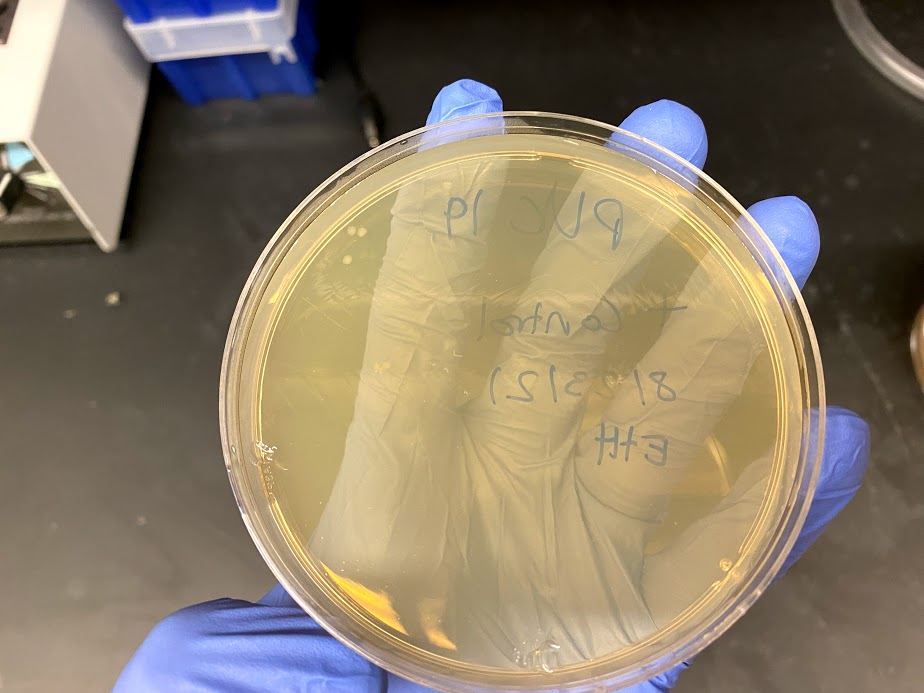
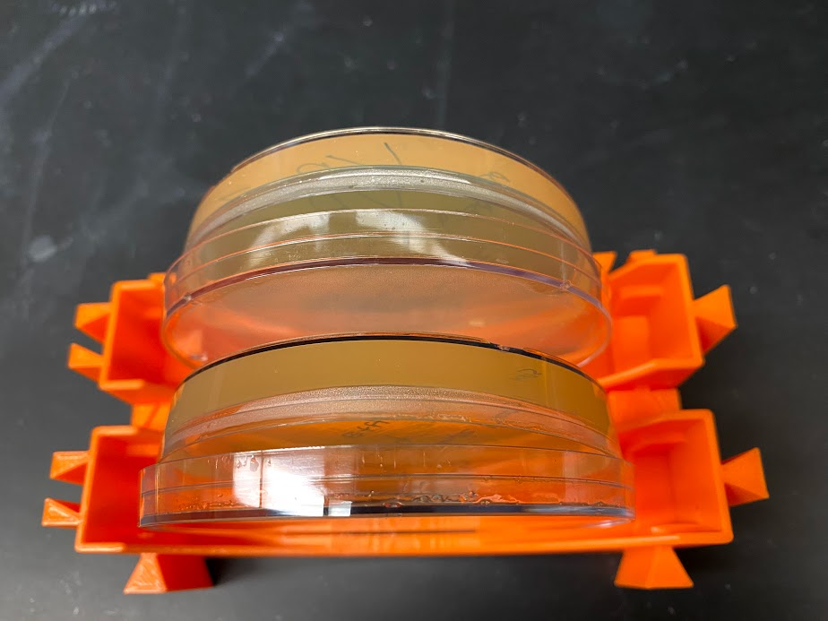

# VR-pFC9 Gibson assembly continued

Continuing Gibson assembly I started [yesterday](15_8-23-21.md) with
chemically competent cells.

## Transformation results

The cells seem to still be viable despite being 4 years expired,
although they may be extra sensitive to mechanical lysis and/or
temperature changes as success rate of transformation was about
50%. The pUC13 control DNA provided as part of the kit was able
to transform bacteria confirming their viability independently of Gibson assembly plasmids.

| Insert | Transformation successful? |
| ------ | -------------------------- |
| VR-29  | 1                          |
| VR-8   | 1                          |
| VR-13  | 1                          |
| VR-3   | 1                          |
| VR-10  | 0                          |
| VR-7   | 0                          |
| VR-5   | 0                          |
| VR-18  | 0                          |

I think this may have been due to my handling of the cells. Even 
though I was careful I did introduce a few bubbles into some
samples. Today I will repeat transformation protocol for inserts
that failed to transform pFC9 from the Gibson assembly products.

## Culture successful transformations

I extracted single colonies from successful transformations
into 500 ml of LB broth with 100 ug/ml of ampicillin. I placed these
cultures in the 37C hot room to incubate overnight at 11:45 AM.

## Redo failed transformations

I repeated the protocol included with the chemically competent cells
for the transformations that failed (VR 10, 7, 5 and 8) using the
extra Gibson assembly products I produced [yesterday](15_8-23-21.md).
I plated these 4 samples and placed into 37C hot room at 1:25 PM
to incubate overnight.

## Modular 3D printed plate holder is too large

The modular version of the petri dish holder I printed yesterday
is too large for the plates I normally use :(

The dovetails do seem to work well though.

## PCR all additional VR inserts

After plating the reattempted transformations I started a PCR reaction
described at [this spreadsheet page "8-24-21 Big VR PCR"](https://docs.google.com/spreadsheets/d/1C9dQ5NALOPIBd9vnqTwMcuQwFouvtItC6r6D7yj8_8g/edit?usp=sharing) to amplify all VR inserts that I have not previously amplified.