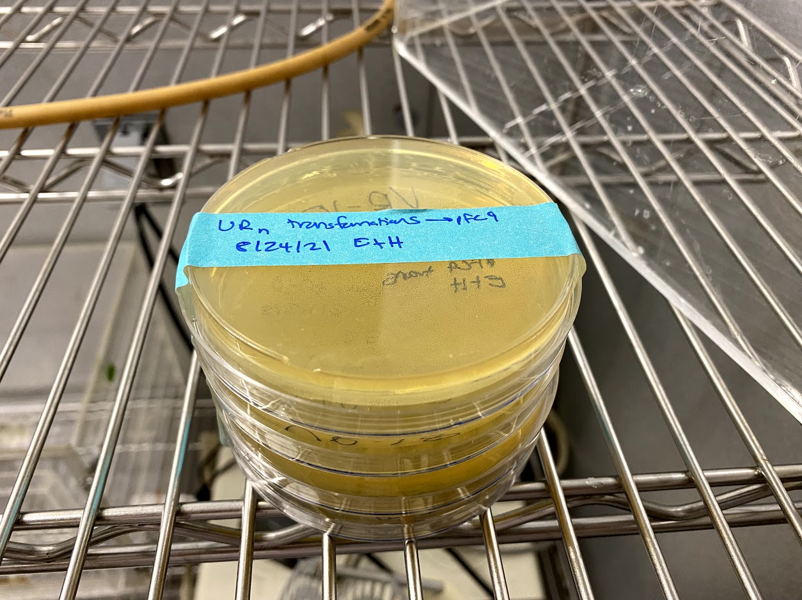
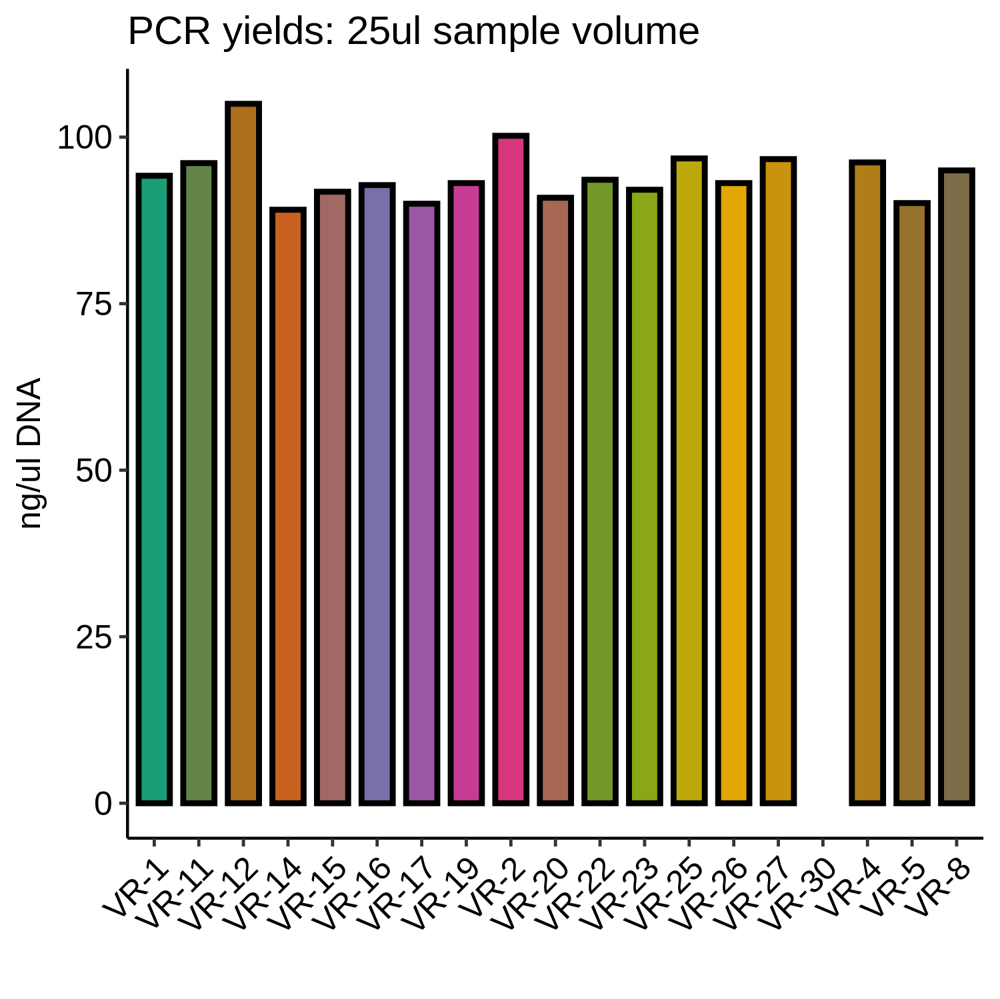
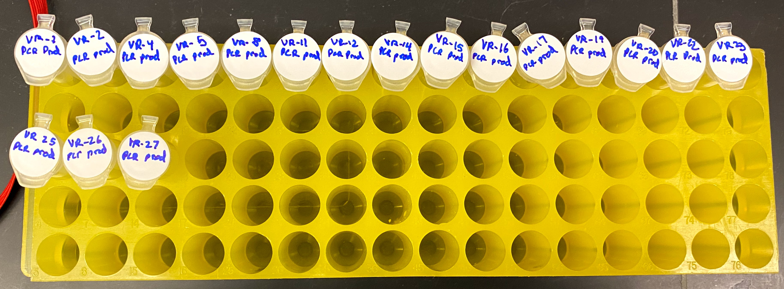

# VR-pFC9 Gibson assembly continued

Continuing Gibson assembly I started [yesterday](15_8-23-21.md) with
chemically competent cells.

## Transformation results

The cells seem to still be viable despite being 4 years expired,
although they may be extra sensitive to mechanical lysis and/or
temperature changes as success rate of transformation was about
50%. The pUC13 control DNA provided as part of the kit was able
to transform bacteria confirming their viability independently of Gibson assembly plasmids.

| Insert | Transformation successful? |
| ------ | -------------------------- |
| VR-29  | 1                          |
| VR-8   | 1                          |
| VR-13  | 1                          |
| VR-3   | 1                          |
| VR-10  | 0                          |
| VR-7   | 0                          |
| VR-5   | 0                          |
| VR-18  | 0                          |

I think this may have been due to my handling of the cells. Even 
though I was careful I did introduce a few bubbles into some
samples. Today I will repeat transformation protocol for inserts
that failed to transform pFC9 from the Gibson assembly products.

## Culture successful transformations

I extracted single colonies from successful transformations
into 500 ml of LB broth with 100 ug/ml of ampicillin. I placed these
cultures in the 37C hot room to incubate overnight at 11:45 AM.

## Redo failed transformations

I repeated the protocol included with the chemically competent cells
for the transformations that failed (VR 10, 7, 5 and 8) using the
extra Gibson assembly products I produced [yesterday](15_8-23-21.md).
I plated these 4 samples and placed into 37C hot room at 1:25 PM
to incubate overnight.

## Modular 3D printed plate holder is too large

The modular version of the petri dish holder I printed yesterday
is too large for the plates I normally use :(

The dovetails do seem to work well though.

## PCR all additional VR inserts

After plating the reattempted transformations I started a PCR reaction
described at [this spreadsheet page "8-24-21 Big VR PCR"](https://docs.google.com/spreadsheets/d/1C9dQ5NALOPIBd9vnqTwMcuQwFouvtItC6r6D7yj8_8g/edit?usp=sharing) to amplify all VR inserts that I have not previously amplified.

### Nanodrop measurements

Below is table of nanodrop results of the unpurified PCR products.

| Insert | ng/ul | 26/280 | 260/230 |
| ------ | ----- | ------ | ------- |
| VR-1   | 94.2  | 0.832  | 0.19    |
| VR-2   | 100.2 | 0.87   | 0.197   |
| VR-4   | 96.2  | 0.854  | 0.195   |
| VR-5   | 90.1  | 0.804  | 0.181   |
| VR-8   | 95    | 0.857  | 0.196   |
| VR-11  | 96.1  | 0.846  | 0.187   |
| VR-12  | 105   | 0.901  | 0.199   |
| VR-14  | 89.1  | 0.836  | 0.189   |
| VR-15  | 91.8  | 0.836  | 0.191   |
| VR-16  | 92.8  | 0.841  | 0.19    |
| VR-17  | 90    | 0.838  | 0.19    |
| VR-19  | 93.1  | 0.915  | 0.192   |
| VR-20  | 90.9  | 0.842  | 0.188   |
| VR-22  | 93.6  | 0.837  | 0.222   |
| VR-23  | 92.1  | 0.847  | 0.191   |
| VR-25  | 96.8  | 0.839  | 0.191   |

VR-30 evaporated or something? It was the last sample I transferred
out from the PCR plate and there was almost nothing in there, maybe
a microliter of sample. I placed all samples into a new box in the
kitchen freezer called `VR Inserts 2`. All samples added to the box
are shown in the image below.

I am waiting on the Zymogen PCR cleanup spin columns to arrive before
I purify and then run all the purified products on gel.v
