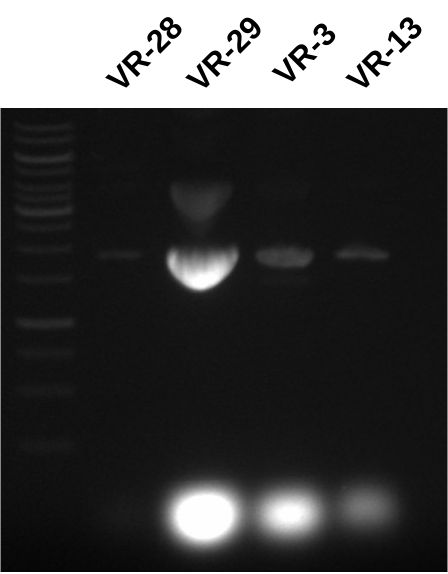

# VR transformation midi preps

Picked up cultures in the morning around 7:10 AM. VR-7 culture failed
to grow but all others were successful. Also checked on the transformation plates and VR-7 and 18 failed to transform while VR-5 and 10 were successful.

## Midi preps

In order to avoid purchasing a large number of DNA purification columns
I am using the [lab midi-prep protocol](https://docs.google.com/document/d/19i-aIjbmIZrZ8iP5_cozzsLwRFM9bkGq/edit?usp=sharing&ouid=102107235715896780978&rtpof=true&sd=true) which does not utilize columns. Midi prep went well, was running low on P1 reagent with RNaseA at one point and had to make more. Used RNaseA from Rachel's box for the remaining samples. 

### Midi prep results

Nanodrop results for each transformation are below.

| Plasmid  | ng/ul | 260/280 | 260/250 |
| -------- | ----- | ------- | ------- |
| pFC9VR28 | 570   | 1.986   | 2.284   |
| pFC9VR29 | --    | --      | --      |
| pFC9VR3  | --    | --      | --      |
| pFC9VR13 | --    | --      | --      |

Nanodrop failed to read any values from VR-29, 3 or 13 samples. I
thought this might be due to contamination and hoped that there
was actually some DNA in these samples so I ran everything out
on a gel.

While VR-28 looks good (as expected since nanodrop curve looked good)
rest of the samples have very high RNA contamination. I am guessing
that the RNAseA I added to the new batch of buffer P1 either was not actually RNaseA or I did not actually add it (pretty sure I did though), or I did not add enough. Good news is this can be cleaned
up with RNAseA digestions in the future.

## Advice from Fred for future plasmid preps

Fred advised in the future after Gibson assembly of fragments
to do *mini*preps first on as many transformed colonies from each
sample as possible and then blowing these up to midi preps after
confirming via Sanger that the insert actually made it into the
plasmid backbone. This is definitely a much better strategy and I
will be doing this moving forward.

