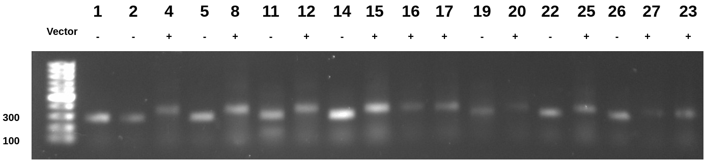
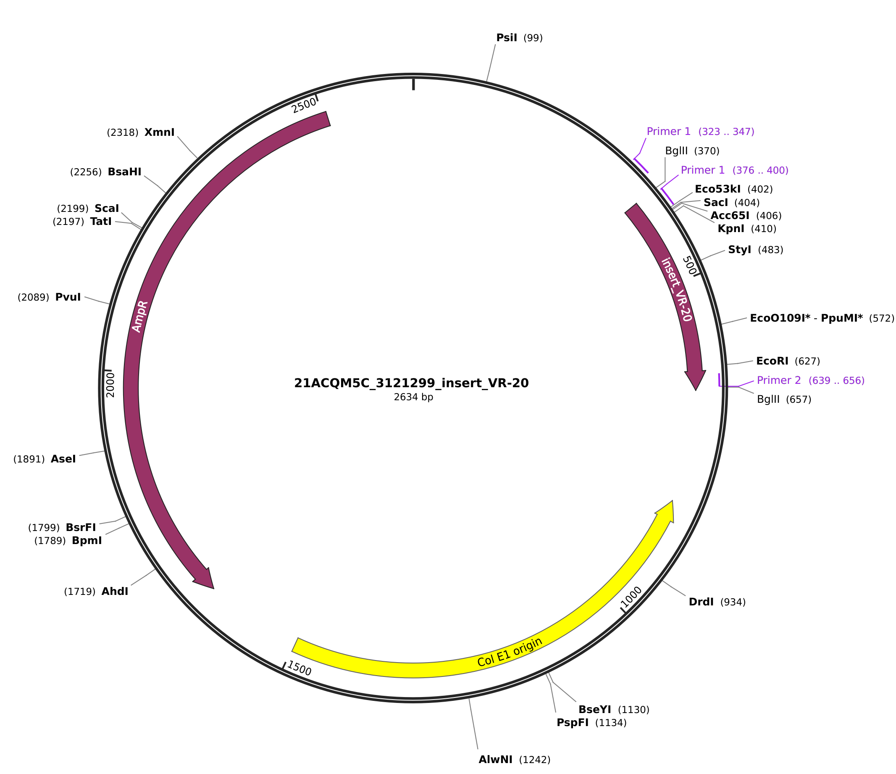

# VR PCR product cleanup

Used openwetware protocol for PCR product cleanup

TAE gel 120 V for 45 mins.

## The cause of shifted vector vs fragment bands

pFC9 was created from some backbone vector by cloning in the SNRPN
gene. Primer 1 targets the homology region of VR inserts which
is part of the pFC9 backbone. The vector used by Thermo to clone
in these fragments contains this same sequence meaning the primer 1
has two binding sites, one just upstream of the VR insert.

