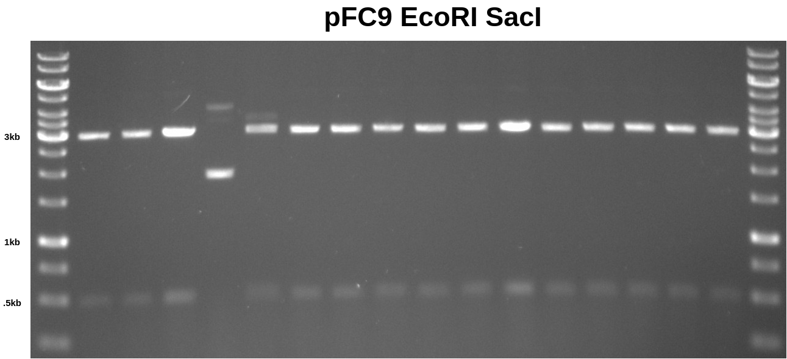
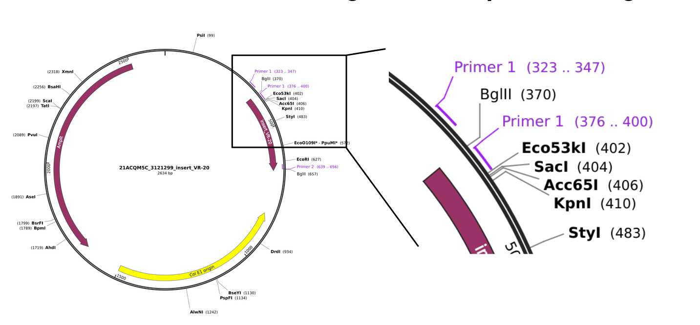

# pFC9 EcoRI SacI digest

In preparation for upcoming Gibson assembly reactions I needed to make
more pFC9 large fragment. I digested pFC9 in 50ul volumes containing
1ug of plasmid. Below is 0.8 TAE gel of 5ul aliquots of each sample.

I discarded sample 4 (4th lane) and sample 5 (5th lane) due to the apparent
under-digestion. I stored the remaining ~45ul of each sample in the VR inserts
2 box at -20C for later agarose gel purification of the large fragments.

## Explanation of differences between PCR amplified vectors and inserts

It turns out that the backbone used for pFC9 is the same plasmid that thermo
used for cloning these inserts. This means that the homology arms used for Gibson
assembly that target the backbone (5' homology arm) occur once in the insert
and once in the thermo vector. This means that the forward primer for amplifying
fragments actually has **two** binding sites for vectors but only one for
fragments.

This results in vector amplified fragments being noticeably longer than fragment
amplified vectors. This then requires digestion with BglII. 