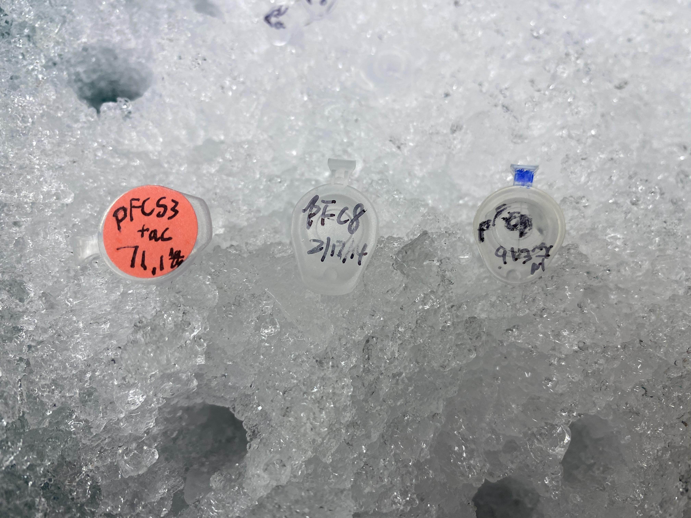
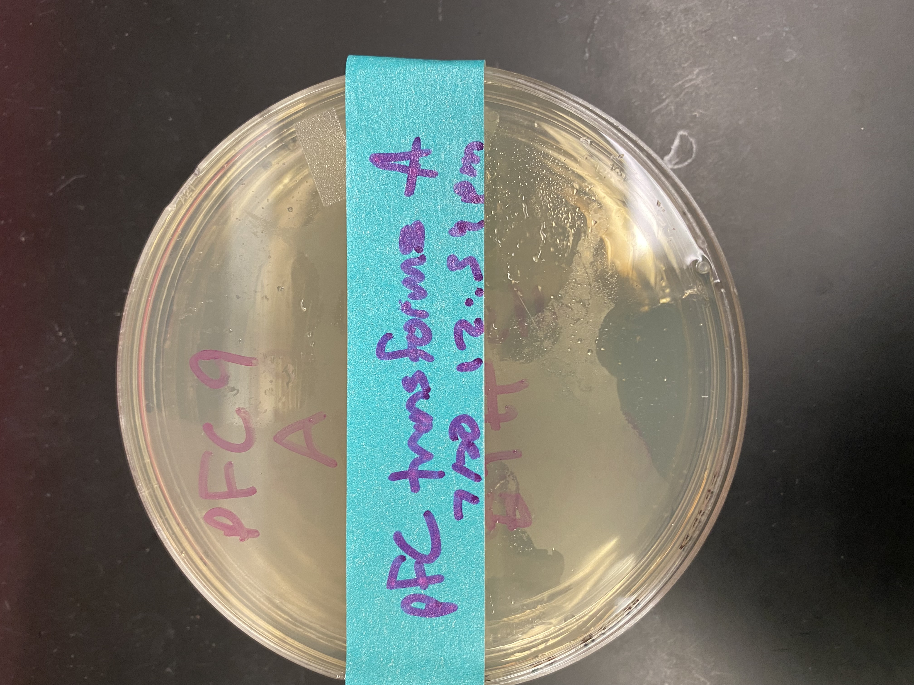
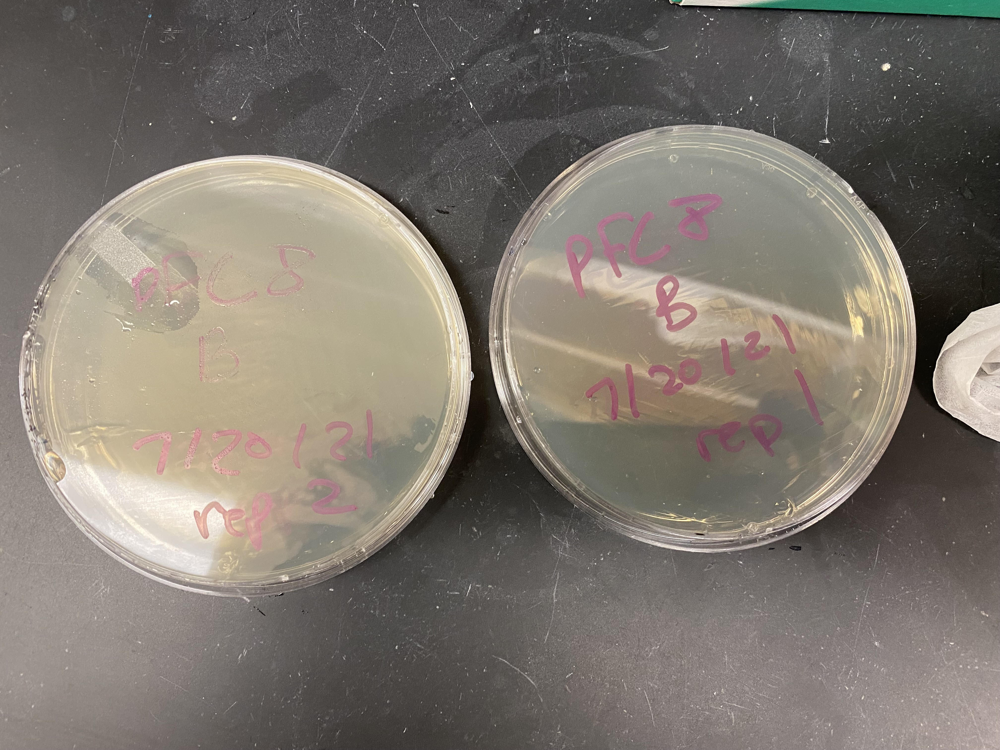

# pFC8, 9 and pFC53Tac transformation

pFC8, 9 and 53TacT1T2 are backbones for upcoming insert cloning experiments.
Here I am transforming E. coli to produce more of each plasmid.

## Protocol

Followed this [lab electroporation protocol](documents/Electroporation_of_E.coli.doc.pdf).

### DNA

Measured DNA concentrations using nanodrop for each plasmid which are listed in the table below.

| Plasmid  | ng / ul |
| -------- | ------- |
| pFC8     | 922     |
| pFC9     | 1000    |
| pFC53Tac | 100     |

Image of plasmids used.

pFC8 and pFC9 were both diluted to a concentration of 100 mg / ul. 100 ng of DNA from each plasmid was used for the transformation.

During the first electroporation pFC8 arced and the bacteria were destroyed. I continued the protocol with the
pFC53Tac and pFC9 samples and plated each on ampicilin agarose gel and left to incubate overnight at 37 C. These plates became the "A" samples.

I then repeated the electro-poration protocol with three new samples (one of each plasmid) to both make up for the
fact the pFC8 bacteria were zapped and serve as replicates for the others in case something went wrong with the first batch, these became the "B" samples. When pulsing the B samples both pFC9 and pFC53Tac arced and so I was unable to do any replicates for those plasmids but thankfully pFC8 survived and so at least one of each plasmid transformation was plated. I plated the pulsed pFC8 cells onto two separate plates; rep 1 and 2 shown in the image below.

| Series | Plasmid  | Replicate | Incubation start (pm) |
| ------ | -------- | --------- | --------------------- |
| A      | pFC9     | 1         | 12:40                 |
| A      | pFC53Tac | 1         | 12:40                 |
| B      | pFC8     | 1         | 1:10                  |
| B      | pFC8     | 2         | 1:10                  |

Tomorrow I will check on the colonies in the morning and
growing any survivors up over the next 24 hours.
