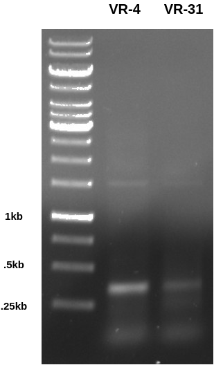
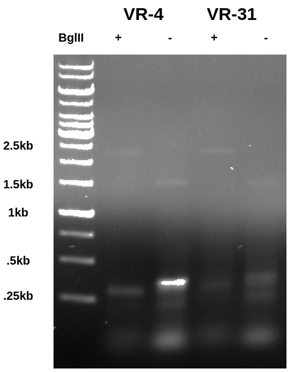
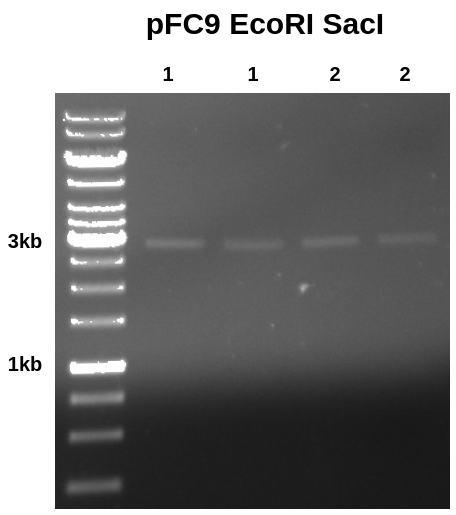
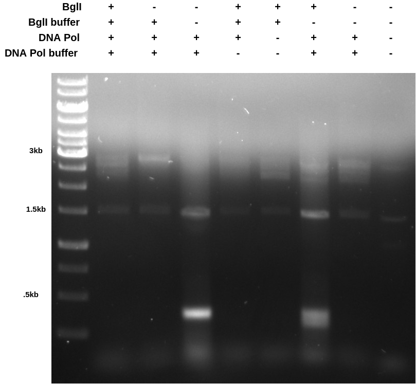

# BglII digests and one-pot PCR BglII digest

Following up from [Saturday](19_8-28-21.md) I
purchased Bgl*II* from the sci store in the morning. Today I am testing digestion of PCR vector fragments with BglII and accessing if
it is possible to do a BglII digestion followed by PCR in the same tube.

## BglII digests

First set up a PCR reaction with VR-4 and VR-31
to create amplicons that contain the repeated
homology motif and subsequently one BglII
site. Ran the gel below (0.8 agarose in TAE at 120V for 45 mins) to confirm
that the PCR worked correctly.

After confirming PCR worked I digested alliquotes of each sample with BglII
overnight at room temperature (was leaving the lab at the time reaction was
ready to go). I then ran the gel the next day (I know this is slightly out
of order but makes more sense to put in these notes.) The gel below was run at
150V because I was in a hurry to get out of the lab (was getting late) and
this ended up causing a pretty annoying amount of smearing. In the future
I will max out voltage at 130 with 120 being a normal running voltage and 100
being for extra special gels.

In the BglII digested lane the PCR product is
shifted downwards indicating the BglII was capable
of digesting the PCR product despite the close
proximity of the recognition sequence to the end of the fragment. Additionally if you look closely
you can see a band at 1.5kb in the undigested lane that seems to shift up to 2.5kb in the digested lane.
This is the vector which is intact and supercoiled in the undigested samples
but is then linearized in the BglII digested lane.

## pFC9 SacI EcoRI large fragment extraction "Freeze and squeeze"

I wanted to test the [freeze and squeeze](https://www.youtube.com/watch?v=b3wfhofZJSI) method of DNA extraction from agarose gels. To test I selected two unpurified pFC9 SacI EcoRI
digestions from [8/17/21](12_8-17-21.md)

## Extraction results

Yield was modest but considering the overall volume acceptable for a first
attempt. I think some amount of DNA was lost when loading the gel, as I was
really trying to squeeze sample into small wells and I noticed at least
some degree of overflow / spilling when loading the wells and moving
the box over to the power supply.

| Sample | ng/ul |
|--------|-------|
| 1-1    | 20.6  |
| 1-2    | 6.9   |
| 2-1    | 3.7   |
| 2-2    | 3.2   |

I then ran 10 ul aliquots of each sample out on a gel.

Results looks clean with band where it should be, additionally the intensity of
each band does not look that different to me despite the nanodrop measuring
sample 1-1 (lane 1) to have about 4x the amount of DNA as all other samples.

## PCR BglII digest experiments

[Link to protocol spreadsheet](https://docs.google.com/spreadsheets/d/1heigmyT47i7k8DykecSWknJY0t6LkyB3aOdmKK1iBn4/edit?usp=sharing).

These results were somewhat confusing but it seems to me that DNA polymerase
may not be compatible with the BglII buffer. In the future I will just run the
PCR reaction first, then dilute the reaction to a total volume of 50 ul and
and BglII and buffer.