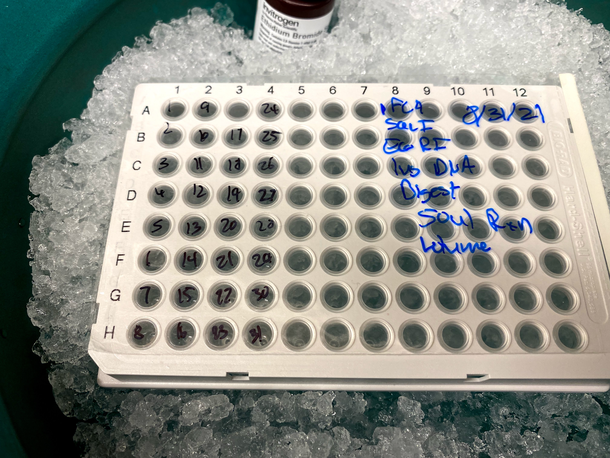
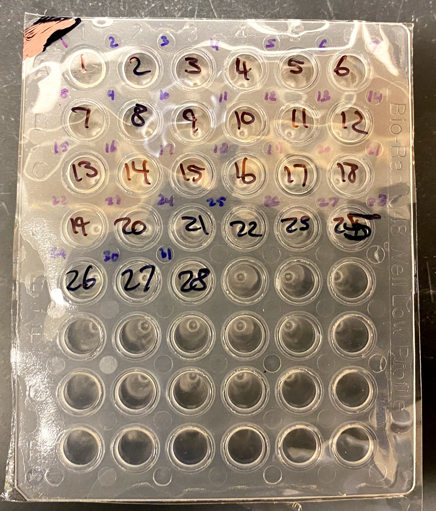

# pFC9 EcoRI SacI digestion, purification, and big VR PCR

## pFC9 EcoRI SacI LF agarose gel extraction

I extracted the remaining pFC9 EcoRI SacI digested samples using the freeze
and squeeze method, then combined all samples together into one tube. Final
concentration was 9.6 ng / ul with an approximate volume of 250 ul. This equates
to around a 30% recovery efficiency which is much lower than I was hoping for
but considering the amount of pFC9 that I have isn't actually that much of an
issue considering how easy freeze and squeeze makes the extraction process.

## pFC9 EcoRI SacI LF mass production

Digested a total of 36 ug of pFC9 with EcoRI and SacI in 36 wells (1ul per well,
1ul each enzyme, 50ul total reaction volume.)

Ran 5ul aliquots of each sample out on a gel to confirm that the digestion
was complete.

I combined all samples into same tube given the results and the complete 
digestions shown in the gel above. Planning on extracting these samples
tomorrow.

## VR PCR and BglII digestion

