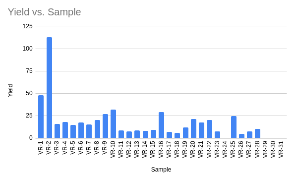
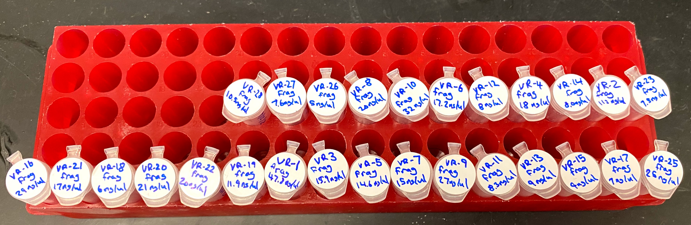
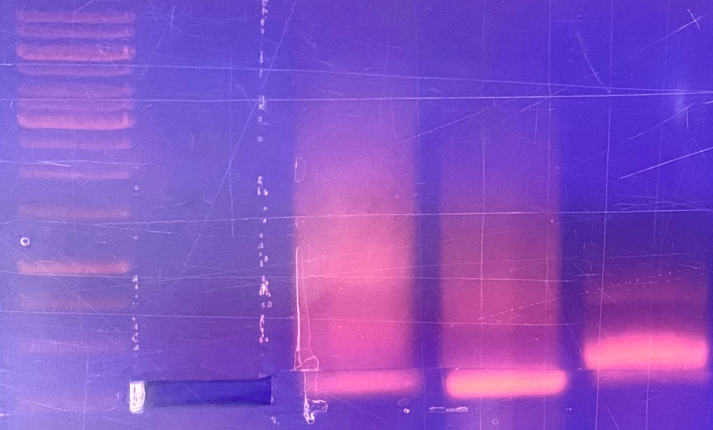

# More VR insert purifications

## Agarose purifications

Purfied most inserts (except 29-31 due to weird PCR issues shown in next section)
via agarose gel extraction using the freeze and squeeze method. 

| Sample | Yield | r_260_280 | r_260_230 |
|--------|-------|-----------|-----------|
| VR-1   |  47.8 |     1.816 |     0.064 |
| VR-2   | 112.9 |     1.824 |     0.439 |
| VR-3   |  15.9 |     1.138 |     0.164 |
| VR-4   |  18.1 |      1.09 |     0.196 |
| VR-5   |  14.6 |      0.88 |     0.145 |
| VR-6   |  17.2 |     1.411 |     0.251 |
| VR-7   |  15.1 |     1.493 |     0.321 |
| VR-8   |  20.3 |     1.285 |     0.208 |
| VR-9   |  26.9 |     1.352 |     0.216 |
| VR-10  |  31.7 |     1.609 |     0.335 |
| VR-11  |   8.8 |     1.207 |     0.349 |
| VR-12  |   7.6 |     1.358 |      0.33 |
| VR-13  |   8.6 |     1.332 |     0.238 |
| VR-14  |     8 |      1.23 |     0.243 |
| VR-15  |   8.9 |     1.512 |     0.425 |
| VR-16  |  28.8 |     1.512 |      0.33 |
| VR-17  |   7.1 |     1.574 |     0.455 |
| VR-18  |   5.8 |     1.545 |     0.565 |
| VR-19  |  11.9 |     1.521 |     0.434 |
| VR-20  |  21.2 |     1.608 |     0.242 |
| VR-21  |  17.4 |     1.607 |     0.459 |
| VR-22  |  20.4 |     1.787 |     0.476 |
| VR-23  |   7.2 |     1.709 |      0.46 |
| VR-24  |       |           |           |
| VR-25  |  24.7 |     1.803 |     0.502 |
| VR-26  |   4.9 |     1.678 |     0.368 |
| VR-27  |   7.6 |     1.357 |     0.352 |
| VR-28  |  10.5 |     1.232 |     0.082 |

This table is also available on google drive [at this link](https://docs.google.com/spreadsheets/d/1uVMHNV4ZRlbc2tSt_ybtEGExGHNorv1Q5E7ToMvlFII/edit?usp=sharing).
I places all samples into the VR inserts 2 box in the kitchen freezer.

## PCR VR-29, 30 and 31

Yesterday I did not have enough PCR master mix to amplify samples 29, 30, and 31
so I did those samples today. However, I found a Phusion polymerase master mix
that was basically unused to I decided to use that instead of the OneTaq
Polymerase I had used in previous reactions. Since VR-31 was supplied as a
vector, after amplification I digested with BglII at 37C for 1hr. Since sample
29 and 30 were also on the same strip of tubes they were also incubated at
37C but no BglII was added to these samples. Image below is from the trans-illuminator from right to left samples are VR-29, 30 and 31.

Phusion seems to have produced more PCR product but in all cases produced
a smear of DNA in addition to the main fragment band. Also it looks like
BglII failed to digest the PCR product. For tomorrow will use the lab Taq 
polymerase and dilute the digested sample to 50ul.

## Verification of Gibson assembly

Sent Gibson assembly samples VR 3, 19, 28, and 29 for sequencing with pFC9
T7 forward primer. Then I aligned all VR sequences as ordered to Sanger
data.

### VR-13

### VR-28

### VR-29

