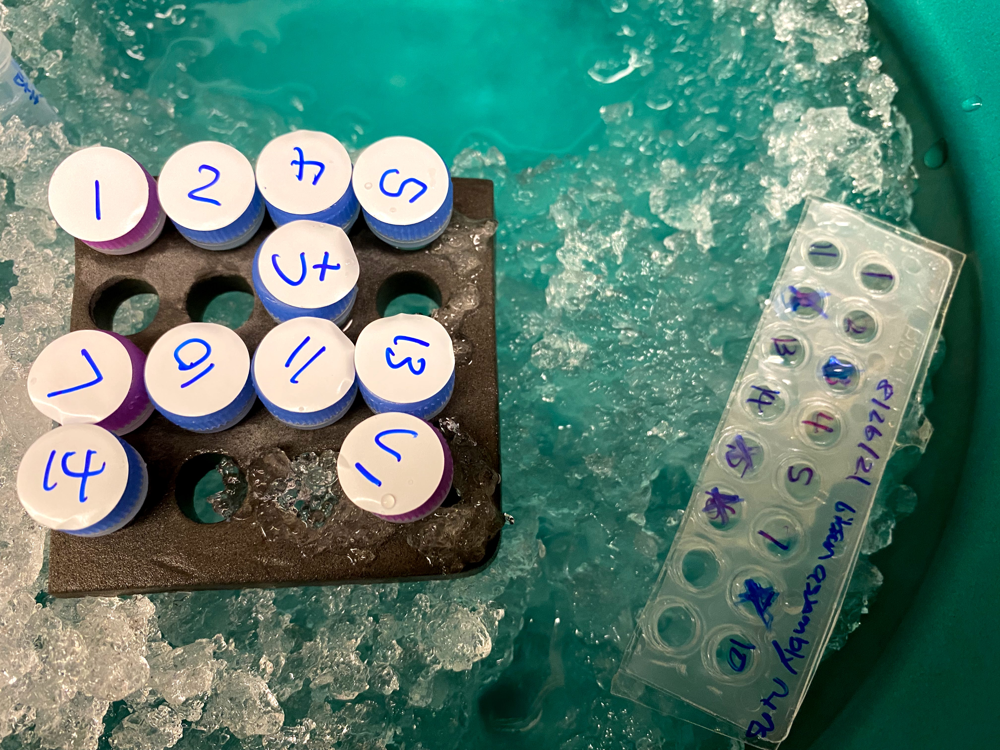

# VR transformations and VR fragment isolation

## Gibson assembly product transformation

Previously I had completed Gibson assembly reactions for inserts
1-16 but had not yet transformed cells and kept these samples in the
freezer. Since then I learned about the [homology between the inserts
and the vector](19_8-27-21.md) Thermo used to synthesize inserts into which caused PCR products from vectors to be larger than those from
fragments. Since samples from this round of Gibson reactions had not
been digested with BglII prior to the reaction I did not use
reactions with inserts that were contained in fragments. 

I transformed inserts 1, 2, 4, 5, 7, 10, 11, 13 and 14 into Invitrogen
chemically competent cells following the supplied protocol. I also used the
provided pUC plasmid as the positive control and Gibson isothermal mastermix
as the negative control. After transformation and recovery I plated all samples
onto Agar + Amp plates and placed into the 37C room to grow overnight.

## VR 29, 30, 21 PCR and GblII digestion

Following up on the issues with PCR amplification of these fragments using
[Phusion polymerase](24_9-2-21.md), I reran the PCR reaction for these inserts
with lab Taq polymerase and then diluted VR-31 to 50ul and digested with
BglII overnight at room temperature as I was leaving the lab by the time the
PCR was finishing. Will extract these fragments tomorrow when I come in to
retrieve the transformed colonies.