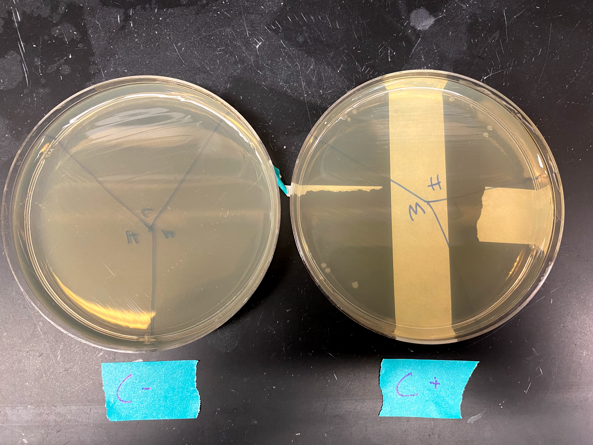
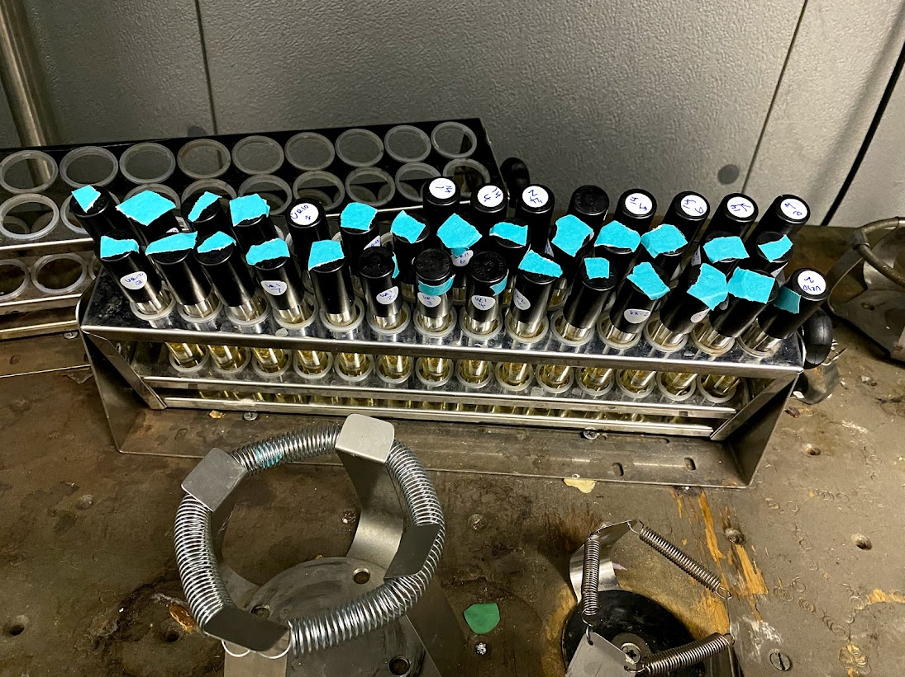

# Transformed colony culture and VR agarose gel extraction

## Culture preparation

Retrieved the plates from the transformation I did [yesterday](25_9-3-21.md)
from the 37C room around 11am. All transformations were successful except for
VR-7 and VR-13. Additionally the negative control showed no growth while there
were several colonies present on the positive control plate.

I transferred several colonies from each plate into 8ml of LB + amp and placed
tubes onto the shaker in the 37C room at 200 rpm to grow overnight.

## Replated VR-7 and 13

Since I saved the transformed bacteria from yesterday I figured I would just
replated the failed transformation just to be sure it was in fact the
transformation that failed and not some other weird plating fluke. Placed
those plates in the 37C room at around 1pm to grow overnight.

## VR-29, 30 and 31 agarose gel extractions

Used freeze and squeeze method to extract small bands (VR fragments) from
VR-29, 30, and 31 PCR / BglII digestion products I set up yesterday. Nanodrop
results from the extractions are below. VR-29 and 30 were ran in two lanes
while VR-31 was ran in three due to the larger volume of the sample after
BglII digestion. Approximate sample volume was 50ul.

| Sample | Yield | R_260_230 | R_260_280 |
|--------|-------|-----------|-----------|
| VR-29  | 8.7   | 7.164     | 0.23      |
| VR-29  | 6.9   | 7.606     | 0.219     |
| VR-30  | 14.4  | 7.648     | 0.169     |
| VR-29  | 8     | 7.915     | 0.159     |
| VR-31  | 8.6   | 7.615     | 0.171     |
| VR-31  | 7.8   | 11.8      | 0.193     |
| VR-31  | 7.3   | 7.618     | 0.53      |

CSV version of the table is also available [here](tables/nanodrop-VR-29-30-21-agarose-extraction.csv).After nanodroping I combined 
samples (1 sample per insert in the end) and placed
into the VR-inserts 2 box in the kitchen freezer. 
