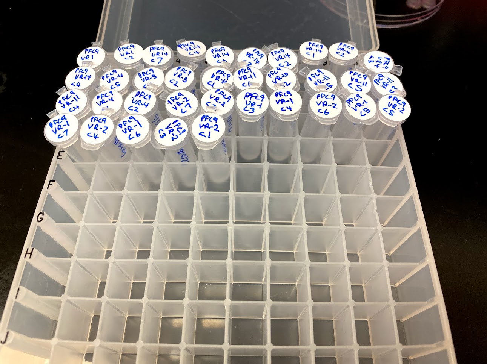

# Mini prep VR insert cultures

Came in today to mini prep the cultures I started [yesterday](26_9-4-21.md).
I followed the lab mini prep protocol. One thing to note for future preps
is that the protocol is expecting you to be working with 2 ml tubes the whole
time, if you start with more than 2ml of culture (I used 8ml to get more DNA)
cultures transfer cultures from glass tubes to 15 ml centrifuge tubes. Spin down
cells in those cells and re-suspend, then transfer to 2ml tubes. 

## Mini prep results

| Sample | Colony | Yield |
| ------ | ------ | ----- |
| VR-1   | 1      | 2316  |
| VR-1   | 2      | 527   |
| VR-1   | 3      | 2302  |
| VR-1   | 4      | NA    |
| VR-1   | 5      | 2115  |
| VR-1   | 6      | NA    |
| VR-1   | 7      | NA    |
| VR-10  | 1      | 2371  |
| VR-11  | 2      | NA    |
| VR-11  | 3      | NA    |
| VR-11  | 4      | NA    |
| VR-11  | 5      | NA    |
| VR-14  | 1      | NA    |
| VR-14  | 2      | NA    |
| VR-14  | 3      | 2023  |
| VR-14  | 6      | NA    |
| VR-14  | 7      | NA    |
| VR-2   | 1      | NA    |
| VR-2   | 2      | NA    |
| VR-2   | 3      | NA    |
| VR-2   | 4      | 1993  |
| VR-2   | 5      | NA    |
| VR-2   | 6      | NA    |
| VR-2   | 7      | 1859  |
| VR-4   | 1      | NA    |
| VR-4   | 2      | 2310  |
| VR-4   | 2      | NA    |
| VR-4   | 2      | NA    |
| VR-4   | 5      | NA    |
| VR-5   | 1      | NA    |
| VR-5   | 2      | NA    |

Samples were suspended in 100 ul of TE. There was obviously a sample
mixup when I transfered from the 15ul tubes to 2ml because there
are 4 VR-4 colony 2 samples. Will require sequencing to determine
exactly what is in these.
Like the last plasmid prep it seems that many of the samples are contaminated
with RNA. Will need to run all samples on gel to confirm and then purify
with LiCl protocol that is described as part of the lab midi-prep protocol. 
The
table is also available as a csv file [at this link](tables/9-5-21-VR-insert-mini-preps.csv).

## Sample storage

I started a new box for mini prep samples called `VR insert midi preps` and
add these samples to that box which is stored on my shelf in the the kitchen
freezer.

