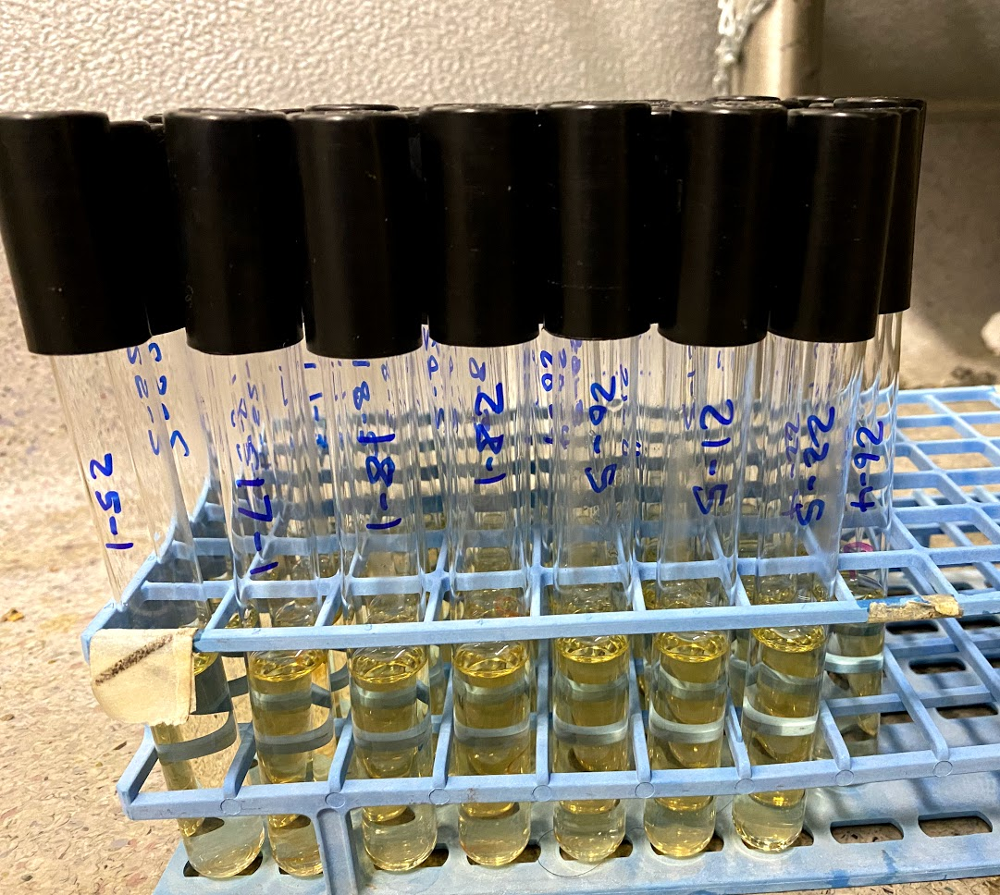
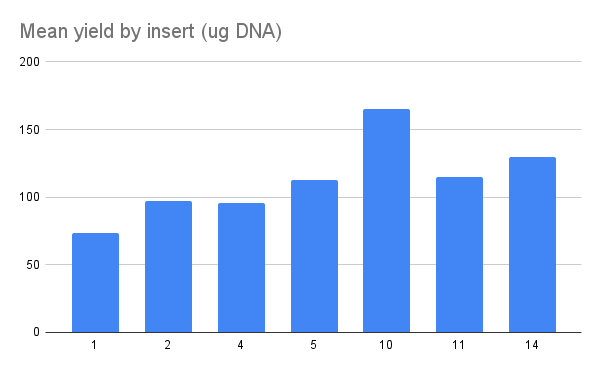
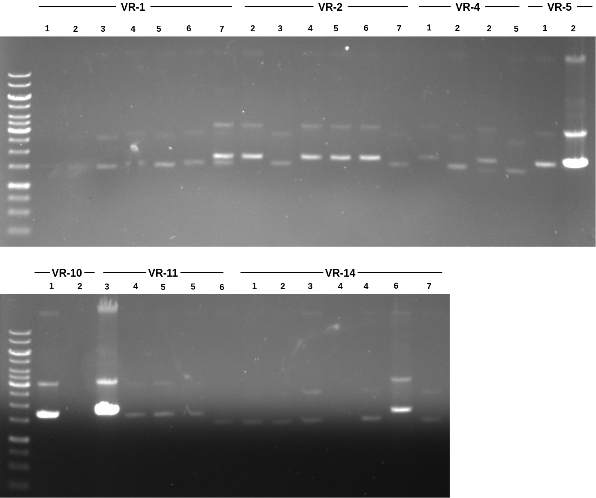

# Gibson assembly continued

## Transformation results

Picked up transformed colonies from yesterday's Gibson assembly
reactions. Results were not great. Negative control had about 5
colonies and only plates that were streaked had any visible colonies.
On average these plates had about 5x the number of colonies as the
negative control giving me some hope there might be successful
transformations.

For transformations that failed I replated with the transformed cells
from yesterday which were kept at 4C using 100 ul of the transformed cells and spreading via beads. I put these plates in the 37C room at around 10:30. For plates with colonies I (VR-25, 17, 18, 28, 20, 21, 22 and 26) harvested 5 individual colonies from each plate and began LB cultures of each colony at 37C with shaking in the hot room. 

The platinum loop
is broken so I hade to dig out colonies with more of a platinum stick
resulting in very large chunks of agar coming with the colonies.

## Finished LiCL purification of [9/4/1](26_9-4-21.md) insert mini preps

Finished LiCl purification of Gibson samples that I started yesterday.
Nanodrop results for all samples are below and is also available
at [this spreadsheet in sheet `9-7-21`](https://docs.google.com/spreadsheets/d/1O_App4gvx7tG9lM3cS9GkizzeMRDeNwbMTDCg1XVw3M/edit#gid=0). 

| Insert | Colony | Yield | Total DNA (ug) | Additional ID |
| ------ | ------ | ----- | -------------- | ------------- |
| 1      | 1      | 102   | 51             |               |
| 1      | 2      | 97    | 48.5           |               |
| 1      | 3      | 166   | 83             |               |
| 1      | 4      | 131   | 65.5           |               |
| 1      | 6      | 167   | 83.5           |               |
| 1      | 7      | 219   | 109.5          |               |
| 2      | 2      | 261   | 130.5          |               |
| 2      | 3      | 193   | 96.5           |               |
| 2      | 4      | 137   | 68.5           |               |
| 2      | 5      | 162   | 81             |               |
| 2      | 6      | 276   | 138            |               |
| 2      | 7      | 136   | 68             |               |
| 4      | 1      | 198   | 99             |               |
| 4      | 2      | 157   | 78.5           |               |
| 4      | 2      | 192   | 96             |               |
| 4      | 5      | 216   | 108            |               |
| 5      | 1      | 273   | 136.5          |               |
| 5      | 2      | 177   | 88.5           |               |
| 10     | 1      | 160   | 80             |               |
| 10     | 2      | 501   | 250.5          |               |
| 11     | 3      | 372   | 186            |               |
| 11     | 4      | 232   | 116            |               |
| 11     | 5      | 144   | 72             | B             |
| 11     | 5      | 203   | 101.5          | A             |
| 11     | 6      | 199   | 99.5           |               |
| 14     | 1      | 216   | 108            |               |
| 14     | 2      | 317   | 158.5          |               |
| 14     | 3      | 224   | 112            |               |
| 14     | 4      | 123   | 61.5           | B             |
| 14     | 4      | 411   | 205.5          | A             |
| 14     | 6      | 326   | 163            |               |
| 14     | 7      | 195   | 97.5           |               |

Overall preps look good DNA wise. I then ran samples out on a
gel (TAE 120V 1hr).

There seems to be type groups of bands, one running slightly higher
than the other. This looked to me like how PCR products from vectors
are longer than those from fragments and I checked again to see
if any inserts were actually from vectors and not fragments; VR-4 is. But I only prepped 7 samples of VR-4 and there are more high bands than that. Sending [samples](https://docs.google.com/spreadsheets/d/14LjpJSkiA-oPS-KEz1mo4wCLo4d90pHl8FkdC7rvQTM/edit?usp=sharing) to sequencing tomorrow so we will see how that goes. Samples are
already prepared and are stored in the kitchen freezer. Just need
to be dropped of at LSA before 5 tomorrow.

