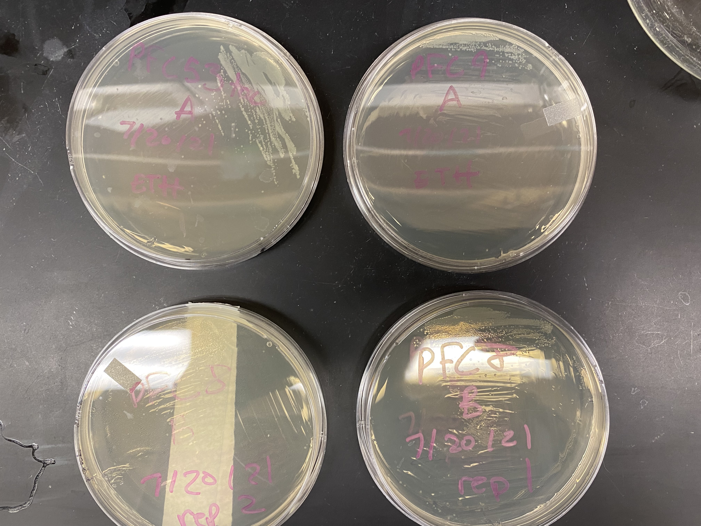
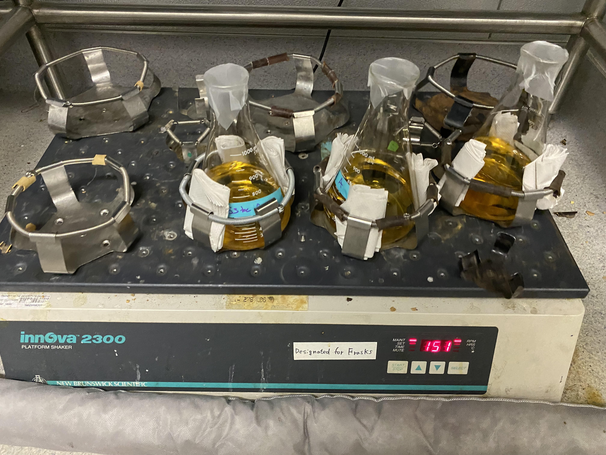

# pFC8, 9 and pFC53Tac transformation day two

## Growing up bacteria

Picked up plates from incubation room at 8:00 am this morning (image of plates
below.)

All plates at usable colonies! I transfered one colony  pFC9 A, pFC53tac A and pFC8 B rep 1 placed into
~500 ml of LB broth with 0.5g of ampicilin and placed flasks on the shaker in the incubation room at 8:58 am.

However, this was a mistake that
I only realized until later in the day. With that much ampicilin the concentration
comes out to *1000* ug/ml instead of the target 100 ug/ml. So hopefully I just get bacteria that are 10x as strong.

In case everything dies I made up a new batch of 2L of LB broth and
autoclaved.

Additionally I looked through the MIDI-prep kit box and did not find
buffers P1 or P2 so I made both of those solutions following the
guides posted in the "kitchen".

Megan and I also found the location of the MCB common dishwashers which are located on the far wing of the first floor of the building with the DNA sculpture (LSB?) in the stairwell.

Tomorrow as long as bacteria are able to grow in the high amplicilin
broth will do MIDI prep of plasmids and restriction digest.