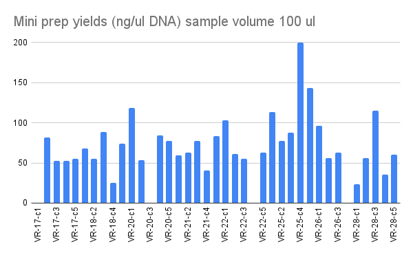
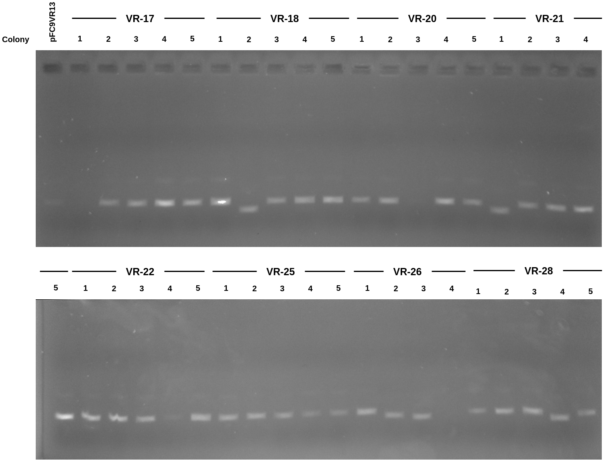
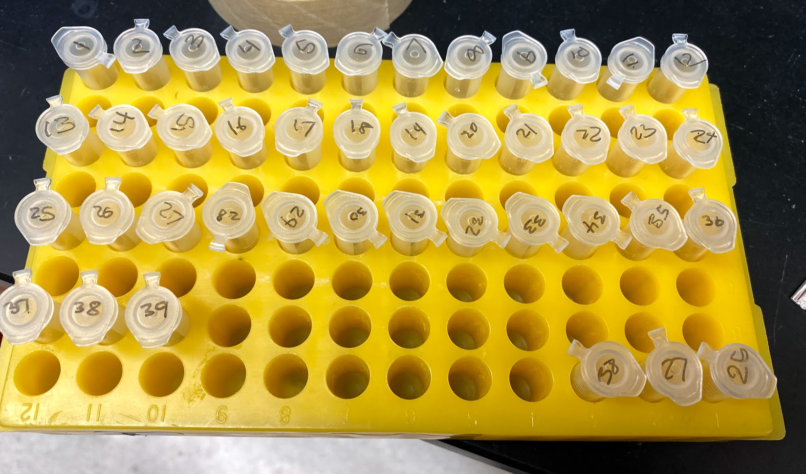

# Mini prep of VR [9/7/21](29_9-7-21.md) cultures

Today I am focusing on preparing minipreps of the cultures I
started yesterday from Gibson assembly transformants. I am following
the [lab mini prep](https://docs.google.com/document/d/1P8q8EZnLw2H7baQGGploSTo_pQk0PoP9/edit?usp=sharing&ouid=102107235715896780978&rtpof=true&sd=true) protocol followed by
a LiCL extraction scaled down to mini prep size.

Since I has some sample mix ups in the last mini prep I went with a
different simplier sample labeling scheme that only uses sample IDs,
no messing with labeling the actual insert on each tube. The key to
translate sample IDs to insert and colony numbers is at [this link sheet 9-7-21](https://docs.google.com/spreadsheets/d/1YbTQZP7iOjKYjVpWuJhYwFoNeU2vJh9WC2E_G857ZOs/edit?usp=sharing) and is also shown in the table below.

| Insert | Colony | Sample number |
|--------|--------|---------------|
|     17 |      1 |             1 |
|     17 |      2 |             2 |
|     17 |      3 |             3 |
|     17 |      4 |             4 |
|     17 |      5 |             5 |
|     18 |      1 |             6 |
|     18 |      2 |             7 |
|     18 |      3 |             8 |
|     18 |      4 |             9 |
|     18 |      5 |            10 |
|     20 |      1 |            11 |
|     20 |      2 |            12 |
|     20 |      3 |            13 |
|     20 |      4 |            14 |
|     20 |      5 |            15 |
|     21 |      1 |            16 |
|     21 |      2 |            17 |
|     21 |      3 |            18 |
|     21 |      4 |            19 |
|     21 |      5 |            20 |
|     22 |      1 |            21 |
|     22 |      2 |            22 |
|     22 |      3 |            23 |
|     22 |      4 |            24 |
|     22 |      5 |            25 |
|     25 |      1 |            26 |
|     25 |      2 |            27 |
|     25 |      3 |            28 |
|     25 |      4 |            29 |
|     25 |      5 |            30 |
|     26 |      1 |            31 |
|     26 |      2 |            32 |
|     26 |      3 |            33 |
|     26 |      4 |            34 |
|     28 |      1 |            35 |
|     28 |      2 |            36 |
|     28 |      3 |            37 |
|     28 |      4 |            38 |
|     28 |      5 |            39 |

## Mini prep nanodrop results

Nanodrop results were pretty much as expected curves looked good.
No DNA in a couple samples. Sample 1 I accidently pushed the
wrong button on the syringine pipette and dispensed about 10x
buffer two than I should have. Sample VR-26-c4 (34) was a negative
control of sorts as nothing grew in the overnight culture so no DNA
was expected.

Complete results are [at this spreadsheet table 9-8-21](https://docs.google.com/spreadsheets/d/1YbTQZP7iOjKYjVpWuJhYwFoNeU2vJh9WC2E_G857ZOs/edit?usp=sharing).

## Mini prep product gel

After nanodroping samples prepared aliquots of 100 ng of DNA from
each sample in 10ul H20. If sample had no DNA according to OD then
ran 2ul of sample. Gel is 0.8 agarose TAE ran for 45 mins with EtBr. 

Clearly there are again two categories of bands, similar to what is
observed in the Gibson product gel from [yesterday](29_9-7-21.md).
Submitted several samples to sequencing for identification which is detailed in the next section.

### Mini prep sample storage

I placed samples in the deli fridge and they are shown in the image
below. They still need to be properly labeled with insert and colony
number and then moved into the mini prep products bin.

## Sanger seq submission

After running the gel I decided to send all VR-18 and VR-28 colonies
for sequencing. The details of preparation for each reaction are
in [this spreadsheet table 9-7-21](https://docs.google.com/spreadsheets/d/14LjpJSkiA-oPS-KEz1mo4wCLo4d90pHl8FkdC7rvQTM/edit?usp=sharing). Actual order form is linked [here](https://drive.google.com/file/d/1lAZ7i51g94XKpZFVBOVYAwracLyY607j/view?usp=sharing). 