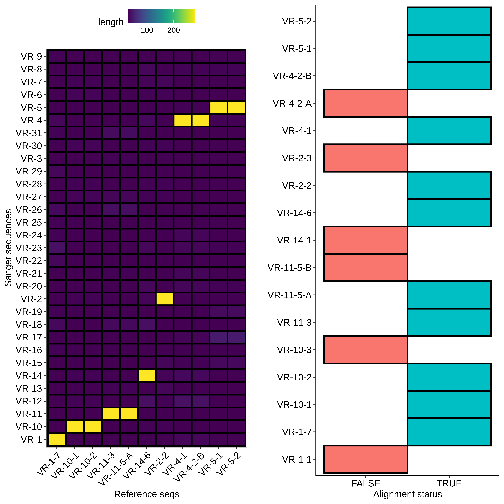
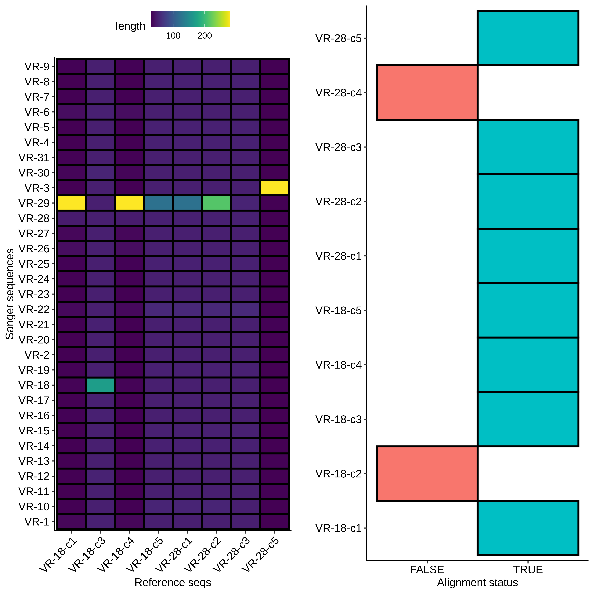

# Gibson prep and sanger analysis

## Sanger sequence analysis

On Wendesday I submited two batches of samples for sequencing; both
from Gibson assembly reactions. The first was from reactions completed on
[9/5/21](27_9-5-21.md) and the second from reactions completed on [9/8/21](29_9-7-21.md).

### [9/5/21](27_9-5-21.md) Gibson assembly Sanger analysis

First I used BLAST to align the VR insert reference sequences to the submitted
samples (format VR-{insert number}-{colony number}). Since BLAST does not align
low similarity sequences I created the second plot to show which Sanger
sequences had no alignment. 

For sequences that did align, everything looks about as expected. Longest
alignment lengths map to the insert each sample is labeled as. If we look at
a non-alignment, for example VR-1-1, we can see a couple of interesting things.

Although the Vr-1-1 band is faint it is there and it about at the same height
as samples VR-1-1 through VR-1-6. From the simulated gel below we can 
see that plasmids with a successful insertion will run slightly but 
detectably lower on the gel due to their smaller size
compared to pFC9.

With this in mind we would expect VR-1-7 to be a good candidate for a succesful
insertion. The BLAST alignment indicates it is and further analysis also
confirms this.

These principals hold but are not shown for the remaining sequences. In the
future it is probably only worth sequencing mini-preps that show this
lower band on gels. Overall I would say this assembly was a success, as there
was at least one colony from each insert species that aligned to the correct
reference.

### [9/8/21](29_9-7-21.md) Gibson assembly Sanger analysis

With the fact that the height of midi-prep products on gels can be an early
indicator of a likely successful insert (or at least disqualify potential ones)
we can take a look at the results from the 9/8/21 Gibson assembly. The heatmap
type plots of BLAST sequence alignments are shown below.

Here the results are a bit more muddled. Most of the sequences did align to 
*a* reference to some degree but almost none aligned to their labled reference.
THis could be explained by sample mix up but I really focused on sample
organization this time around and VR-29 nor VR-3 were ever actually
a part (at least to my knowledge) of this 
[round of Gibson reactions](28_9-6-21.md). Either way, looking more closely at
the data and traces yields a few pieces of information. First looking at
a "successful" alignment (in so much as *an* insert made it into the pFC9 fragment),
VR-18-1 showed all the signed of successful insertion but with fragment VR-3 not
18.

Next looking at the less successful case of VR-18-2 we see clear contamination
from the DNA trace and no alignment to any VR inserts. Additionally, something
a bit weird is going on with the gel in terms of the band heights. The first
lane is pFC9VR13 which is confirmed to have the insert. Even though signal
is faint (did not add enough DNA apparently) it is clearly at the same height
as most bands except for the two that did not align to VR reference sequences;
VR-28-C4 and VR-18-C2. This is indicating to me some other source of contamination
in these samples but I am not sure where from. 

Additionally, when looking at VR-28-C2, the other non-aligning
sequence with the lower running band, there is no alignment to
VR inserts but there is to pFC9 as is shown in the image below. Additionally the trace does not look contaiminated like is seen
with VR-18-2.

The alignment stops right at the SacI site which makes me
think that this is from an un-assembled pFC9 fragment. But
if that is the case, how was this bacterial colony able to
survive? And in addition why is the band seen lower on the
gel when if it was a digested fragment it should be higher?
Things to think about and ask during lab meeting.