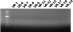

# Re-purification of Gibson fragments

Since pFC9 fragment purification on Friday yielded no DNA, I am 
guessing this was a significant problem in the last assembly attempt.
So today I am starting from scratch and attempting to make high quality
pFC9 large fragment fractions to use in the next Gibson assembly attempt.

## Check VR fragments

Before next assembly to be safe I am running the VR fragments out
on a gel to make sure they are also there as well.

Ran gel with 100bp ladder 45 mins TAE at 120 V shows no evidence of
DNA in any appreciable amounts for these inserts. Need to probably
just remake PCR / BglII digestion products before next assembly.

## Fragment PCR and BglII digestion

Given results of the last gel I used a pre-prepared PCR grid with
primers for VR inserts to amplify inserts 6, 7, 8, 12, 15, 16,
17, 18, 19, 21, 22, 23, 24, 25, 26, 27, 28, 30 and 31. After amplification I digested fragments originally cloned as vectors
with BglII; Inserts 8, 12, 15, 16, 17, 21, 23, 26, 27, 28, 30 and 31. The reaction components are shown in the table below.

| Reagent        | Volume (ul) |
| -------------- | ----------- |
| PCR product    | 25          |
| BglII          | 0.5         |
| 10x 3.1 buffer | 5           |
| H20            | 19.5        |

After 1hr at 37C in the hot room I alliquoted 4ul digested samples and 2ul undigested samples for agarose gel. Also took 3ul of the digested samples and repeated the VR insert PCR protocol without
adding additional reagents.

