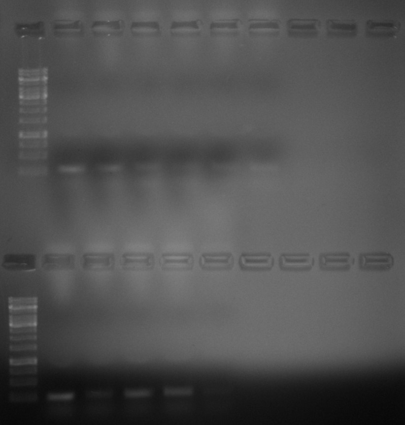
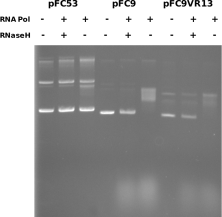
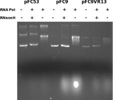

# Insert fragment synthesis continued, BglII digestions and revisiting IVT

## Transformation efficiency of old chemically competent cells

Yesterday I set up a control transformation to measure the efficiently
of old chemically competent cells I found in the -80C. Three colonies
grew equating to an efficiency of 1.9e6 transformants / ug plasmid. On
the low end of what is acceptable but potentially still workable.

## Insert fragment creation continued

### Overnight PCR results

Yesterday I set a PCR to run as I was leaving the lab. OD results
from each sample are in the table below.

| Insert | ng/ul |
|--------|-------|
| 6      | 114.6 |
| 7      | 123.6 |
| 8      | 129   |
| 9      | 87    |
| 12     | 123   |
| 15     | 109   |
| 16     | 151   |
| 21     | 66    |
| 23     | 342   |
| 26     | 340   |
| 27     | 303   |
| 28     | 220.9 |

Now we have about double the DNA. Turns out its important to have
nucleotides in your PCR mix. Although there must have been some free
from the thermo synthesis reactions because even without adding there
was some degree of amplification. Either way there was enough DNA to
move onto BglII digestion.

### Digestion of successful PCR reactions

Next, having enough DNA to move forward I digested vector originating
samples (8, 12, 15, 16, 21, 23, 26, 27, 28) with BglII using the reagents and volumes in the table below.

| Reagent         | Volume (ul) |
| --------------- | ----------- |
| PCR product     | ~25         |
| BglII           | 1           |
| r3.1 10x buffer | 5           |
| H20             | 19          |

#### Results after 1.5 hours

OD samples after digestion shown in the table below.

| Sample | ng/ul |
|--------|-------|
| 8      | 51    |
| 12     | 49.9  |
| 15     | 4.6   |
| 16     | 66.5  |
| 21     | 28.3  |
| 23     | 52.7  |
| 26     | 50.8  |
| 27     | 32.8  |
| 28     | 42.5  |

Overall looks as expected considering the dilution that occurs by
adding the digestion reagents except for VR-15 which lost most DNA
apparently. Not sure where it went though. Next, I ran BglII digested samples on 0.8 agarose gel for 40 mins at 120V using ~200 ng of DNA.
The gel showed underdigestion of a number of fragments. The lane layout is shown in the table below since I do not want to have to
label this one. First lanes of each row were inserts amplified from
fragments so if digestion is complete, all bands should be at
this height.

| Lane | Sample | Frag? |
|------|--------|-------|
| 2    | 6      | 1     |
| 3    | 7      | 1     |
| 4    | 8      | 0     |
| 5    | 12     | 0     |
| 6    | 15     | 0     |
| 7    | 16     | 0     |
| 12   | 9      | 1     |
| 13   | 21     | 0     |
| 14   | 28     | 0     |
| 15   | 26     | 0     |
| 16   | 27     | 0     |

So I put BglII digestions back into the 37C room to sit for a while while I revisited IVT reactions.

## IVT pFC53, pFC9 and pFC8VR13

### Attempt 1

Followed lab protocol for IVT reactions with pFC53, pFC9 and pFC8VR13.
Design for each reaction is described in this [spreadsheet table 9-14-21](https://docs.google.com/spreadsheets/d/1MHvlWMkcTyaiC89gw1SH2E4P3L9vcjeuG9Od9_k7VZA/edit?usp=sharing) and shown in the table below (these are main mixes and do not include RNAseA or H addition steps).

| Plasmid | DNA (ul) | 5x Transcription buffer (ul) | DTT | rNTP (ul) | DTT (ul) | npH20 (ul) | Pol Species |
|---------|----------|------------------------------|-----|-----------|----------|------------|-------------|
| pFC53   |      1.2 |                            6 |   3 |       0.6 |        3 |       16.2 | T3          |
| pFC9    |        2 |                            6 |   3 |       0.6 |        3 |       15.4 | T7          |
| pFC9VRX |        1 |                            6 |   3 |       0.6 |        3 |       16.4 | T7          |

After completion of each reaction, I ran products out on 0.8 agarose
*TBE* gel at 60V for 2 hours with purple loading dye. At this point I realized I forgot to
add DTT to the main mixes (oops forgetting reagents always seems to
be my downfall) but the gel had been run.

It appears that pFC53 was not transcribed really at all (lack of RNA smear at the bottom of the gel) otherwise this looks really great! Efficiency of pFC9 and pFC9VR13 are around 95% by my estimate which is
far better than any IVT reaction I had done previously. In next attempt I will be sure to add DTT. If pFC53 forms R-loops then
it must be that T3 is sensitive to the presence of DTT while T7 is not
so much.

### Attempt 2

This time around I made sure to add DTT. Additionally loaded the
gel using the lab reciepe for SDS loading dye. Gel was ran at 60V
for two hours same as the last one. 0.8 agarose in TBE. Both gels were
post-stained for ~45 mins in EtBr.

Here the shift in pFC53 is much clearer, indicating that T3 is
in fact sensitive to DTT. Using the SDS loading dye does not appear
to make that much of a difference.

