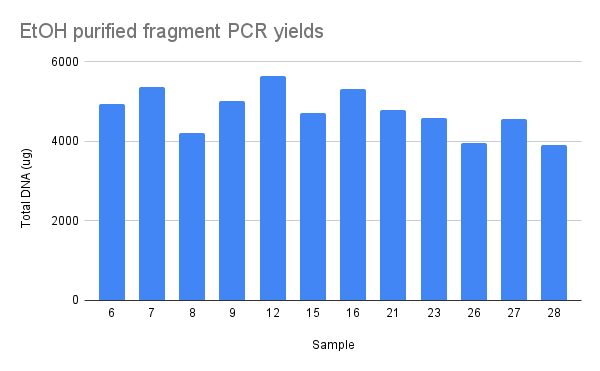

## pFC9VR28 LiCl purification recovery

Finally got around to precipitating DNA from the somewhat botched
LiCl prepcipitation where I used 70% EtOH instead of 100%. Added 1/10th
volume of sodium acetetate, froze at -80C for 1 hour and then spun
at 10k RPM (max large lab centrifuge) for 1.5 hours, washed with 70% EtOH, then dried pellet and resuspended in 2ml 10mM Tris HCL. Final
concentration was 40 ng/ul. Little lower than hoped but at least
got the DNA out.

## PCR and BglII digestion product cleanup

Yesterday I worked on making Gibson ready fragments from inserts
cloned in vectors. I PCRed inserts first, then digested with BglII [see yesterday's notes](34_9-14-21.md). I then did a EtOH precipitation on
all fragments following the protocol below, although this was only strictly necessary on BglII digested samples to remove BglII.

1. Add 1/10 volume 3M ph 5.2 sodium acetate
2. Add 2.2 volumes 100% ethanol
3. Freeze at -80 for 1 hour
4. Spin at max speed at 4C for 30 minutes
5. Decant, but save, the supernatant
6. Wash pellet with 70% EtOH
7. Spin for 5 mins at max speed
8. Decant supernatant
9. Dry pellet for 15 mins at room temperature
10. Resuspend in 40 ml 10 mM Tris HCL

Following this protocol I then OD each sample results of which are
below.

| Sample | ng/ul |
| ------ | ----- |
| 6      | 18.2  |
| 7      | 23.6  |
| 8      | 11.4  |
| 9      | 21.5  |
| 12     | 12    |
| 15     | 9.7   |
| 16     | 16    |
| 21     | 4.3   |
| 23     | 23    |
| 26     | 10.9  |
| 27     | 27    |
| 28     | 10.6  |

Yields seemed a bit low to me, with 40ul of sample this represented
about 50% recovery for most samples. So I repeated the protocol on the
supernatent to see if I could get any extra DNA; OD results are below.

| Sample | ng/ul |
| ------ | ----- |
| 6      | 13.7  |
| 7      | 15.3  |
| 8      | 20.9  |
| 9      | 17.9  |
| 12     | 38.1  |
| 15     | 21.4  |
| 16     | 14.5  |
| 21     | 27.5  |
| 23     | 21.8  |
| 26     | 14    |
| 27     | 16.1  |
| 28     | 12.1  |

This recovered a significant amount of DNA and got efficiency up to
around 70%. I did not combine samples and stored in the deli fridge.

Then I ran ~200 ng of each fragment out on a 0.8 gel at 120V for
45 mins.

I then used ~10ng of each in a PCR reaction in order to create highly
concentrated fragment samples. I used a standard PCR master mix
with lab taq and OneTaq NEB buffer. OD of PCR products is chart below.

## BglII digest followed by PCR

Based on the results of the gel it looks like the digestion may be
incomplete. So I set up the reverse of the reaction that produced
these fragments. First digesting ~200 ng of insert containing vector for
1 hour and then adding PCR master mix directly to sample and amplifying
whatever is in there (hopefully the digested fragment).

| Reagent            | Volume (ul) |
| ------------------ | ----------- |
| BglII              | 0.2         |
| NEB 3.1 10x buffer | 1           |
| DNA                | 2           |
| H20                | 2.4         |

Ran this reaction for 1hr @ 37C in the thermocycler and then added
25 ul PCR master mix (lab taq, NEB OneTaq buffer) and ran reaction
overnight before leaving the lab.

