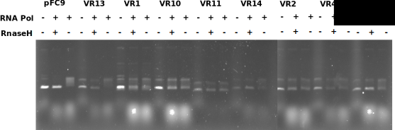
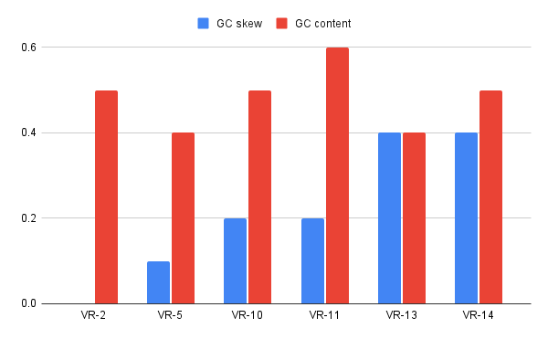

## VR insert IVT

Ran IVT with completed inserts that had enough DNA to spare to use
in an IVT. Reaction descriptions are listed in the table below.

| Plasmid   | DNA (ul)     | 5x Transcription buffer (ul) | DTT | rNTP (ul) | npH20 (ul)  | Pol Species |
|-----------|--------------|------------------------------|-----|-----------|-------------|-------------|
| pFC9      |            2 |                            6 |   3 |       0.6 |        18.4 | T7          |
| pFC9VR13  | 0.8163265306 |                            6 |   3 |       0.6 | 19.58367347 | T7          |
| pFC9VR1   |  2.739726027 |                            6 |   3 |       0.6 | 17.66027397 | T7          |
| pFC9VR10A |         3.75 |                            6 |   3 |       0.6 |       16.65 | T7          |
| pFC9VR11A |  1.612903226 |                            6 |   3 |       0.6 | 18.78709677 | T7          |
| pFC9VR14  |  1.840490798 |                            6 |   3 |       0.6 |  18.5595092 | T7          |
| pFC9VR2   |  2.298850575 |                            6 |   3 |       0.6 | 18.10114943 | T7          |
| pFC9VR4A  |   3.03030303 |                            6 |   3 |       0.6 | 17.36969697 | T7          |
| pFC9VR5A  |  2.197802198 |                            6 |   3 |       0.6 |  18.2021978 | T7          |

Then ran products on TBE gel without EtBR for 2 hours at 60V. Then
post-stained the gel for 45mins in TBE with EtBr.

