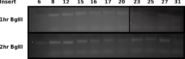

# VR vector insert purification continued

## Re-ran BglII digest followed by PCR

Re-ran a [BglII digest](36_9-16-21.md#VR-vector-BglII-digestion) of vector but digested for two hours in order to access if the subtle
differences in height of the bands are due to under
digestion or from sequences differences (DNA
secondary structures).

Comparing lanes directly shows that patterns look basically the same, adding
evidence to the differences in DNA secondary structure argument as it is
unlikely digestion was incomplete in the same ways in both experiments.

Based on these results I went forward with agarose gel extraction of the 2hr
digested samples.

## Agarose gel extraction yields and follow up PCR

Did standard freeze and squeeze extraction. Then ODed each sample. Total sample
volume was around 20 ul.

| Sample | ng/ul |
| ------ | ----- |
| 8      | 53.3  |
| 12     | 35.6  |
| 15     | 30.8  |
| 16     | 21.8  |
| 17     | 23.6  |
| 20     | 57.6  |
| 21     | 25.6  |
| 23     | 30.4  |
| 25     | 23.4  |
| 27     | 19.2  |
| 31     | 38.5  |

After extraction I used 1ul of each sample in a 7ul PCR reaction (running out
of master mix and primer) then ODed the reaction contents.

| Sample | ng/ul |
| ------ | ----- |
| 8      | 177   |
| 12     | 149   |
| 15     | 98    |
| 16     | 169   |
| 17     | 174   |
| 20     | 175   |
| 21     | 171   |
| 23     | 176   |
| 25     | 116   |
| 27     | 124   |
| 31     | 172   |
