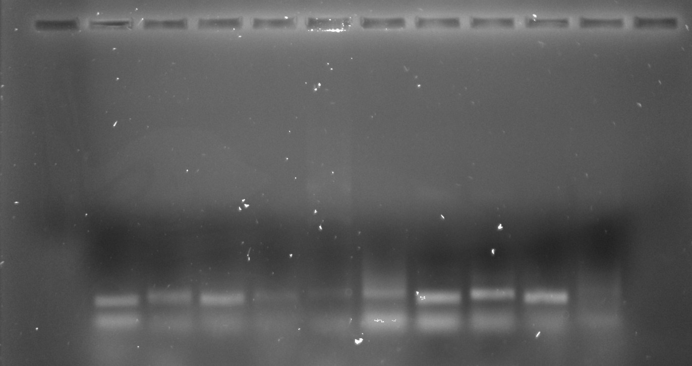

## BglII digest followed by PCR and agarose gel extraction

Digesting vector bound VR fragments with BglII then amplifying
by PCR. Digest conditions are listed below.

- 1 ul (50 ng vector)
- 1 ul 10x 3.1 buffer
- 0.2 ul BglII
- 7.8 ul npH20

After 2 hours of digestion the samples were then amplified using
a PCR master mix made up of lab Taq, dNTP, OneTaq PCR buffer and VR
inert primers. 

### Agarose gel extraction

After PCR loaded 2 ul of each sample into top rows of wells for
visualization. Loaded remaining samples into corresponding bottom
row well.

#### Lane layout

After PCR completed; 11th lane is a control with *no* insert added.

| Lane | Sample |
| ---- | ------ |
| 1    | 8      |
| 2    | 12     |
| 3    | 15     |
| 4    | 16     |
| 5    | 17     |
| 6    | 21     |
| 7    | 23     |
| 8    | 25     |
| 9    | 27     |
| 10   | 31     |
| 11   | C      |

Control lane shows contamination bottom fuzzy lanes that are present
in the gel. That is what we call not good. Need to run negative control
reactions to figure out what is going on here.