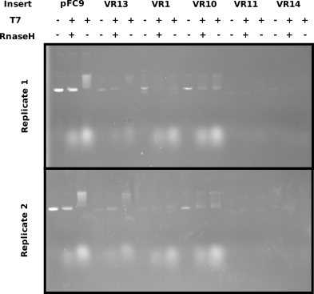

# VR insert IV with 2 replicates

Repeat [9/14/21](34_9-14_21.md) IVT with two sets of replicates to
make sure results saw previously (or lack there of) are real. Used
standard lab IVT protocol which is described in [this spreadsheet table 9-21-21](https://docs.google.com/spreadsheets/d/1MHvlWMkcTyaiC89gw1SH2E4P3L9vcjeuG9Od9_k7VZA/edit?usp=sharing).

## IVT results

Ran IVT reactions out on gel for 2 hours at 60V TBE and then post stained with 400 ul of EtBr (wanted to go fast) for 20 mins before
imaging. Did not destain.

Results look similar to previous IVT and replicates are also
very similar which was nice to see.