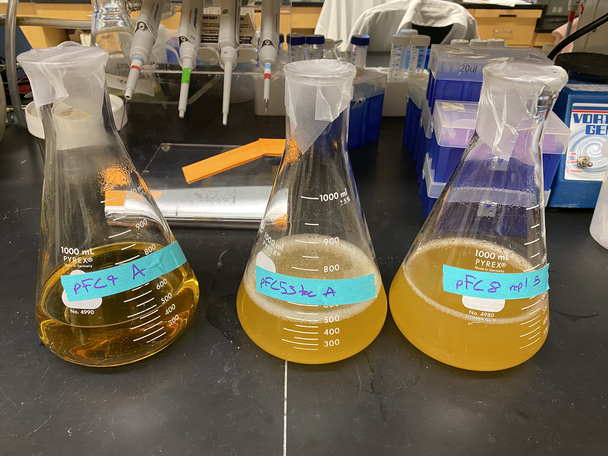
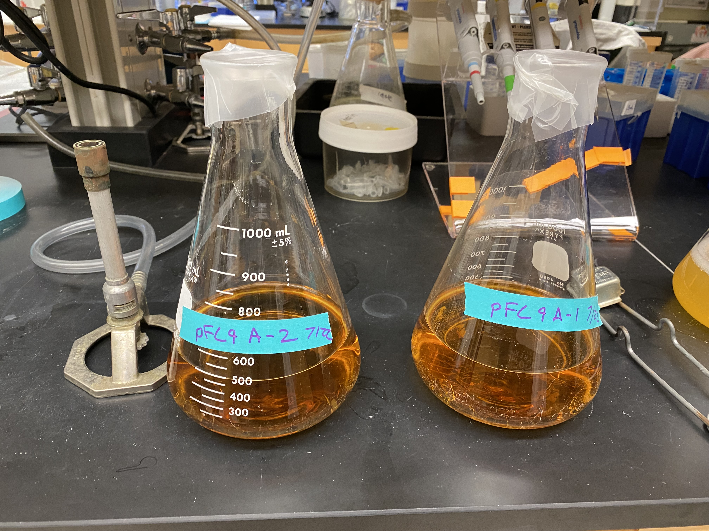
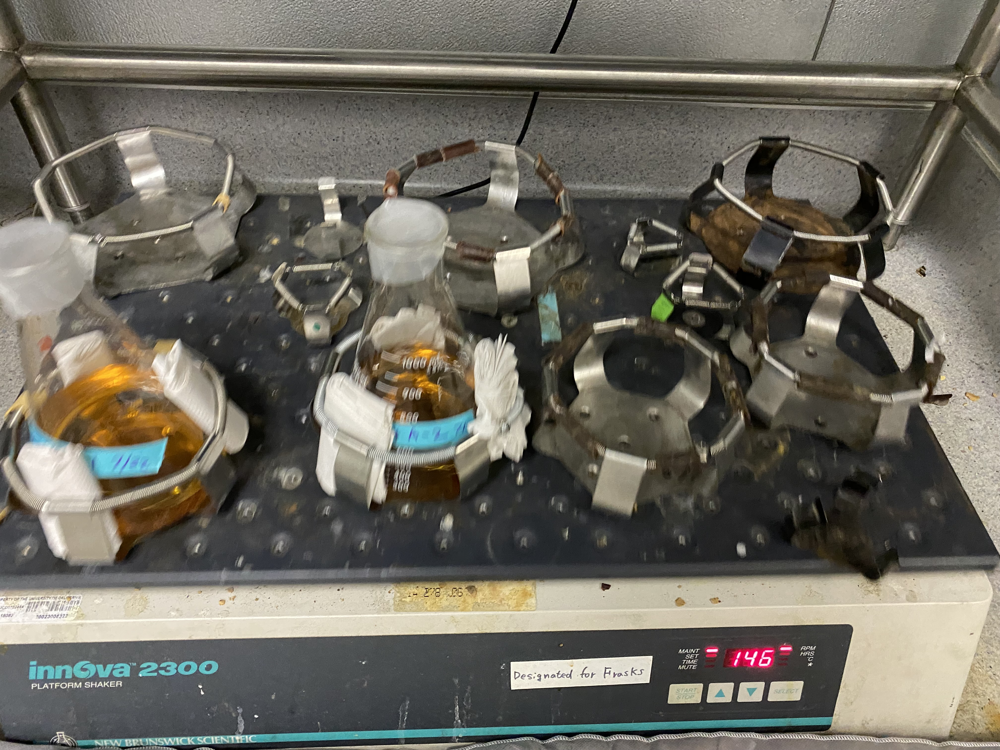
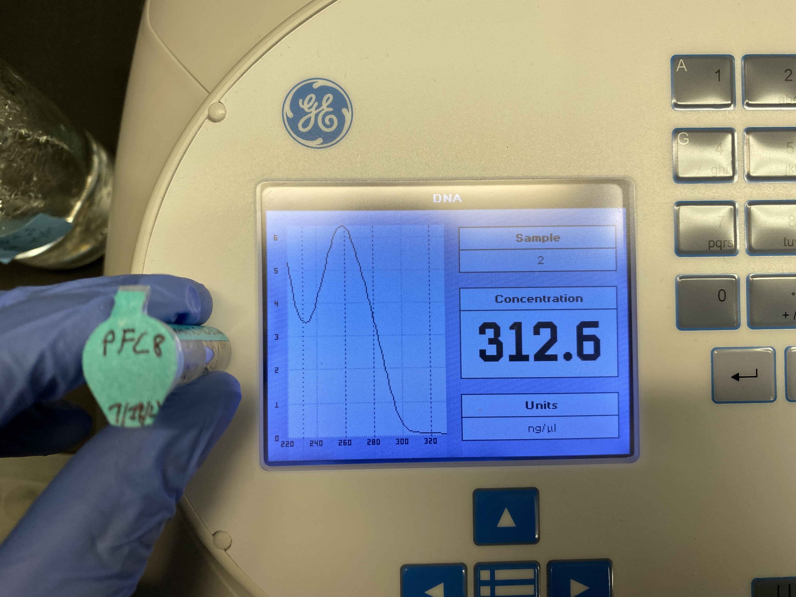
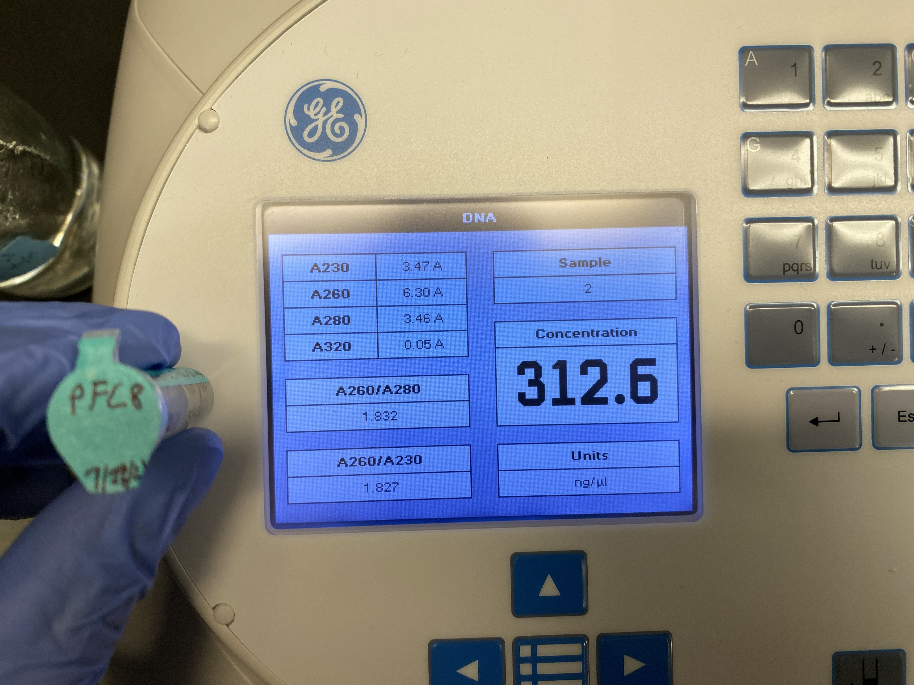
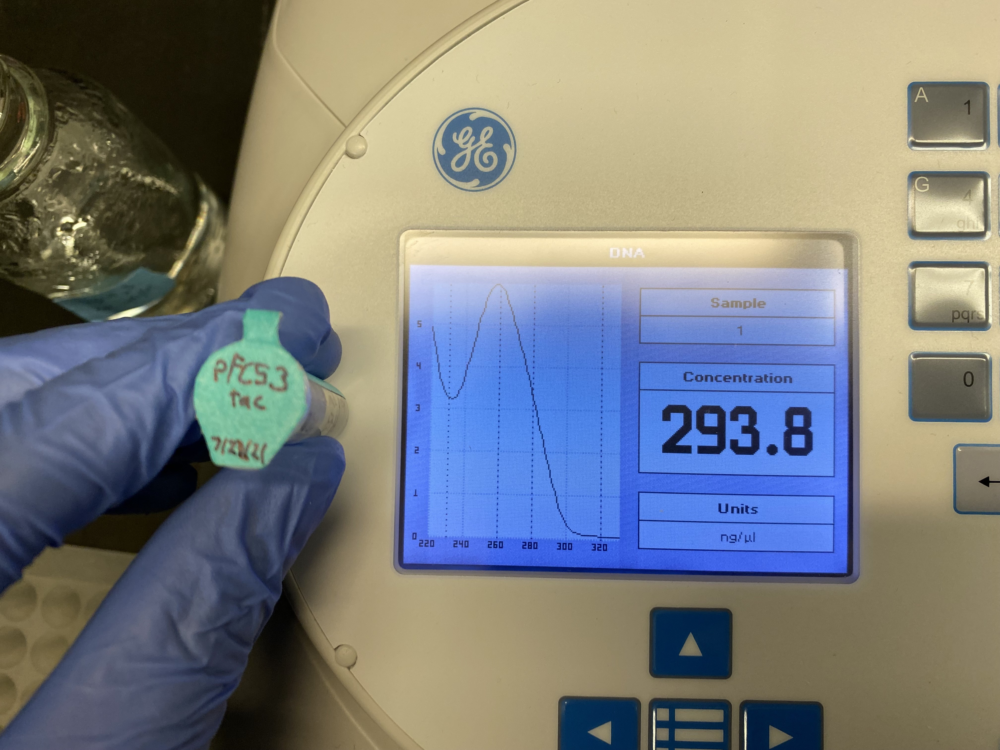
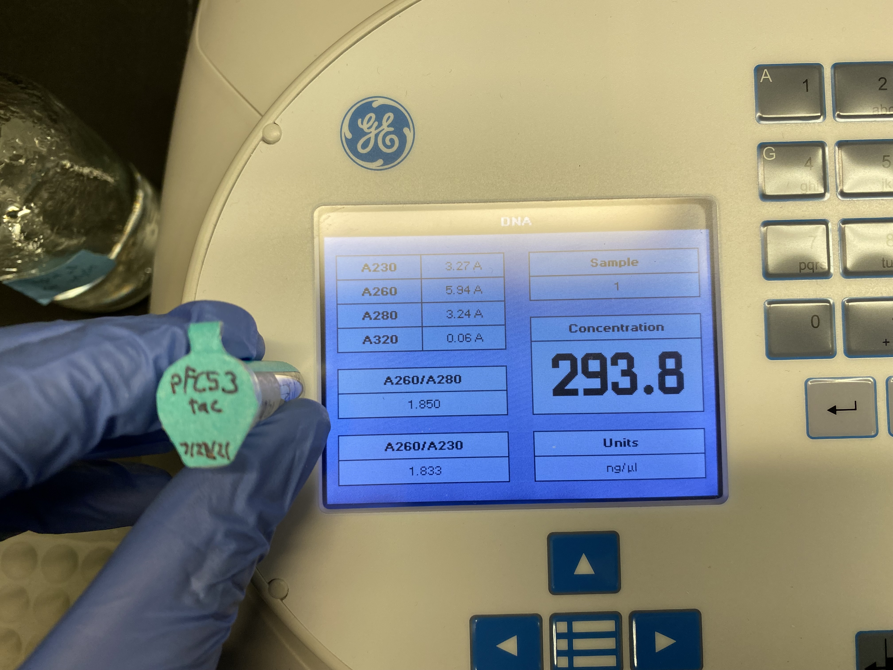

# pFC8, 9 and pFC53Tac transformation day three

## Colony overnight growth

Came into the lab around 8 am and found that the pFC8 and 53tac
samples grew but the pFC9 sample did not.

Plated two new pFC9 colonies into seperate 1L flasks with ~500 ml
LB and 0.05 g amplicilin (100ug/ml).

Placed into incubation room at ~8:30 am to grow.

## pFC8 and 53tac midi-prep

Followed Qiagen midi-prep protocol. Used all Qiagen kit reagents for
pFC8 and all reagents I made on Tuesday for pFC53tac. Did not run restriction digest yet (still need to select enzymes to use). Results
from nanodrop are below.

### pFC8 nanodrop results

### pFC53tac nanodrop results

### DNA concentrations

|  Plasmid  |    DNA (ng / ul) |
|  -------  |    -----------   |
|   pFC8    |      312         |
| pFC53tac  |      293         |

## Lessons learned

This was a hell of a day. A combination of not really knowing what
I was doing with this protocol and factors out of my control
(centrifuge compatibility hell) lead to this prep taking just around
11 hours which is absolutely insane. So I have put together list of
advice / tips for next midi-prep

- Cool all centrifuges to 4 C before starting anything
- Figure out what rotors you are using for each spin the day before
  - SLA 1500 works in MCB centrifuge room with the 250 ml centrifuge flasks. These will generally be your best bet for larger volumes.
  - The centrifuge that uses SLA 1500 takes about 45 mins to cool down to 4 C.
- The 50 ml centrifuge tubes with the weird caps *will* fit into the
lab's refrigerated centrifuge you just need to push down on the UFO
rotor a bit when closing it.
- Minimize the number of separately treated sample tubes before running the columns. Running columns with large volumes will be a
major time killer.