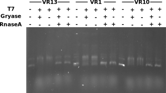

# VR insert IVT with gyrase

Given the results of the last VR IVT with some inserts showing
little R-loop formation I wanted to see if I could increase or
at least alter R-loop shift by incubating with DNA gyrase before
transcribing.

## Reaction setup

Set up 5 reactions for each sample

- untranscribed control; no T7
- Gyrase incubated transcribed
- Transcribed only no Gyrase treatment
- Gyrase transcribed RnaseH treated
- Transcribed RnaseH treated

Only alteration to standard IVT conditions was using 5x Gyrase buffer
in leu of some water. Additionally used 1ug of DNA total instead of
600 ng in order to still end up with 200 ng per lane. 

### IVT results

Lanes that were treated with Gyrase before transcription do not really
look that different from the untreated but transcribed samples. The
bands that are shifted (not treated with RNaseH) look pretty similar
to results from yesterday but maybe there is a greater degree of shifting for VR-10 even in the Gyrase negative sample? Possibly
pointing to inconsistency in the IVT reaction setup.

