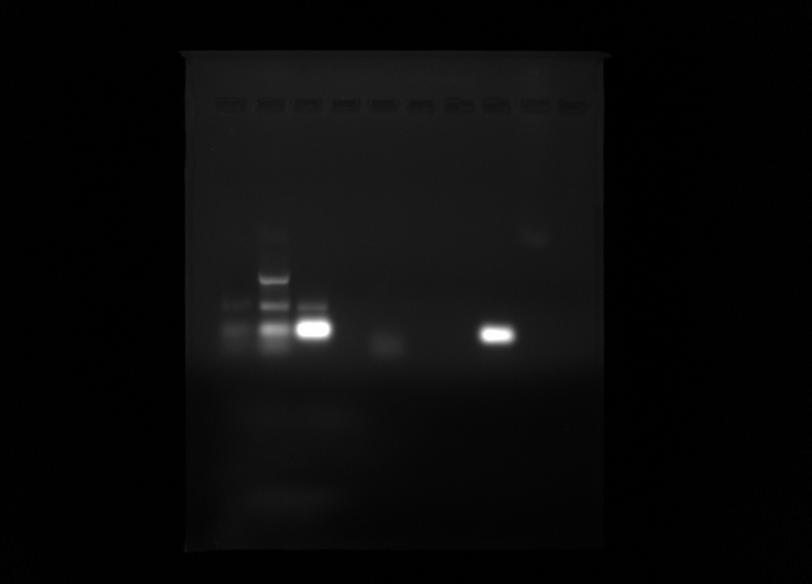
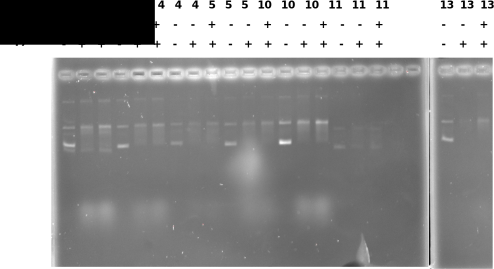
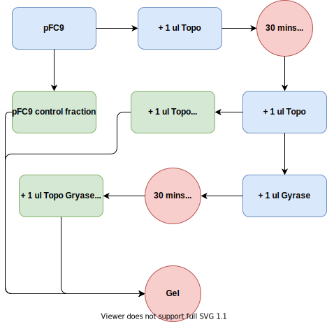
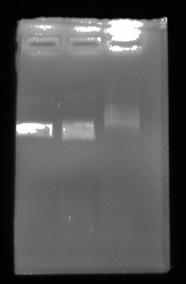

# Another day, another contaminated PCR sample

## OD [9/23](41_9-23-21.md#PCR-grid-test) PCR grid reactions

See reaction [setup table](41_9-23-21.md#PCR-grid-test) for mapping samples to reagents.

| Sample | ng/ul |
| ------ | ----- |
| MM     | 833.9 |
| H20    | -24.7 |
| 1      | 1009  |
| 2      | 372.9 |
| 3      | 1034  |
| 4      | 1000  |
| 5      | 241   |
| 6      | 254   |
| 7      | 25.7  |
| 8      | 1346  |
| 9      | 1346  |
| 10     | 291   |
| 11     | 1191  |
| 12     | 133.7 |
| 13     | 312   |
| 14     | 1787  |
| 15     | 1205  |
| 16     | 1239  |
| 17     | 1059  |
| 18     | -31   |
| 19     | -32   |
| 20     | -23   |
| 21     | 73.3  |
| 22     | -30   |
| 23     | 1676  |
| 24     | 230.7 |
| 25     | 118.4 |

Contamination seems to be spreading to other reagents beyond just the dNTPs
as I first thought was the issue. Wiped down all pipettes with DnaseAway
which should destroy Dnases and DNA molecules that might be present on the
pipettes. Then set up the PCR reactions described below.

## Pre and post pipette clean PCR

Testing if cleaning pipettes removed contaimination issues by using new
reagents and setting up reaction before and after cleaning with DnaseAway.
Since amplifications occured when only single reagents were used in the
previous PCR test I am testing single reagent reactions and using reactions
with only H20 as the control.

- H20 is np Dnase / Rnase free aliquots
- "Fresh" refers to opened for first time for this reaction

| Sample | H20         | Pipette | Reagent        | Pipette Cleaning |
| ------ | ----------- | ------- | -------------- | ---------------- |
| 1      | Fresh npH20 | p20     | Deepvent       | Pre-DnaseAway    |
| 2      | Fresh npH20 | p20     | red dNTPs      | Pre-DnaseAway    |
| 3      | Fresh npH20 | p20     | Daisy dNTPs    | Pre-DnaseAway    |
| 4      | Fresh npH20 | p20     | Forward primer | Pre-DnaseAway    |
| 5      | Fresh npH20 | p20     | Rev primer     | Pre-DnaseAway    |
| 6      | Fresh npH20 | p20     | Lab Taq        | Pre-DnaseAway    |
| 7      | Fresh npH20 | p20     | H20            | Pre-DnaseAway    |
| 8      | Fresh npH20 | p20     | H20            | Pre-DnaseAway    |
| 9      | Fresh npH20 | p20     | Deepvent       | Post-DnaseAway   |
| 10     | Fresh npH20 | p20     | red dNTPs      | Post-DnaseAway   |
| 11     | Fresh npH20 | p20     | Daisy dNTPs    | Post-DnaseAway   |
| 12     | Fresh npH20 | p20     | Lab Taq        | Post-DnaseAway   |
| 13     | Fresh npH20 | p20     | Forward primer | Post-DnaseAway   |
| 14     | Fresh npH20 | p20     | Rev primer     | Post-DnaseAway   |
| 15     | Fresh npH20 | p20     | H20            | Post-DnaseAway   |
| 16     | Fresh npH20 | p20     | H20            | Post-DnaseAway   |

## Gel of select [9/23](41_9-23-21.md#PCR-grid-test) PCR grid reactions

Ran some of products from [9/23](41_9-23-21.md#PCR-grid-test) PCR tests
out on a 0.8& agarose gel in 1x TAE buffer with 1ul / ml EtBr for 45 mins. Lane
layout is listed in the table below. Refer to [9/23 PCR grid test sample table](41_9-23-21.md#PCR-grid-test) for mapping sample numbers to reagent treatments.

### Lane layout

| Sample | Lane |
| ------ | ---- |
| MM     | 1    |
| 2      | 2    |
| 4      | 3    |
| 7      | 4    |
| 9      | 5    |
| 11     | 6    |
| 12     | 7    |
| 17     | 8    |
| 21     | 9    |
| 23     | 10   |

### Gel image

Lane 6 looks like no contaimination which is sample 11 (new buffer, Daisy dNTP,
deepvent taq but with no primers) so should not be amplification anyway. Lane
8 (sample 17: original Go, Lab taq, Daisy dNTP and both primers) shows a very
strong band. This may be primer dimer though.

## IVT with Gyrase

Given the somewhat surprising results of [9/22/21 IVT](40_9-22-21.md#IVT-results)
that included Gyrase samples I wanted to do more replicates with more inserts.
So in order to condense the number of reactions I would need to do I did
not include gyrase RnaseH controls.

Here I followed standard IVT lab protocol but added 6ul of 5x Gyrase buffer
to each sample (substituting for 6ul H20) and then pretreated one fraction
of plasmid with DNA gyrase for 30 mins at 37C. After Gyrase treatment
samples were transcribed with T7.

Overall Gyrase treatment did not really seem to make a difference for any
of the inserts. Granted I did not heat kill Gyrase after treatment so really
testing R-loop formation in the _presence_ of DNA gyrase instead of just
on a hyper supercoiled template.

## Testing DNA Gyrase activity

Given that some VR insert plasmids do not seem to change
[R-loop formation patterns](40_9-22-21.md#IVT-results) when pre-treated
with DNA gyrase I wanted to test for activity of the enzyme. So I came up with
the basic protocol shown below.

If Topo is working this should cause relaxation which Gyrase should then
restore back to the supercoiled state.

### Reaction setup

- 600 ng pFC9 (2 ul)
- 3 ul 10x rCutsmart (Topo buffer)
- 6 ul 5x Gyrase buffer
- 19 ul npH20

Take 20 ul from initial mix and treat with 1ul Topo for 30 mins at 37C. Then
take 10ul of the topo treated fraction and treat with 1 ul DNA Gyrase under
those same conditions.

### Gel image

After completing both reactions ran all three samples out on 0.8% TAE agarose
gel in 1x TAE buffer for 45 mins at 120V.

| Lane | Sample                |
| ---- | --------------------- |
| 1    | Control               |
| 2    | Topo treated          |
| 3    | Gyrase + Topo treated |

Gel was loaded with 6x purple loading dye.

If anything this is almost the opposite of what I was expecting to occur. Gyrase
should not be shifting the band upward. Although Fred brought up the fact that
I did not heatkill enzymes after each treatment (which I should have thought
to do) and so there could have been competition between them. This is not
really a valid assay. Despite this I think that something might be up with
these enzymes.
