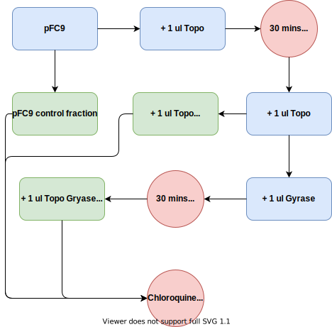

# Gyrase activity assay with chloroquine gels

## Revised Gyrase activity assay

Revised the Gyrase activity assay to include heat killing each enzyme after
37C incubation periods.

### Reaction setup

Setup this reaction starting with pFC9 control which included

- 3.33 pFC9 (1ug)
- 6 ul Gyrase buffer (5x)
- 3 ul rCutsmart (10x)
- 3 ul 10x ATP for EcoP1rI (NEB product code B61015)
- 14.67 ul H20

20 ul of this formed the Topo treated fraction to which I added 1ul Topo.
After incubation and heatkill fractioned 10ul and added 1 ul DNA
Gyrase and incubated + heatkilled. I set up two replicates of these reactions
so I could run two independent chloroquine gels.

### Chloroquine gel

Fred suggested running reaction products on chloroquine gel to better
resolve supercoiling. Gel protocol is below

1. Prepare a 1% agarose gel with 2x TBE buffer
2. Allow gel to cool to around 50C.
3. Add chloroquine to a final concentration of 2.5 ug / ml of agarose
4. Pour gel.

Made two 12 cm 100 ml 1% agarose with .250g chloroquine each
using 2x TBE buffer. Running gels for 16 hours at 110V according to
supplemental materials in Robert's paper.