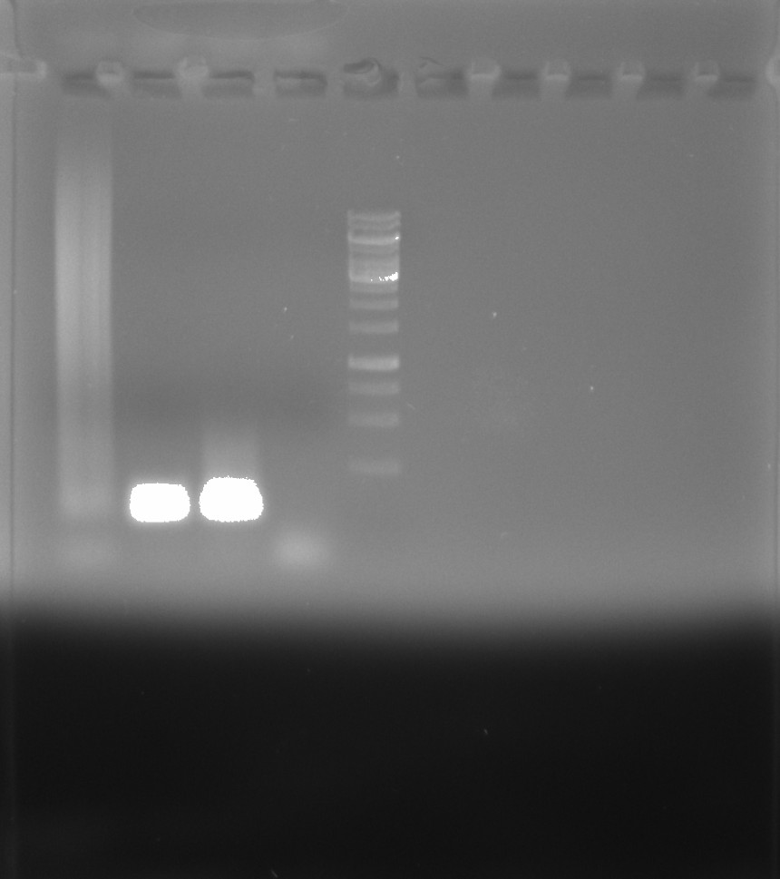

## Chloroquine gel post staining and imaging

Picked up gels that I started yesterday. Washed each in ~500 ul of npH20 for
two hours with shaking. After I drained H20 and poststained with 200 ul
1 ul / ml EtBr for 45 minutes. After post stained rinsed for 5 mins with
EtBr.

### Gel layout

| Gel | Lane | Treatment     |
| --- | ---- | ------------- |
| 1   | 1    | Empty         |
| 1   | 2    | Control       |
| 1   | 3    | Topo          |
| 1   | 4    | Topo + Gyrase |
| 2   | 1    | Empty         |
| 2   | 2    | Control       |
| 2   | 3    | Topo          |
| 2   | 4    | Topo + Gyrase |

### Gel images

DNA is not present on the gel. Looking back at my calculations I used way too
much chloroquine in the gel. Maybe this caused bands to run backwards?

Made stock solution of chloroquine with 125 ug / ul and prepared new Gyrase
activity assay as described in
[9/27/21 notes](43_9_27_21.md#Revised-Gyrase-activity-assay) and prepared
chloroquine gel that actually follows the [correct protocol](<(43_9_27_21.md#Chloroquine-gel)>) using 2 ml of
stock chloroquine solution in 98 ul agarose. Loaded samples and ran gel
at 110V for 16 hours.

## PCR contamination test

Testing new PCR master mix with various Taqs. Using reagents I have never
used before to test for Taq contamination (in theory).

### Master mix

| Reagent  | Lot      |
| -------- | -------- |
| 5x GoTaq | 28522702 |
| NEB dNTP | 0561010  |
| H20      | NA Fresh |

### Polymerases

| Pol name    | Lot            |
| ----------- | -------------- |
| Phusion Pol | 00783326       |
| Deepvent    | 11             |
| Lab taq     | NA (A on tube) |

Made four reactions one with each polymerase and one negative control with only
master mix. Amplfied all samples for 34 cycles using standard PCR protocol.

### Gel

Ran products on 0.8% agarose TAE gel with 1ul/ml EtBr in 1x TAE buffer at 120V
for 45 mins.

| Lane | Sample        |
| ---- | ------------- |
| 1    | MM + Phu      |
| 2    | MM + Deepvent |
| 3    | MM + lab taq  |
| 4    | MM            |
| 5    | 1kb ladder    |

Clearly contamination present in the Deepvent (lane 2) and lab taq (lane 3)
lanes. Not sure what is going on with Phu that is producing a smear but Megan
saw this in an unrelated test that used phusion but with no substrate (as
is the condition here).

Need to get even more extreme in contamination battle.
