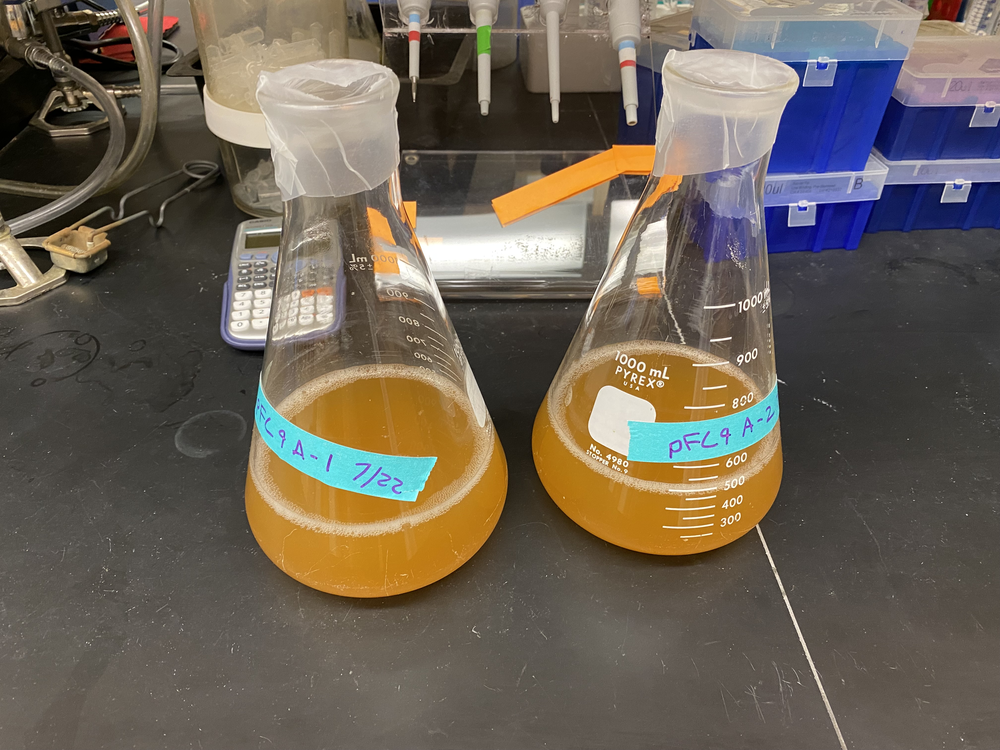
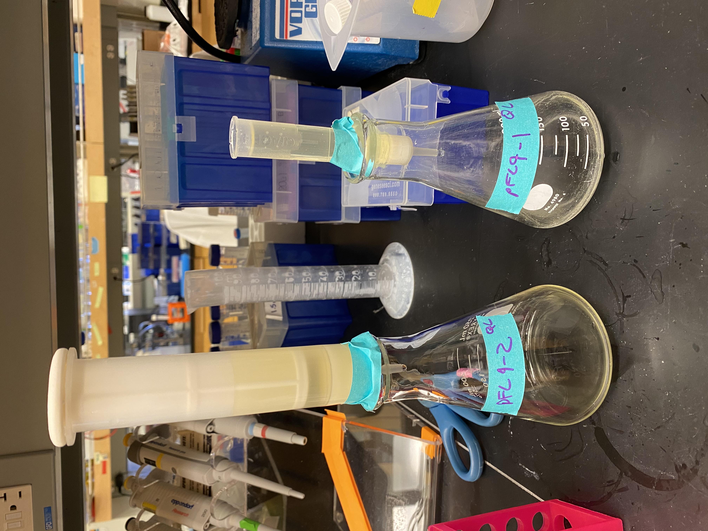
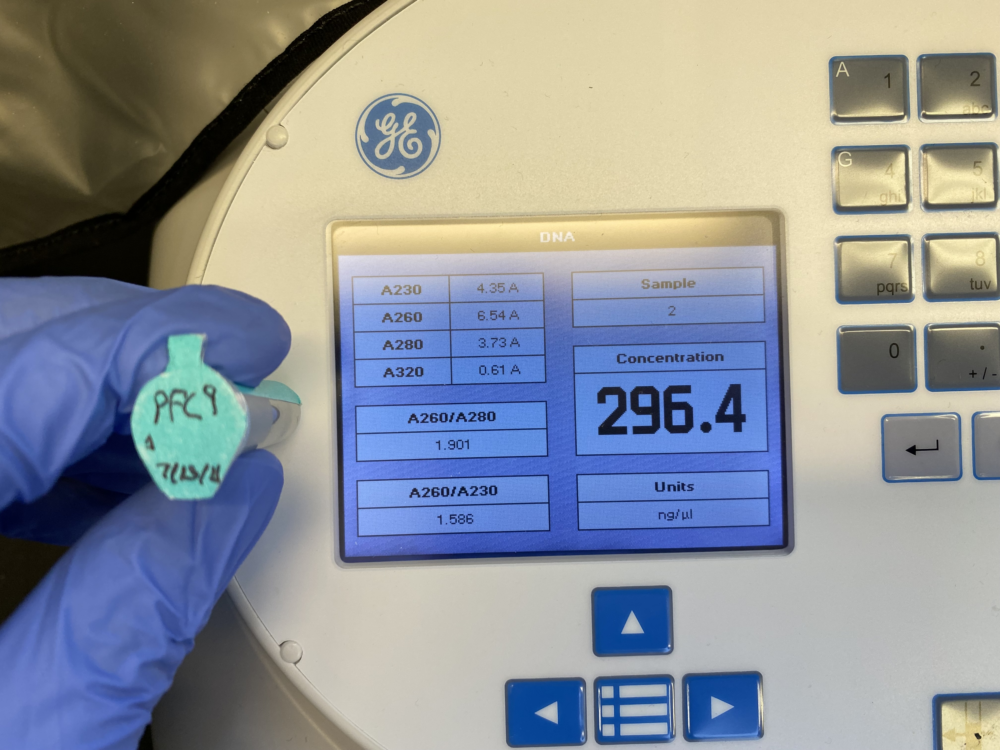
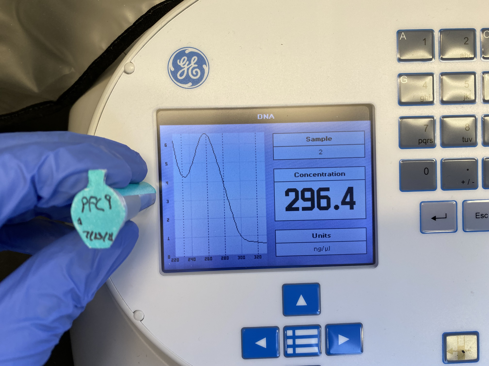
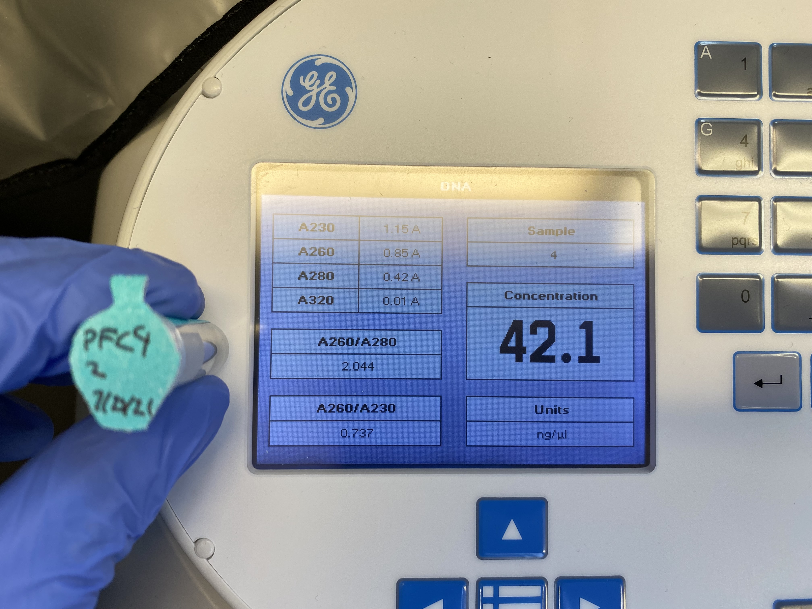
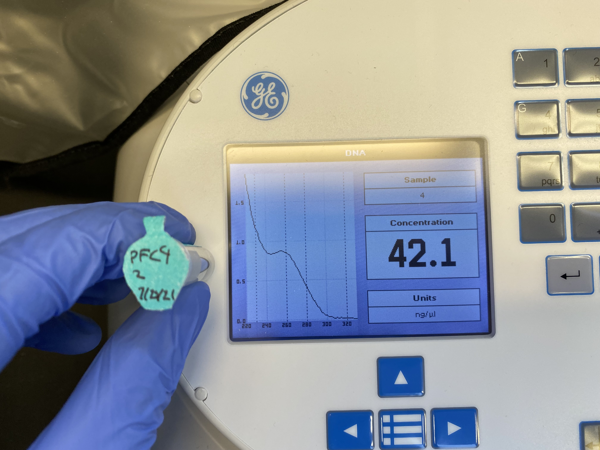

# pFC8, 9 and pFC53Tac transformation day three

## pFC9 midi prep

Collected pFC9 cultures at 8:30 am. Both had grown successfully. I kept the two samples pFC9-A-1 and pFC9-A-2 seperate during the rest of the procedure. I
followed the Qiagen midi-prep protocol using my own reagents for both samples.

Added 10 ml stock RNAseA to 50 ml buffer P1 and chilled with buffer P3 before
starting protocol. 

For first spin to harvest bacteria I used lab refrigerated centrifuge at 6000 x g.
For spin after cell lysis I used MCB common centrifuge (floor 3) with 
SLA 1500 rotor from common centrifuge room on floor 2. Ran into problem where
centrifuge would not start but rebooting seemed to fix it. For final spins I
used refrigerated centrifuge in lab. All spins were at 4C. 

For sample pFC8-A-2 I used the Invitrogen maxi-prep column from 2007 to test
if these were still good and could be used in future preps.

I followed the Qiagen maxi prep protocol for washing and eluting DNA from 
the Invitrogen column. 

## Results

### pFC9-A-1 (Qiagen midi prep column)

Nanodrop results

### pFC9-A-2 (Invitrogen maxi prep column)

Nanodrop results

Basically no plasmid was captured my the Invitrogen column and these columns
should be thrown away or at least not used with Qiagen reagents. Absorbance curve showed a large degree of
contamination and this sample should not be used for anything. I saved it
in case it is needed for some reason but noted on the tube that it should
not be used due to contamination and low DNA concentration.

Both samples were stored in the `VR-inserts` box in the -20 C freezer on my shelf in the kitchen. 

