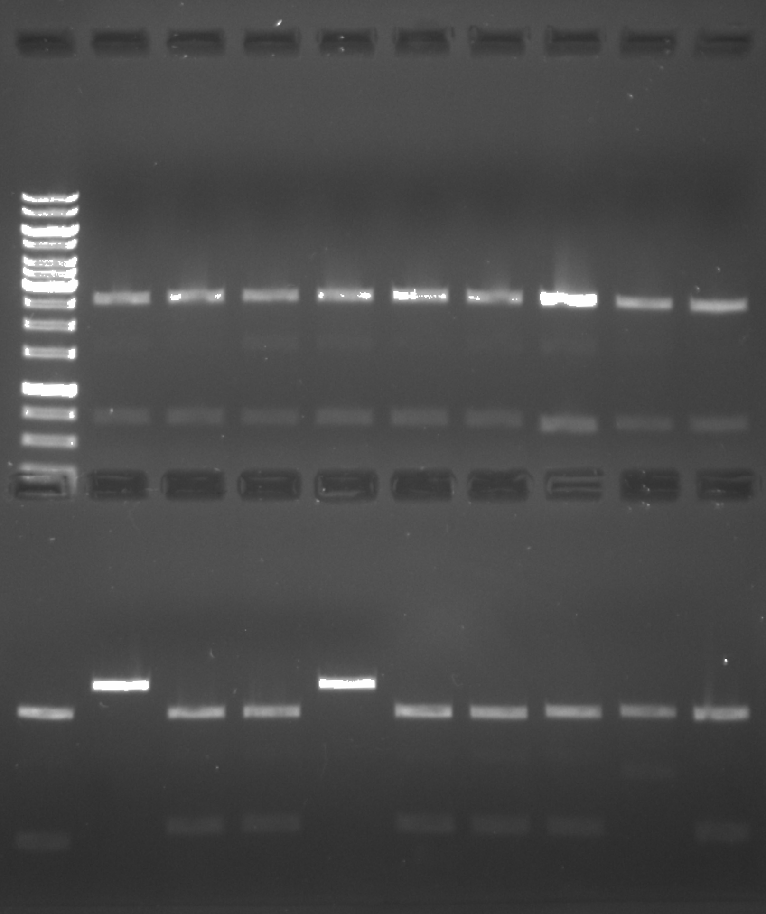

# Miniprep and electro-competent cell transformation results

## Minipreps

Came in early to miniprep samples VR 12, 15, 16, 25, 23 and 21 that I grew overnight
cultures of yesterday. I followed my [miniprep protocol](https://github.com/EthanHolleman/plasmid-minipreps-protocol) and then ODed the samples after LiCl
precipitation of DNA the results of which are shown in the table below and
are also recorded in table [10-8-21 of nanodrop spreadsheet](https://docs.google.com/spreadsheets/d/1O_App4gvx7tG9lM3cS9GkizzeMRDeNwbMTDCg1XVw3M/edit#gid=294568087&range=A1).

## Yields

| Insert | Colony | ng_per_ul | Volume at measurement | Diluted Volume | Final Concentration |
|--------|--------|-----------|-----------------------|----------------|---------------------|
|     12 |      1 |      1461 |                    40 |             80 |               730.5 |
|     12 |      2 |      1485 |                    40 |             80 |               742.5 |
|     12 |      3 |      1296 |                    40 |             80 |                 648 |
|     12 |      4 |      1296 |                    40 |             80 |                 648 |
|     12 |      6 |      1293 |                    40 |             80 |               646.5 |
|     15 |      1 |      1253 |                    40 |             80 |               626.5 |
|     15 |      2 |      1938 |                    80 |             80 |                1938 |
|     15 |      3 |      1480 |                    40 |             80 |                 740 |
|     16 |      1 |      1368 |                    40 |             80 |                 684 |
|     21 |      1 |      1262 |                    40 |             80 |                 631 |
|     23 |      1 |      1408 |                    40 |             80 |                 704 |
|     23 |      2 |      1436 |                    40 |             80 |                 718 |
|     23 |      3 |      1456 |                    40 |             80 |                 728 |
|     23 |      4 |      1323 |                    40 |             80 |               661.5 |
|     23 |      5 |      1412 |                    40 |             80 |                 706 |
|     25 |      1 |      1366 |                    40 |             80 |                 683 |
|     25 |      2 |      1275 |                    40 |             80 |               637.5 |
|     25 |      3 |      1401 |                    40 |             80 |               700.5 |

Yields looks good, digestion and sequencing will reveal if preps actually contain
successful insertions.

## Digestion with KpnI

I digested 600 ng all prepped samples with 0.5 ul KpnI-HF in 25 ul reaction volumes for 1 hour at 37C. If a VR insert is present in the plasmid this will introduce an
additional KpnI site compared to pFC9 alone and produce 2 bands instead of 1.
Stella loaded this gel.

- 0.8% agarose
- 1x TAE buffer and gel
- 0.04 ul / ml EtBr in buffer and gel
- 120V for 40 minutes

| Lane | Sample | Lane | Sample | Lane | Sample |
|------|--------|------|--------|------|--------|
| 2    | 12-1   | 8    | 15-1   | 15   | 23-4   |
| 3    | 12-2   | 9    | 15-2   | 16   | 23-5   |
| 4    | 12-3   | 10   | 16-1   | 17   | 25-1   |
| 5    | 12-4   | 11   | 21-1   | 18   | 25-2   |
| 6    | 12-5   | 12   | 23-1   | 19   | 25-3   |
| 7    | 12-6   | 13   | 23-2   |      |        |
| 8    | 15-1   | 14   | 23-3   |      |        |

Lane 1 is a 1kb ladder.

Appears that most samples were cloned successfully (with the insert) except for
23-1 and 23-4.

## Transformation of electro-competent cells

Picked up transformed electro-competent cells I plated [yesterday](50_10-7-21.md)
and was again disappointed by relative lack of cell growth, although there was some. Colony counts are shown in the table below.

| Sample | Plated volume | Colonies |
|--------|---------------|----------|
| C      | 150           | 1        |
| C      | 250           | 1        |
| 31     | 250           | 0        |
| 31     | 150           | 0        |
| 20     | 250           | 2        |
| 20     | 150           | 0        |
| 17     | 250           | 1        |
| 17     | 150           | 2        |
| 27     | 250           | 1        |
| 27     | 150           | 3        |

It was also concerning to see that both negative controls (only transformed with pFC9 fragment) had a single colony. There are not that many colonies so I am going
to go ahead with preps anyway and hope for the best with these bugs.

