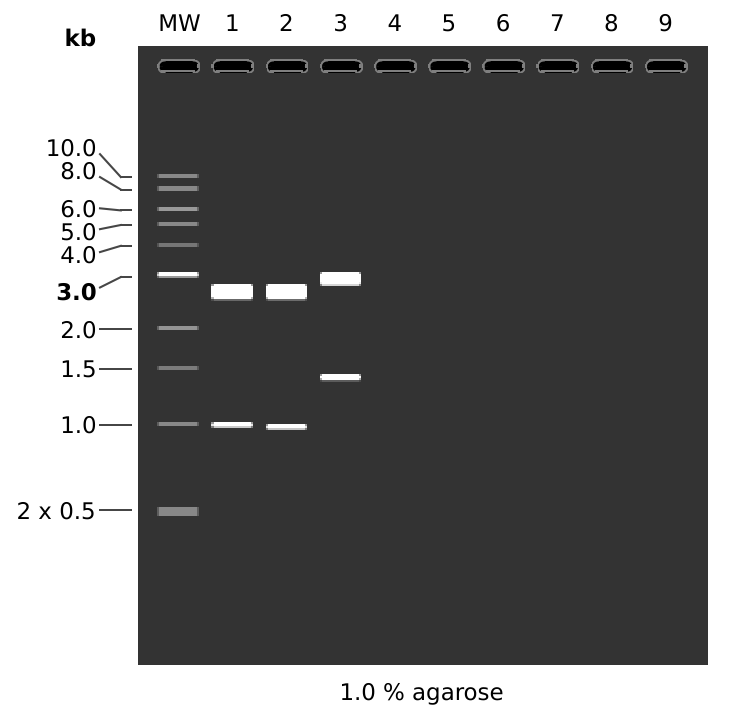
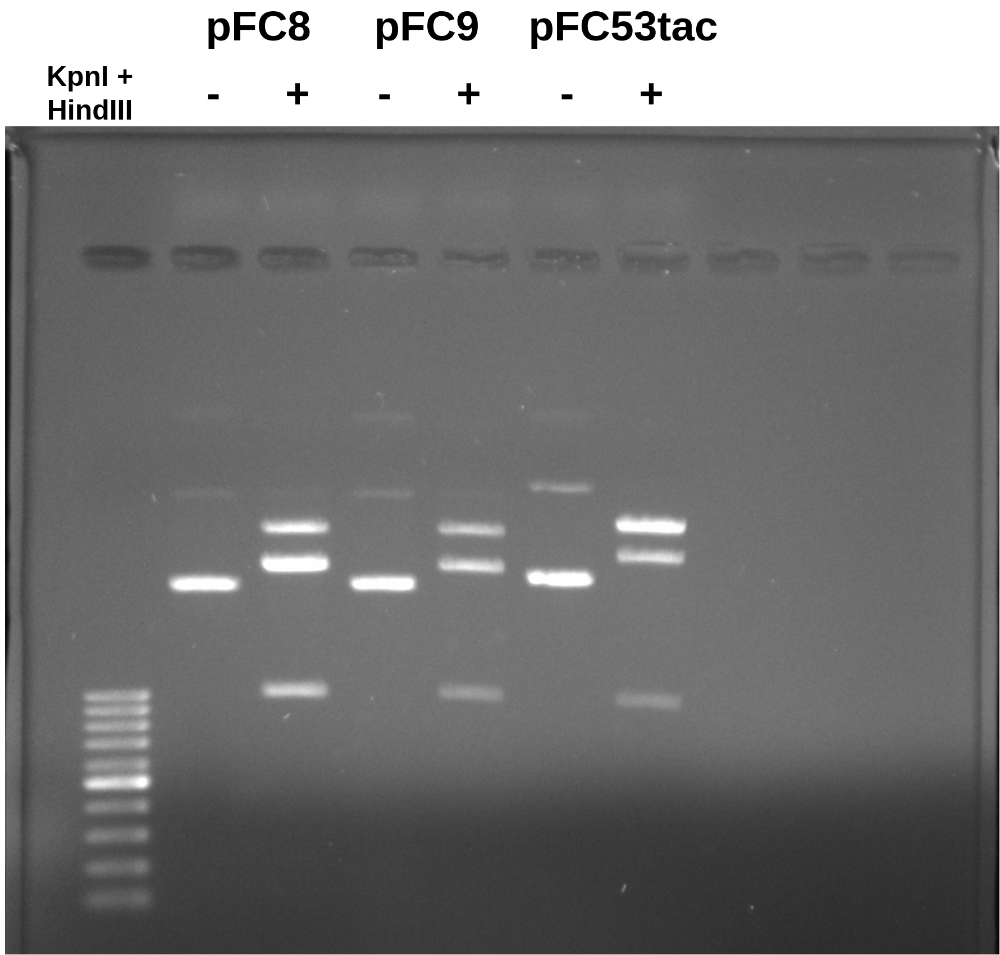
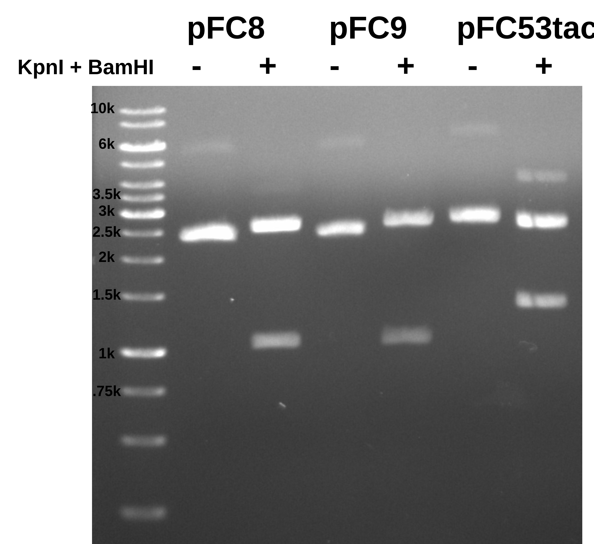
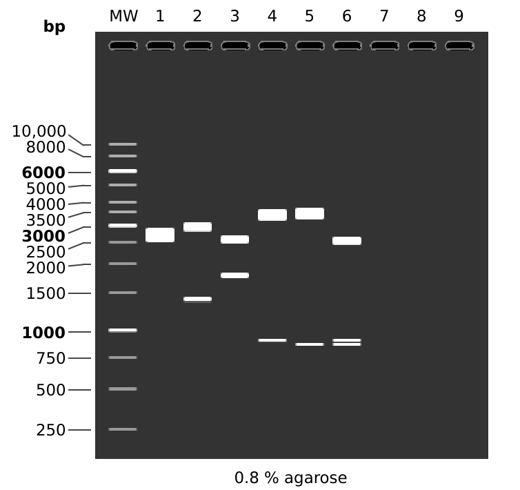

# Confirming midi prep results

Today I am working on visualizing the results of the midi preps
I did for pFC8, 9 and 53tac (see notes from [7-20-21](1-7-20.md)
to [7-23-21](1-7-20.md)).

## KpnI + HindIII double digest

First I utilized a restriction digest with HindIII and KpnI
to confirm plasmid ids and check for contaminating DNAs. Link to
spreadsheet used for reagent calculation [can be found here](https://docs.google.com/spreadsheets/d/1TSMWX3cN_CJO4ygUxHQ6MJX4J-_2AXtZk6WVvlGa3e4/edit?usp=sharing).

### Reagents

| Reagent    | Expiration | Lot number |
| ---------- | ---------- | ---------- |
| Buffer 2.1 | 5/23       | 10070034   |
| KpnI       | 11/19      | 0551711    |
| HindIII    | 8/22       | 10080749   |

KpnI was expired but it did not seem to significantly effect results.

### Results

I expected to see results similar to the simulated gel shown below.



```
MW:  1 kb DNA Ladder

1:  pFC8
    HindIII + KpnI
       1. 2608 bp
       2. 981 bp

2:  pFC9
    HindIII + KpnI
       1. 2616 bp
       2. 973 bp

3:  pFC53tacT1T2
    HindIII + KpnI
       1. 2935 bp
       2. 1385 bb
```

I digested each plasmid for 30 mins at 37C and then ran them on
a 0.8% agarose TAE gel for 1 hr at 90 volts.



Overall both pFC8 and pFC9 look as expect although they cannot
be distinguished with REs. pFC54tac does show the shift upwards
on the large fragment but in a less dramatic fashion as the simulated
gel. This is even more true for the smaller (expected 1385 bp) fragment which shows little differentiation from the ~980 bp fragments produced
from pFC8 and pFC9.

## BamHI-HF + KpnI-HF double digest

After running the KpnI HindIII digest and looking back at the plasmid
maps I realized there was a much better digest that I could have done
that would in theory resolve all three plasmids from each other. Digesting
with BamHI and KpnI takes advantage of the reversed position KpnI site on
pFC8 and 9 and using BamHI which is located downstream of the T1T2 terminators on pFC53tac (which pFC8 and 9 lack) means all three plasmids will produce unique fragments.

So I repeated by protocol but used BamHI-HF and KpnI-HF enzymes with CutSmart buffer. I used HF version because these cutters normally do not have good activity together.

### Reagents


| Reagent         | Expiration | Lot number |
| --------------- | ---------- | ---------- |
| CutSmart Buffer | 9/22       | 10046090   |
| KpnI-HF         | 4/17       | 0061504    |
| BamHI-HF        | 8/17       | 0101508    |

### Results



Here both pFC8 and pFC9 look like pFC8 in the simulated gel. This
makes me think that I accidentally added pFC8 to the pFC9 tube of
the transformation.

I think overall the results for pFC53tac conform to expectations, simulated gel for the two digests done below.



```
MW:  1 kb DNA Ladder

1:  pFC53tacT1T2
    KpnI + BamHI
       1. 2557 bp
       2. 1763 bp

2:  pFC53tacT1T2
    KpnI + HindIII
       1. 2935 bp
       2. 1385 bp
```

Tomorrow I will re-run this gel but using Fred's pFC8 and pFC9 (the same
plasmid used in notes from [7-20-21](1_7-20-21.md)) and start transformation
with pFC9 again because I am thinking that is the most likely explanation.