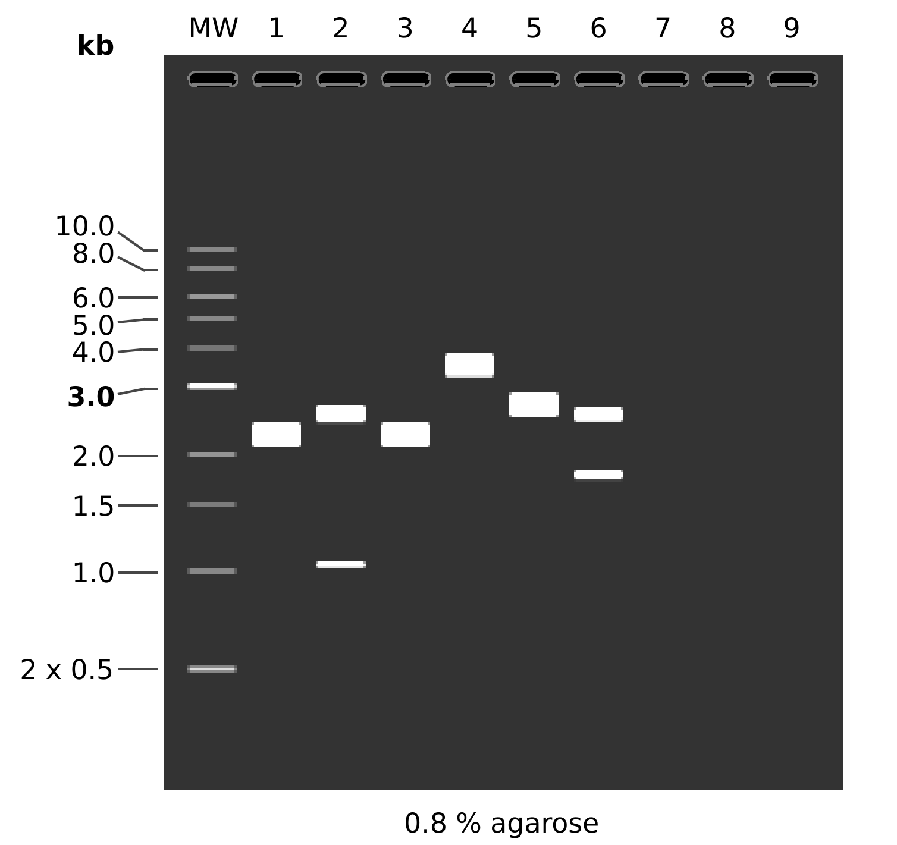
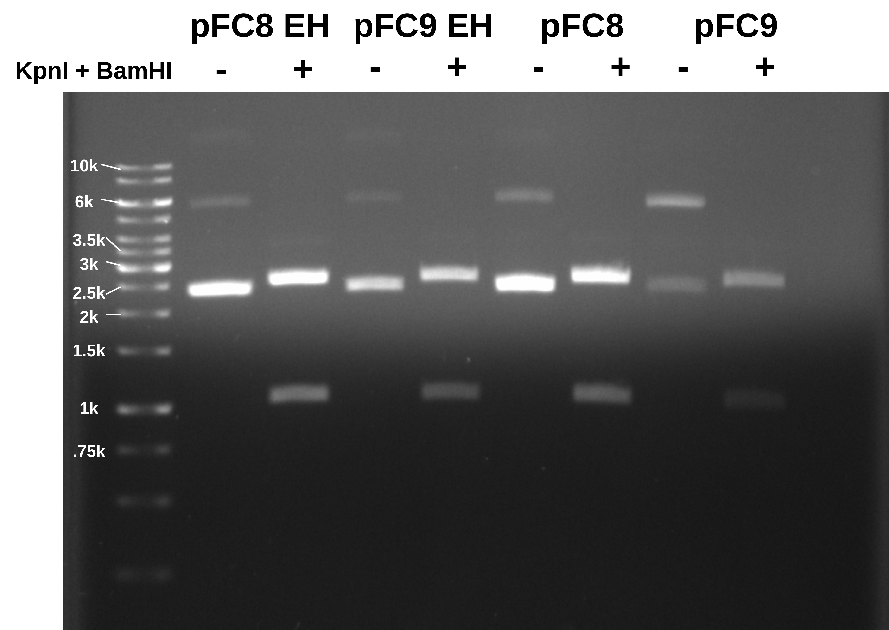
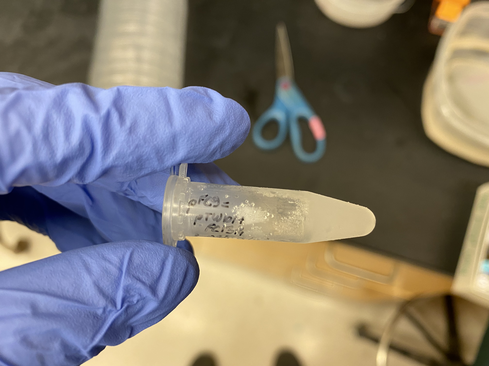
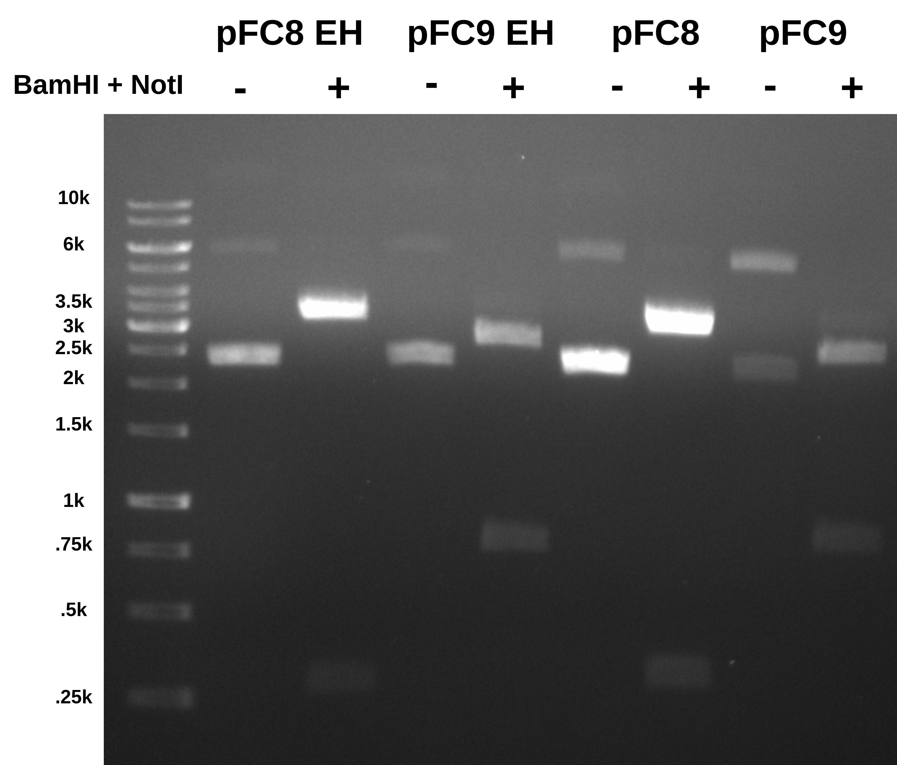

# Confirming identity of pFC9(?) midi prep plasmid

Today I am working on making sure pFC8 is 8 and pFC9 (or what I thought
was pFC9) is also pFC8.

## Double digest with BamHI and KpnI

Replicating restriction digest protocol from [yesterday](5_7-26-21.md)
to make sure that pFC9 is actually pFC8. Spreadsheet of reagents, volumes
and DNA concentrations is [available at this link](https://docs.google.com/spreadsheets/d/1TSMWX3cN_CJO4ygUxHQ6MJX4J-_2AXtZk6WVvlGa3e4/edit?usp=sharing).

### Reagents

| Reagent         | Expiration | Lot number |
| --------------- | ---------- | ---------- |
| CutSmart Buffer | 9/22       | 10046090   |
| KpnI-HF         | 4/17       | 0061504    |
| BamHI-HF        | 8/17       | 0101508    |

### Expected results

Simulated gel and lane contents are below.



```
MW:  1 kb DNA Ladder

1:  pFC8
       1. 3589 bp

2:  pFC8
    BamHI + KpnI
       1. 2558 bp
       2. 1031 bp

3:  pFC9
       1. 3589 bp

4:  pFC9
    KpnI + BamHI
       1. 3535 bp
       2. 54 bp

5:  pFC53tacT1T2
       1. 4320 bp

6:  pFC53tacT1T2
    BamHI + KpnI
       1. 2557 bp
       2. 1763 bp
```

## Results



This looks like everything is pFC8!

Below is the tube I got "pFC9" from. I am pretty sure that says pFC9.



Talked to Fred after and we looked at the original primers and constructs
used to make pFC8 and 9 and seems like the genbank file is incorrect. The
locations of the KpnI and EcoRI sites are not flipped. This would explain
the results of this digest. The pFC9 file has since been updated in the 
lab shared folder. I am currently reworking cloning strategy to reflect
this. Will likely require new sequences or at least new homology arms.

## Double digest with BamHI and NotI

The R-loop forming region in pFC8 and 9 is flipped and NotI, as a part of this region, is also flipped with it. Here I am digesting pFC8 and 9 with
BamHI (same location both plasmids) and NotI in order to tell them apart.

I followed exact same protocol as the BamHI + KpnI digest that is shown above but swapped KpnI-HF for NotI-HF. Should note that NotI-HF is very low and probably needs to be re-ordered.

### Reagents

| Reagent         | Expiration | Lot number |
| --------------- | ---------- | ---------- |
| CutSmart Buffer | 9/22       | 10046090   |
| NotI-HF         | 12/20      | 10030791   |
| BamHI-HF        | 8/17       | 0101508    |

### Expected results

Simulated digest is shown below.

### Results

Ran gel 0.08 agarose for 1 hr at 120 volts with TAE and EtBr in running
buffer as well as in agarose.




## Other misc. items

### pFC9 cultures

Early in the day when I thought that my pFC9 midi prep sample was definitely
pFC8 I started another pFC9 transformation. Those bacteria are currently plated and incubating in at 37C. I placed them into the incubation room around 9:45 am after electroporation with pFC9. I used the eletro-competent E.coli in the first box accessible in the -80C freezer.

### Amp agar plates

Made ~20 amplicilin agar petri plates for future transformations following the kitchen reagent sheet guidelines. I stored all plates in the plastic
sleeve they came in in the deli fridge.