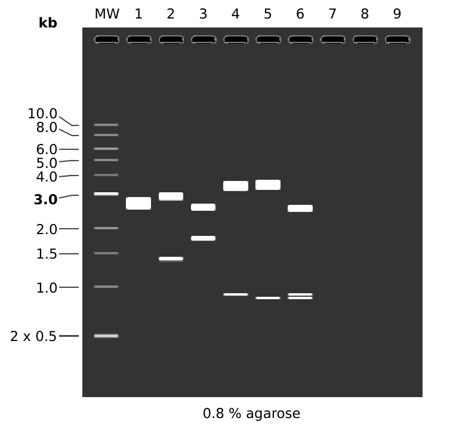
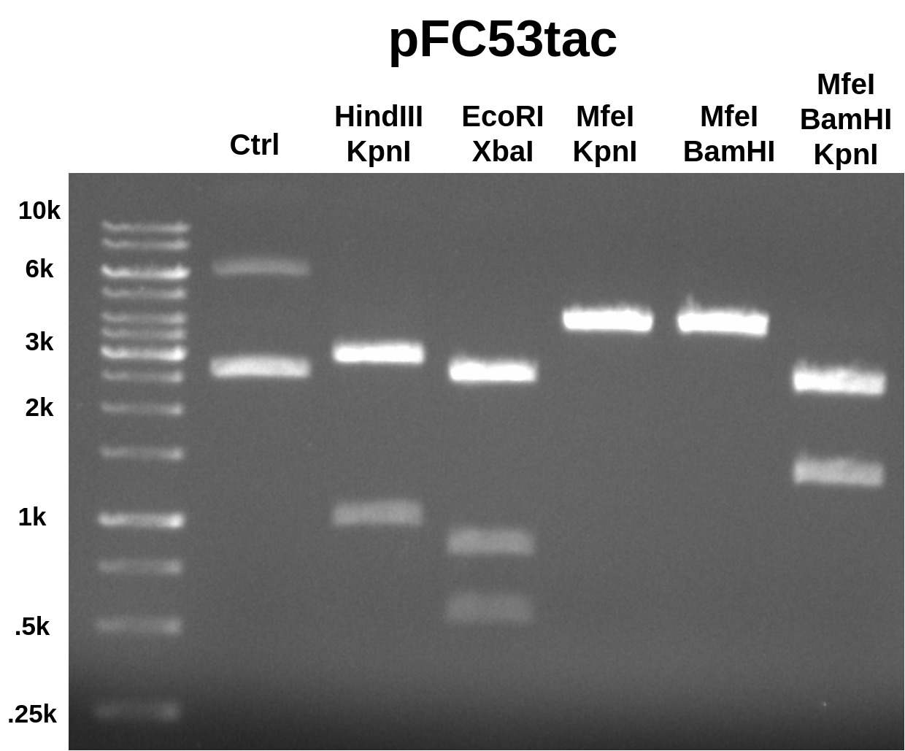
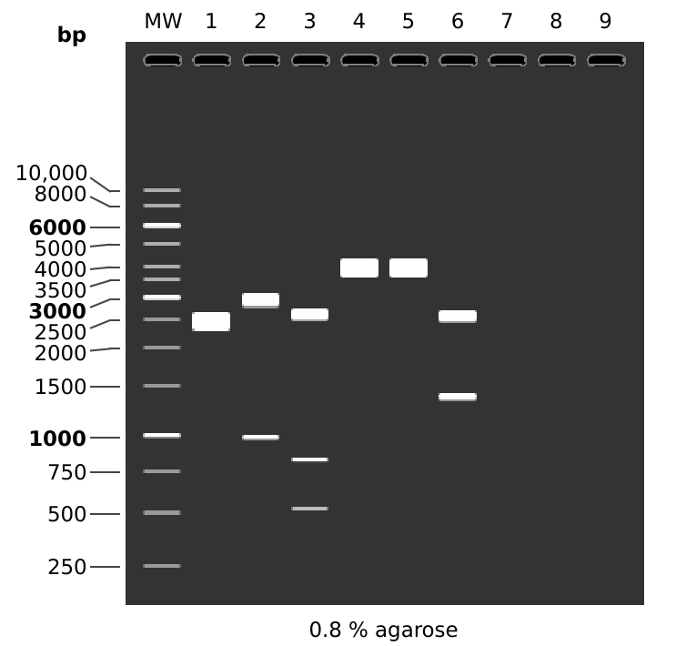

# Confirming identity of pFC53tac

Today I am working on confirming the identity of the pFC53tac sample
that I prepared via midi prep using restriction digests.

## pFC53tac restriction digests

I digested ~200 ng of pFC53tac sample using the assay design below.



```
MW:  1 kb DNA Ladder

1:  pFC53tacT1T2
       1. 4320 bp

2:  pFC53tacT1T2
    HindIII + KpnI
       1. 2935 bp
       2. 1385 bp

3:  pFC53tacT1T2
    EcoRI + XbaI
       1. 2574 bp
       2. 1746 bp

4:  pFC53tacT1T2
    MfeI + BamHI
       1. 3419 bp
       2. 901 bp

5:  pFC53tacT1T2
    MfeI + KpnI
       1. 3458 bp
       2. 862 bp

6:  pFC53tacT1T2
    MfeI + KpnI + BamHI
       1. 2557 bp
       2. 901 bp
       3. 862 bp
```

### Reagents

Each reaction had a total volume of 10ul and used 10x CutSmart buffer. All
reactions were incubated at 37C for 30 mins.

| Reagent    | Lot number | Expiration date |
| ---------- | ---------- | --------------- |
| BamHI-HF   | 0101508    | 8/17            |
| KpnI-HF    | 0061508    | 8/17            |
| HindIII=HF | 0061508    | 8/17            |
| XbaI       | 0431803    | 3/20            |
| EcoRI-HF   | 10026002   | 10/20           |


### Results

Ran 0.08 gel at 120 V for 45 mins in TAE. EtBr in agarose and running buffer.



When first looking at these results the EcoRI-XbaI and digests using MfeI
did not make sense. I was not sure what was causing the double band in the
EcoRI-XbaI digest and it seemed like I forgot to add MfeI to those digests.
I talked to Fred about this and he mentioned that pFC8tac actually has
2 EcoRI sites which could explain the double band. pFC8tac also does not
have an MfeI site. I simulated this digest on pFC8tac and the results are
shown below.



This matches the results of the actual digest very well which leads me
to believe that the stock pFC53tac is mislabeled and is in fact pFC8tac. Tomorrow I will confirm this by repeating this same digest on the stock
I used in for the original midi prep and on pFC8tac stock.

