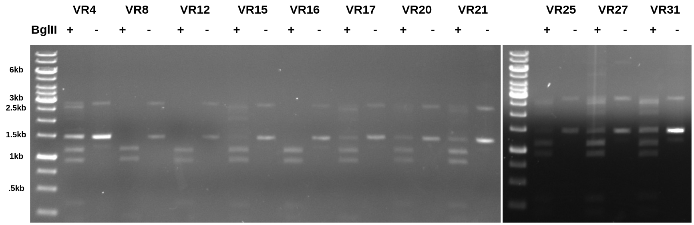
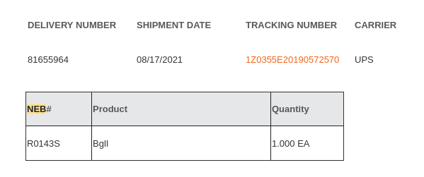

# VR vector digest with BglI(I)

Today I came in to do a quick digest with what I *thought* was BglII on
all inserts that came as a vector. I digested 100 ng of each insert with 0.1 ul
of BglI (thinking it was BglII) and ran an undigested control along side it.
The 0.8 TAE gel is below. 

There were way more bands than I was expecting and so I double checked to make
sure I ordered the correct enzyme because BglI looks *really* similar to
BglII on a screen.

And of course I ordered the wrong one. Whomp whomp. Luckily the campus sci store
stocks it so I will go purchase the correct enzyme and repeat my one pot PCR
experiment Monday morning. 