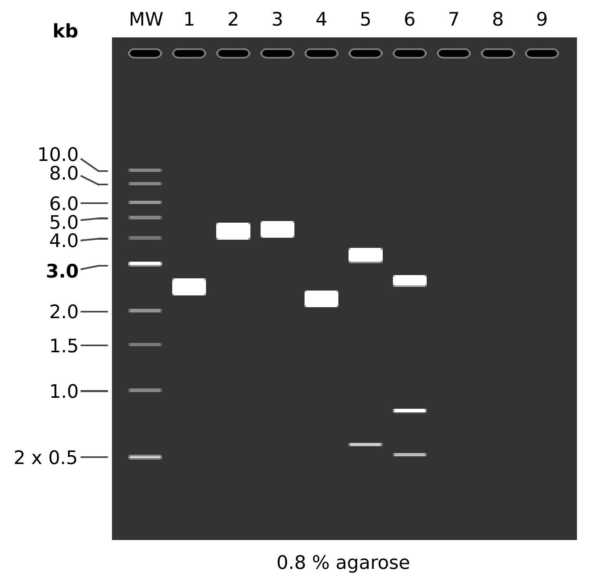
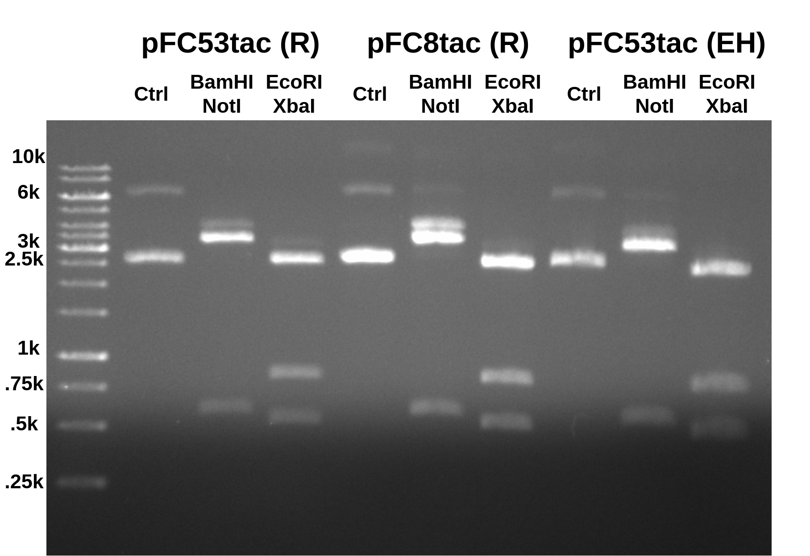
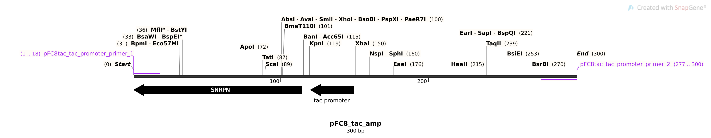
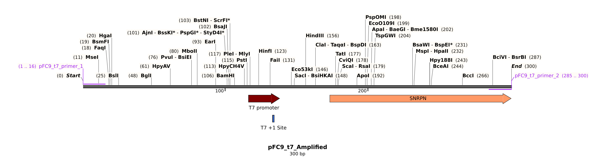
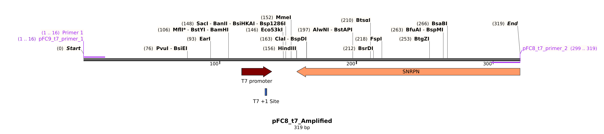
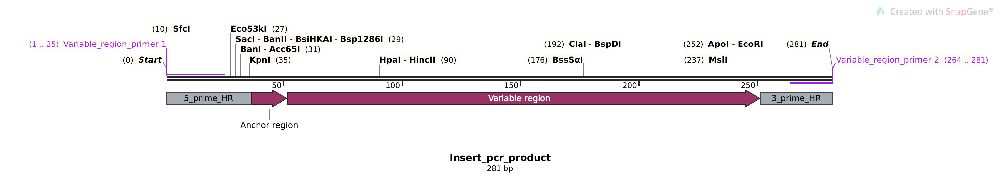

# pFC53tac and pFC8tac digests plus primer design

Today I am continuing to work on determining the true identity and content
of the pFC53 plasmids. I also designed primers to amplify each plasmid for
sequencing.

## pFC53tac and pFC8tac digest

I digested Rachel's pFC53tac and pFC8tac and my own pFC53tac I prepared from
Rachel's pFC53tac stock. Below are the expected results for digests of true
pFC53tac and pFC8tac.



```
MW:  1 kb DNA Ladder

1:  pFC53tacT1T2
       1. 4320 bp

2:  pFC53tacT1T2
    BamHI + NotI
       1. 4299 bp
       2. 21 bp

3:  pFC53tacT1T2
    EcoRI
       1. 4320 bp

4:  pFC8tacT1T2
       1. 3916 bp

5:  pFC8tacT1T2
    BamHI + NotI
       1. 3306 bp
       2. 589 bp
       3. 21 bp

6:  pFC8tacT1T2
    EcoRI + XbaI
       1. 2574 bp
       2. 818 bp
       3. 524 bp
```

## Results

Ran 0.08 agarose gel in TAE for 45 mins at 120V (shown below). R are
Rachel's plasmids while EH are my own.



All digests look basically the same and match the expected results for
the simulated digest of pFC8tac. At this point I would say with confidence
that Rachel's pFC53tac tube should be relabeled as pFC8tacT1T2. The double
band produced by the EcoRI digest confirms the presence of the T1T2 terminators.

## pFC primer design

Primer design for sequencing pFC series plasmids. In order to be absolutely
sure about the identity of each plasmid I will sequence each plasmid I am
planning on working with using the primers in the below sections.
This is my first time designing primers for the lab
and so to keep track of them I created a
[spreadsheet](https://docs.google.com/spreadsheets/d/1hC9VYnkETDaF73ewFpsUHhBizdWiu8ck4LPnwME005o/edit?usp=sharing) were details of all future oligos
should be stored.

### [pFC8tac](sequences/pFC8_t7_Amplified.dna)



#### Sequences

```
>pFC8tac_tac_promoter_Primer_1
gcagaacggcacaacagc
>pFC8tac_tac_promoter_Primer_2
gtattaccgcctttgagtgagctg
```

#### PCR program

```
|95°C|95°C               |    |tmf:64.1
|____|_____          72°C|72°C|tmr:66.4
|5min|30s  \ 60.7°C _____|____|45s/kb
|    |      \______/ 0:30|5min|GC 55%
|    |       30s         |    |301bp
```

### [pFC9](sequences/pFC9_t7_Amplified.dna)



#### Sequences

```
>pFC9_t7_primer_1
cccgccgcgcttaatg
>pFC9_t7_primer_2
gccccaatgcgagcgg
```

#### PCR program

```
|95°C|95°C               |    |tmf:66.0
|____|_____          72°C|72°C|tmr:69.1
|5min|30s  \ 61.3°C _____|____|45s/kb
|    |      \______/ 0:30|5min|GC 56%
|    |       30s         |    |300bp
```

### [pFC8](sequences/pFC8_tac_amp.dna)



#### Sequences

```
>pFC8_t7_primer_2
gaaggggcagtagcacagtcc
```

#### PCR program

```
|95°C|95°C               |    |tmf:66.0
|____|_____          72°C|72°C|tmr:69.5
|5min|30s  \ 61.3°C _____|____|45s/kb
|    |      \______/ 0:30|5min|GC 55%
|    |       30s         |    |319bp
```

All PCR programs calculated using pydna `pcr` module for Tac polymerase.
Notebook for protocol generation can be found [here](notebooks/7-29-21-pcr-rxns.ipynb) or [pdf version here](notebooks/exported_notebooks/7-29-21-pcr-rxns.pdf).

## Insert sequence primers

Since I was ordering primers I also added primers that will amplify all variable regions inserts in case we need to make a larger amount of any
insert.



### Sequences

```
>Variable_region_insert_primer_1
tacgactcactatagggcgaattgg
>Variable_region_insert_primer_2
cctcctcgcctcggtcac
```

## PCR protocol outline

Reagent spreadsheet [available at this link](https://docs.google.com/spreadsheets/d/1C9dQ5NALOPIBd9vnqTwMcuQwFouvtItC6r6D7yj8_8g/edit?usp=sharing).
