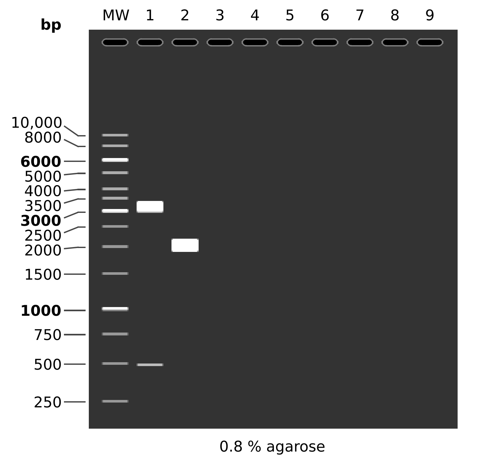
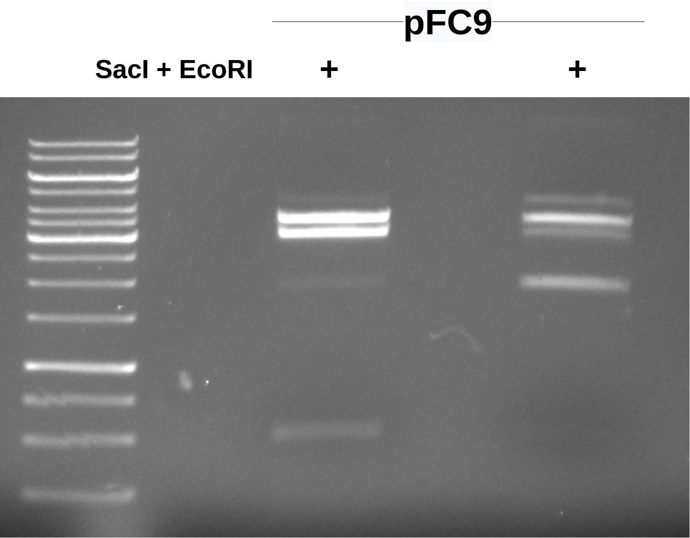
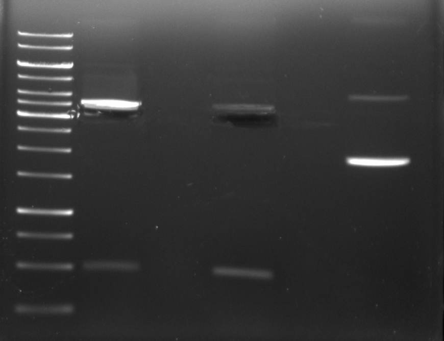
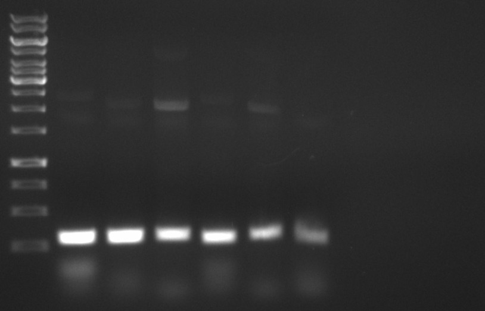
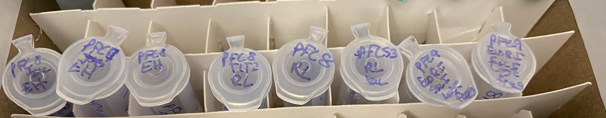

# pFC9 gel purification and pFC PCRs

Recieved both SacI and primers in the mail this morning
so today will be working on extracting large fragment of
pFC9 after digestion with SacI and EcoRI for use in
T7 initiation series cloning and PCR of various pFC8 and 9
plasmids for sequencing later this week.

## pFC9 EcoRI and SacI digest

Reagents and volumes are outlined in the spreadsheet
[at this link](https://docs.google.com/spreadsheets/d/1l6wfkW9ukn345qX2bwtJRiUF5r6L9bTFWAB5k-gCVD8/edit#gid=0).

Expected results for both digests is shown below.



```
MW:  GeneRuler™ 1 kb DNA Ladder

1:  pFC9
    SacI + EcoRI
       1. 3099 bp
       2. 490 bp

2:  pFC9
       1. 3589 bp
```

I would then excise the large fragment and purify using
the Zymogen DNA agarose gel extraction kit reagents and
protocol.


### Digest 1

For first digest I used the buffer included with SacI
which I thought was CutSmart but was actually rCurSmart, 
not sure if that is actually different in anyway or not.

#### Results

Ran 0.08 agarose gel for one hour at 90 volts in TAE buffer.



This *mostly* looks like pFC9 in so much that in lane 1
there are the two bands we would expect at ~3000 bp and at
~500 bp, although this 500 bp fragment is not present in
the second digest (one enyme did not make it in?) and there
is significant signal from a band of similar length around 3500-4000bp.

I am going to run this gel again and for longer to try
and get better separation of the bands to make cutting out
the pFC9 large fragment easier.

### Digest 2

After band cutting I removed the band closet to the 3000 bp ladder
marker.



## PCR

PCR amplification in order to sequence pFC plasmids. More
details on background and motivation for this assay
are in notes from [7/29/21](8_7-29-21.md) and [7/28/21](7_7-28-21.md). All reagents, primers and concentrations are described in the spreadsheet [at this link](https://docs.google.com/spreadsheets/d/1C9dQ5NALOPIBd9vnqTwMcuQwFouvtItC6r6D7yj8_8g/edit?usp=sharing).


### Results



Followed up with agarose gel DNA extraction

| Sample name   | Sample number | Assay             |
| ------------- | ------------- | ----------------- |
| pFC8tac(EH)   | 1             | PCR               |
| pFC9(EH)      | 2             | PCR               |
| pFC8(EH)      | 3             | PCR               |
| pFC8T1T2(RL)  | 4             | PCR               |
| pFC8(RL)      | 5             | PCR               |
| pFC53T1T2(RL) | 6             | PCR               |
| pFC9          | 7             | SacI EcoRI digest |
| pFC9          | 8             | SacI EcoRI digest |



Nanodrop result

| Sample        | DNA concentration (ng/ul) | 260/280 | 260/230 |
| ------------- | ------------------------- | ------- | ------- |
| pFC8tac(EH)   | -0.8                      |         |
| pFC9(EH)      | 12.7                      | 1.43    | 0.321   |
| pFC8(EH)      | 6.3                       | 1.312   | 0.073   |
| pFC8T1T2(RL)  | 4.1                       | 1.141   | 0.117   |
| pFC8(RL)      | -10.5                     | 2.563   | -0.261  |
| pFC53T1T2(RL) |
| pFC9          | 2.2                       | 1.0     | 0.106   |
| pFC9          | 8.5                       | 1.689   | 0.179   |